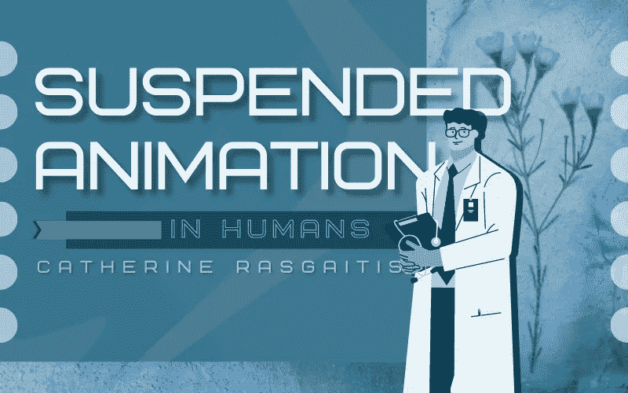

# 人类的假死

> 原文：<https://medium.com/geekculture/suspended-animation-in-humans-b92c5948a5f7?source=collection_archive---------15----------------------->

## 通过“低温睡眠”技术实现休眠与死亡

photo by [Zoltan Tasi](https://unsplash.com/@zoltantasi), courtesy of [Unsplash](https://unsplash.com/photos/hUp58GsPKAw)

在《漫威电影宇宙》中，一个决定性的情节发生在美国队长，也就是史蒂夫·罗杰斯，将他的飞机坠毁在大西洋寒冷的水域中。冷冻的超级士兵很快陷入长达 66 年的冬眠，然后醒来并重新加入社会。