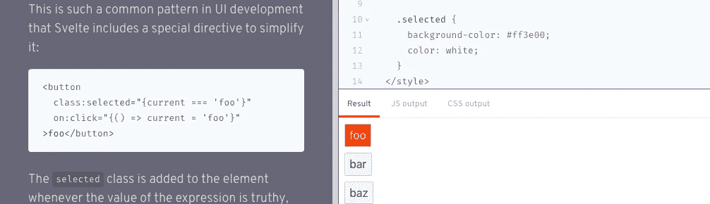

# 苗条的 Gotcha——顺风直列风格

> 原文：<https://medium.com/geekculture/svelte-gotcha-tailwind-inline-styles-a666f8278789?source=collection_archive---------35----------------------->



Svelte 附带了一些小的调整和代码片段，使常见的 UI 行为对你我来说都很容易实现。其中一个行为是应用自定义 css 样式来强调一个 DOM 元素，例如这个按钮或链接是*“活动的”*。来自《苗条教程》本身[https://svelte.dev/tutorial/classes](https://svelte.dev/tutorial/classes)

> *这是 UI 开发中非常常见的模式，因此 Svelte 包含了一个特殊的指令来简化它*

```
<script>
  let current = false;
</script>
<style>
  .active {
    background-color: #ff3e00;
    color: white;
}
</style>
<button class:active="{current}" on:click="{() => current = true}">
Promote
</button>
```

为了逐步完成上述示例，我们有:

1.  一个名为`current`的脚本变量，其值为`false`
2.  一个带有内嵌`on:click`处理程序的按钮，用于将`current`脚本值设置为等于`true`
3.  最后，一个内嵌的类选择器，它说，如果`current==true`，那么将`active`的 css 样式应用到这个按钮。

总而言之，这是一个很好的小指令，开箱即用。在上面的例子中，我们内联了`active`，但是你当然可以内联任何你有的样式。如果你像我一样使用顺风，你可以直接应用顺风风格，如下所示:

```
<script>
  let current = false;
</script>
<style>
  // No need for an explicit component style. Instead apply
  // the Tailwind styles directly as border and primary are 
  // globally available.
</style>
<button class:border-primary="{current}" on:click="{() => current = true}">Promote</button>
```

同样，这一切都按预期工作。在本地以 dev 模式运行它将会得到您想要的结果。

## 但是为什么没有投入生产呢？

然而，在生产构建和部署中，顺风`border-primary`风格 ***可能不适用？在进一步的检查中，打开您的开发工具并检查生产中的 DOM 元素，您可以交互地看到细长的指令 ***被正确地应用了*** ，但是仍然没有视觉上的变化生效？***

这就是为什么这个问题如此棘手的原因！这个指令在 99.99%的时候都是有效的，只要应用的 CSS 定义也应用在你的模板中的其他地方，那么它就是全局样式的一部分。这是怎么回事？

Svelte under the hood(这里用的是 Svelte 3.0)使用 [rollupjs](https://www.rollupjs.org/) 来编译你的应用 js。如果您检查您的默认`rollup.config.js`内容，您应该在您的插件部分看到类似于

```
plugins: [
  svelte({
    // enable run-time checks when not in production
    dev: !production,
    preprocess: sveltePreprocess({ postcss: true }),
    .....
```

请注意，在构建时，rollup 将对 css 样式进行预处理，根据需要缩小并删除未使用的样式。postcss 处理的配置可以在`postcss.config.js`文件中找到。你的 Tailwind 插件部分的关键部分是在生产中，通过了`purgecss`选项，例如:

```
module.exports = {
  plugins: [
    require("tailwindcss"), ...(production ? [purgecss] : [])
  ],
};
```

`@fullhuman/postcss-purgecss`包实际上很好地剥离了不需要的样式，并将你的 css 编译成尽可能小的文件。但是当然`@fullhuman/postcss-purgecss`是一个独立的包，不属于苗条生态系统的一部分。它不知道这个简单的内联样式指令，因此，没有基于确保内联样式在后期处理中不被剥离的规则。

## 修复

好的，所以我们想使用这个细长的内嵌风格指令，我们也想使用一个现有的顺风风格来工作。我们怎样才能既有蛋糕又能吃掉它呢？这其实很简单。我们只需要创建一个显式的组件样式，并使用 Tailwind @apply 指令。示例:

```
<script>
  let current = false;
</script>
<style>
  .active {
    @apply border-primary;
  } 
</style>
<button class:active="{current}" on:click="{() => current = true}">   Promote</button>
```

通过这种方式，样式将**永远不会**通过构建过程被剥离，作为其苗条组件样式块的一部分。我们仍然可以对所有的顺风风格使用`@apply`,而不必制定定制的 css 规则。赢了。

*最初发表于*[*https://www.kylehq.com*](https://www.kylehq.com/2021/09/svelte-gotcha-tailwind-inline-styles/)*。*