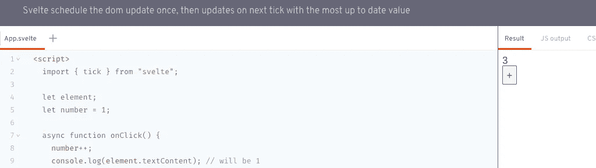

# 细长的 Gotcha——反应式微任务

> 原文：<https://medium.com/geekculture/svelte-gotcha-the-reactive-microtasks-b27f00d53fb6?source=collection_archive---------35----------------------->



[苗条](https://svelte.dev)的 USP 之一当然是它的*【反应性】*。正如他们的主页自豪地宣称的那样

> *不再有复杂的状态管理库——Svelte 为 JavaScript 本身带来了反应能力*

在任何一天，用苗条和它的反应性自然发展只是一个使用的梦想。您可以使用 **$:** 指令告诉 Svelte 跟踪几乎任何东西的状态变化。很有可能你的第一个反应性的改变会产生所有预期的 UI 结果。但是当你开始更多地依赖于基于变量或数组/对象变化的 UI 更新时，你的 UI 很可能会开始跳过一个节拍并丢弃你明确知道在那里的值。

由于 [feed 大军](https://feed.army/)处理不断更新的 Feed 数据，我也遇到了这个问题。随着我的提要的更新，UI 将尝试对用户显示的每个新提要条目进行被动迭代。然而，在用户界面更新时，feed 条目被删除了，我不明白为什么？

为了有所帮助，让我们回顾一下这个简单/常见的例子，它很好地说明了这个问题。建议您查看 svelte.dev/repl/567089d42c3b4146820e51ebb38b6f59 的 REPL:，点击“+”按钮，查看控制台选项卡的输出。您还可以通过移除`await tick();`调用来进行更多实验，以查看控制台输出 4x“1”

在这里，源代码要澄清:

```
<script>
  import { tick } from "svelte";
  let element;
  let number = 1;
  async function onClick() {
    number++;
    *console*.log(element.textContent); // will be 1

    number = 2;
    *console*.log(element.textContent); // will be 1 number = 3;
    *console*.log(element.textContent); // will be 1 await tick(); // Remove this all to see 1 4x times // will be 3, the last change on the number variable
    *console*.log(element.textContent);
}
</script>
<div bind:this={element}>{number}</div>
<button on:click={onClick}> + </button>
```

那么这是怎么回事，为什么 number 和 2 & 3 绑定的时候，控制台会输出 1？明智地说，作者为什么增加了`await tick();`？这最好由官方文件来回答:[svelte.dev/tutorial/tick](https://svelte.dev/tutorial/tick)

> *当你在 Svelte 中更新组件状态时，它不会立即更新 DOM。相反，它会等到下一个微任务，看看是否有任何其他需要应用的更改，包括在其他组件中。*

当然，这是完全有意义的，因此可以进行优化来停止消耗 cpu 周期，并允许 UI 更新的批处理。一旦您知道为什么 UI 没有像您认为的那样更新，您就可以采取措施来处理这种行为。在我的例子中，我使用了一个布尔标志来通知应用程序代码更新可用。然后通过使用基于定制的[苗条商店](https://svelte.dev/tutorial/writable-stores)的队列来完成处理。通过这种方式，UI 代码可以反应性地感知更新，并可以通过队列处理每个新的提要条目，以确保没有遗漏任何条目。

如果你对苗条者的反应商店更感兴趣(你应该对他们很感兴趣)，我在这里发表了另一篇关于我的反应队列商店[的专题文章。](https://www.kylehq.com/2021/06/the-brilliance-of-sveltejs-stores/)

我希望在阐明你是如何被绑定到苗条的“T4”、“微任务”、“T5”的时候，你可以设计你的代码来最大化它的行为。

*原载于*[*https://www.kylehq.com*](https://www.kylehq.com/2021/08/svelte-gotcha-the-reactive-microtasks)*。*