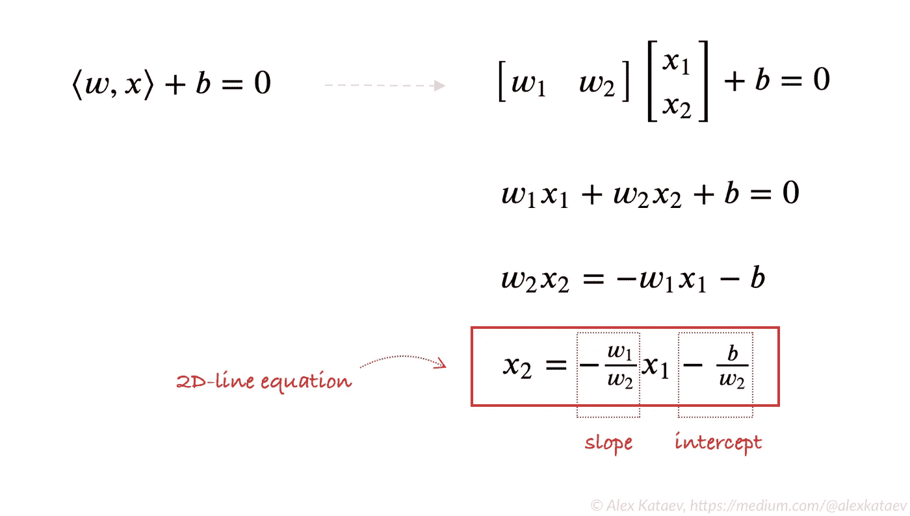
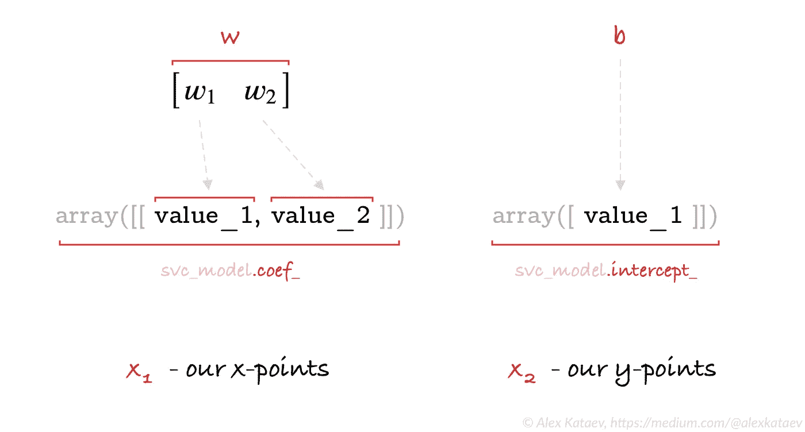
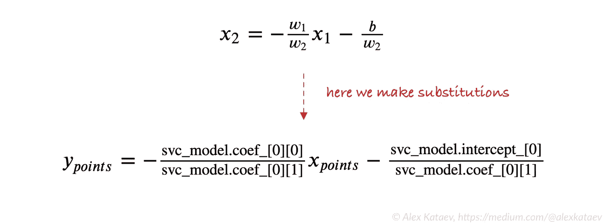
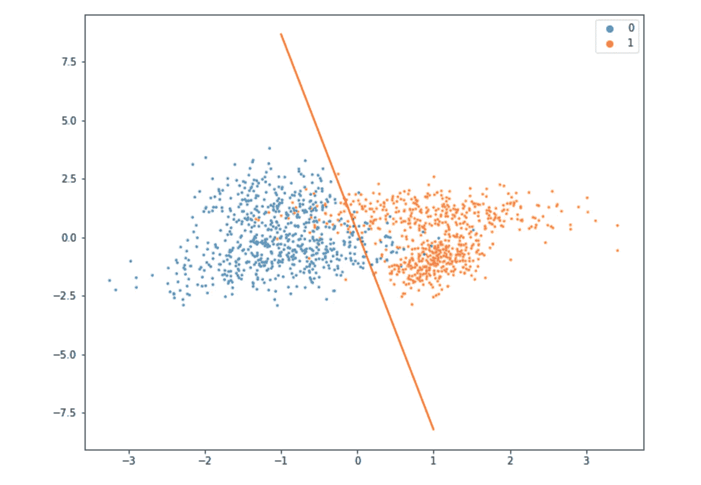
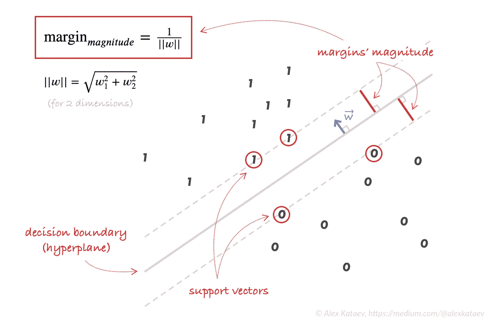
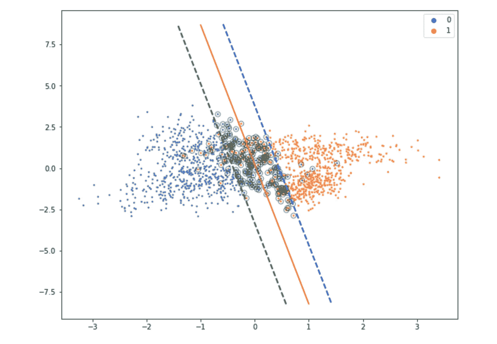

# 使用 sklearn.svm.SVC 进行 SVM 分类:如何在 2D 空间中绘制带有边距的决策边界

> 原文：<https://medium.com/geekculture/svm-classification-with-sklearn-svm-svc-how-to-plot-a-decision-boundary-with-margins-in-2d-space-7232cb3962c0?source=collection_archive---------2----------------------->


Photo by [cottonbro](https://www.pexels.com/@cottonbro?utm_content=attributionCopyText&utm_medium=referral&utm_source=pexels) from [Pexels](https://www.pexels.com/photo/healthy-wood-playing-sport-5740517/?utm_content=attributionCopyText&utm_medium=referral&utm_source=pexels)

因此，如果你厌倦了挖掘大量无用的链接，希望找到如何用支持向量机算法绘制决策边界和边缘线的详细解释，那么恭喜你——你终于找到了！还有最后一步——阅读我关于这个主题的简单指南。开始吧！

> 灵感来源:[https://sci kit-learn . org/stable/auto _ examples/SVM/plot _ SVM _ margin . html](https://scikit-learn.org/stable/auto_examples/svm/plot_svm_margin.html)

*拜托，不要只走过上面的链接。也许，它会帮助你更好地理解这个话题。*

# 0.让模特学会！

我相信你已经熟悉这一步了。这里我们创建一个数据集，然后按训练和测试样本进行拆分，最后用`sklearn.svm.SVC(kernel='linear')`训练一个模型。注意，我们确切地使用了**线性**内核类型(一些例子中的[链接](https://scikit-learn.org/stable/auto_examples/svm/plot_svm_kernels.html))。仔细阅读评论:

```
**import numpy as np
from sklearn.svm import SVC**# Creating a random dataset of 2,000 samples and only 2 features
# (for 2–dimensional space). And yeah, it's a binary classification
# here (`y` contains two classes: 0 and 1).
**X, y = make_classification(n_samples=2000, n_features=2,
                           n_informative=2, n_redundant=0,
                           n_classes=2,
                           random_state=32)**# Splitting our dataset by train and test parts.
# `stratify` is here to make our splitting balanced
# in terms of classes.
**X_train, X_test, y_train, y_test = train_test_split(X, y,
                                   test_size=0.3, stratify=y,
                                   random_state=32)**# And here we train our model. IMPORTANT: we use kernel='linear'.
**svc_model = SVC(kernel='linear', random_state=32)
svc_model.fit(X_train, y_train)**
```

很好！模型已经训练好了，现在你想绘制一个决策边界(超平面)，但是等等……你不知道从哪里开始。别担心，我会一步步指导你。

# 1.我们需要什么来绘制决策边界？

我们需要一个通用的等式:


General equation of a decision boundary in a vector form

> **注:**由于我们在二维空间中操作，决策边界将由 2D 直线表示，因此`w`和`x`都由两个元素组成。

诀窍就在这里。我们转换矢量`w`和`x`的点积，然后求解`x`的第二个元素的方程:



From general equation to a 2D-line equation

结果，我们得到了斜率截距形式的经典线性方程，在我们的例子中，它描述了一条 2D 直线。好的，我们知道了，但是你可能还有一些问题，比如:

1.  `w_1`和`w_2`到底存储在我们的`sklearn`模型对象的什么地方？
2.  还有什么是`x_1`和`x_2`？

看图:



Revealing the parts of a 2D-line equation

`**w**`包含在我们的模型(`**svc_model.coef_**`)的属性`**coef_**`中，这些是我们的决策边界的法向量的坐标(该向量与超平面正交)。

`**b**`是我们模型(`**svc_model.intercept_**`)的一个属性`**intercept_**`。

`**x_1**`是一个坐标平面的 **x 点**的数组。

`**x_2**`是一个坐标平面的 **y 点**的*结果*数组。

> 正如你所注意到的，我们只有 2 个元素用于`w`，同样的元素用于`x`。这是因为我们正在探索二维空间中的 SVM 分类，只是为了让绘制 SVM 决策边界和边际的想法更加清晰。

# 2.把所有的东西放在一起

只要对 2D 线公式做一些替换…



…在代码中，我们得到:

```
**import matplotlib.pyplot as plt
import seaborn as sns****plt.figure(figsize=(10, 8))**# Plotting our two-features-space
**sns.scatterplot(x=X_train[:, 0], 
                y=X_train[:, 1], 
                hue=y_train, 
                s=8);**# Constructing a hyperplane using a formula.
**w =** **svc_model****.coef_[0]** # w consists of 2 elements **b =** **svc_model****.intercept_[0]** # b consists of 1 element **x_points = np.linspace(-1, 1)** # generating x-points from -1 to 1 **y_points = -(w[0] / w[1]) * x_points - b / w[1]** # getting corresponding y-points# Plotting a red hyperplane
**plt.plot(x_points, y_points, c='r');**
```

它的输出是:



Two features (that’s why we have exactly 2 axis), two classes (blue and yellow) and a red decision boundary (hyperplane) in a form of 2D-line

太好了！我们现在已经绘制了决策边界！因此，是时候转向 SVM 利润率了。

# 4.绘制 SVM 边距

在这里，我创建了一个决策边界和利润的图片。灰色虚线是“边界”,显示了它们的基础，以及如何计算它们的大小。仔细看各方面:



SVM classification illustrated. Decision boundary, margins, and support vectors.

因此，虚线只是沿着向量`w`的方向平移了等于`margin`的距离的判定边界线。我们可以用这个算法来实现:

```
**Step 1.** Find a normal vector to the decision boundary;**Step 2.** Calculate a unit vector of that normal vector -- let's call it `w_hat`;**Step 3.** Get a distance between the lines (margin);**Step 4.** Translate all points of the decision boundary to a new location by this formula:# for a line above
new_points_above = hyperplane_points **+** w_hat * margin# for a line below
new_points_below = hyperplane_points **-** w_hat * margin
```

**第一步:**我们已经知道，`w`是我们需要的法向量——它总是正交于超平面(顺便说一句，这就是为什么——[stack overflow link](https://datascience.stackexchange.com/questions/6054/in-svm-algorithm-why-vector-w-is-orthogonal-to-the-separating-hyperplane))。而且我们还知道它包含在我们模型的属性`**coef_**`(`**svc_model.coef_**`)中。

**第二步:**我们来计算单位矢量:


Unit-vector formula

```
# Calculating the unit vector of w
**w_hat =** **svc_model****.coef_[0] / (np.sqrt(np.sum(****svc_model****.coef_[0] ** 2)))**
```

**第三步:**现在我们计算保证金:


Margin formula

```
# Calculating margin
**margin = 1 / np.sqrt(np.sum(svc_model.coef_[0] ** 2))**
```

第四步:最后，我们计算新线条的点数:

```
# Calculating margin lines
**new_points_up   =** **hyperplane_points** **+ w_hat * margin
new_points_down =** **hyperplane_points** **- w_hat * margin**
```

还有一件事…是的，让我们把它们放在一起，然后画出结果:

```
**plt.figure(figsize=(10, 8))**# Plotting our two-features-space
**sns.scatterplot(x=X_train[:, 0], 
                y=X_train[:, 1], 
                hue=y_train, 
                s=8);**# Constructing a hyperplane using a formula.
**w =** **svc_model****.coef_[0]** # w consists of 2 elements **b =** **svc_model****.intercept_[0]** # b consists of 1 element **x_points = np.linspace(-1, 1)** # generating x-points from -1 to 1 **y_points = -(w[0] / w[1]) * x_points - b / w[1]** # getting corresponding y-points# Plotting a red hyperplane
**plt.plot(x_points, y_points, c='r');**# Encircle support vectors
**plt.scatter(****svc_model****.support_vectors_[:, 0],** **svc_model****.support_vectors_[:, 1], 
            s=50, 
            facecolors='none', 
            edgecolors='k', 
            alpha=.5);**# Step 2 (unit-vector):
**w_hat =** **svc_model****.coef_[0] / (np.sqrt(np.sum(****svc_model****.coef_[0] ** 2)))**# Step 3 (margin):
**margin = 1 / np.sqrt(np.sum(****svc_model****.coef_[0] ** 2))**# Step 4 (calculate points of the margin lines):
**decision_boundary_points = np.array(list(zip(x_points, y_points)))
points_of_line_above = decision_boundary_points + w_hat * margin
points_of_line_below = decision_boundary_points - w_hat * margin**# Plot margin lines# Blue margin line above **plt.plot(points_of_line_above[:, 0], 
         points_of_line_above[:, 1], 
         'b--', 
         linewidth=2)**# Green margin line below **plt.plot(points_of_line_below[:, 0], 
         points_of_line_below[:, 1], 
         'g--',
         linewidth=2)**
```



Final result: decision boundary (red), support vector (encircled dots), and margin lines (dashed blue and green lines)

我们完了。希望对你有帮助。如果是，按下`thumbs up 👍`。

感谢您的宝贵时间！🎉
**关注我**更多有趣话题😉👍