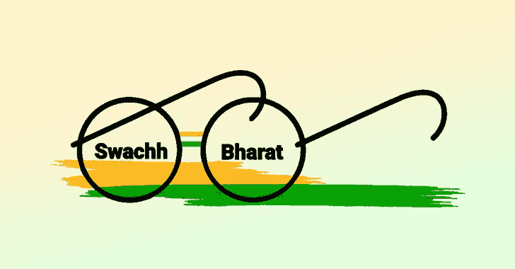

# Swachhata 平台数据泄露:1.6 Cr 人的凭证面临风险

> 原文：<https://medium.com/geekculture/swachhata-platform-data-leak-1-6-cr-peoples-credentials-at-risk-e738951014fc?source=collection_archive---------8----------------------->

作者:[安舒尔·维亚斯](https://www.instagram.com/_ansh_vyas/)

研究人员周三透露，黑客已经入侵了由住房和城市事务部运营的 Swachh Bharat Mission 的 swachh.city 平台，威胁要暴露约 16 亿用户(约 1600 万)的“关键信息”。9 月 23 日星期五，一个名为 LeakBase 的攻击者在 BreachForums(网络罪犯经常使用的在线交易平台)上发布了一个 6GB 的数据转储。

有可能从威胁行为者披露的数据样本中获取受影响用户的注册电子邮件地址、密码哈希、电话号码、发送的 OTP、登录 IP、个人用户令牌和浏览器指纹等信息，以证实他在黑网上的说法。研究人员发现，在地下论坛上，对手的名字是 LeakBase、Chucky、Chuckies 和 Sqlrip，共享一个包含个人身份信息(PII)的数据库，包括电子邮件地址、哈希密码和用户 id，据报道，这影响了 Swachh City 平台的 1600 万用户。

黑暗网络上的 LeakBase marketplace 论坛经常被用来获取经济利益和进行销售。“帖子中披露了一个 1.25 GB 的数据库，它被托管在一个流行的文件托管平台上，”该团队解释说。此外，LeakBase 还提供对大多数 CMS(内容管理系统)管理面板和服务器的访问。根据 CloudSEKA 的说法，如果个人的个人信息被广告出售，那么这些信息很有可能被用来对付他们，因为这些信息是可以出售的。为了获取敏感信息，威胁参与者可以使用这些信息来进行网络钓鱼，例如来自 Swachh City 的伪造违规通知电子邮件，以及社会工程。

研究人员警告说，它可能会让恶意行为者发起复杂的勒索软件攻击，泄露数据，并保持持久性。他们说，它也可以被聚集起来，作为在网络犯罪论坛上进一步销售的线索。研究人员建议实施强密码策略，并在登录时启用 MFA(多因素身份验证)。他们还建议修补易受攻击的端点，并监控用户帐户中可能表明帐户被接管的异常情况。