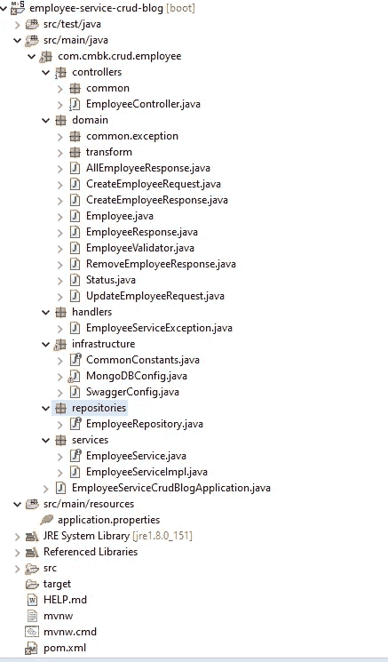
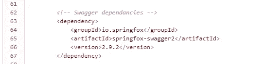
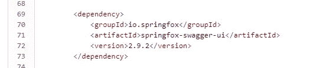
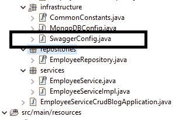
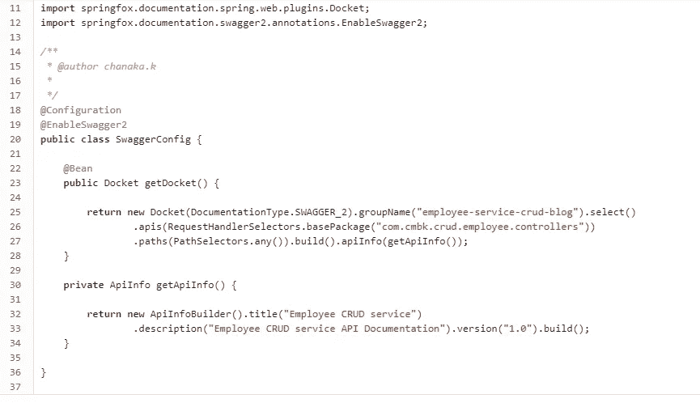
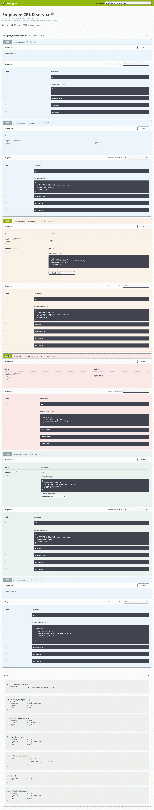
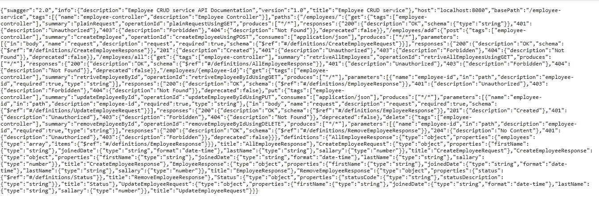

# Swagger 2.0 API 集成到 SpringBoot REST web 服务(第 1 部分:基本集成)

> 原文：<https://medium.com/geekculture/swagger-2-0-api-integration-to-springboot-rest-web-service-part-1-basic-integration-d43948d157fe?source=collection_archive---------1----------------------->

如今，web 应用程序是作为独立的模块(后端/前端)开发的。在这种情况下，我们应该有适当的文档，信息丰富，可读性强，用户友好。在这里，我们将看看使用 Springfox 实现的 Springboot REST web 服务的 Swagger 2.0。

为了描述 Swagger 实现，我使用了 Employee management CRUD 应用程序，它是使用 SpringBoot 开发的。除了 swagger 实现，您还可以学习领域驱动架构、适当的异常处理、日志记录、验证等。但在这里，我将只解释大摇大摆积分。请访问 bitbucket 链接 [**此处**](https://bitbucket.org/employee-crud-service-swagger-blog/employee-crud-service-swagger-blog/src/master/) 下载完整的示例应用程序。

**技术** Java 1.8
Maven 3 . 6 . 1
spring boot 2 . 2 . 7 . release
MongoDB
Swagger 2.0
log4j

**项目结构**

Project structure

首先，我们必须仔细检查我们的控制器端点是否工作正常。我们可以使用 Postman 或任何其他第三方工具来执行端点。
之后，我们还要添加 Springfox 相关的 Swagger 2.o 依赖项。

**第一步:依赖关系**

Swagger 相关依赖。

为了启用 Springfox 的 Swagger UI，我们必须添加另一个名为“springfox-swagger-ui”的依赖项。

**第二步:配置**

在进行配置之前，我们必须创建一个名为**SwaggerConfig.java**的类(您可以为这个配置类使用不同的名称)。

这是它的实现。

在我们的项目中，我们需要显式启用 Swagger 2.0。所以，我们必须在我们的配置类上使用 **@EnableSwagger2WebMvc** 。 **@Configuration** 是一个 spring 相关的注释，表示一个类声明了一个或多个 bean 方法，并且可以被 Spring 容器处理以生成 bean 定义和服务请求。

一旦我们定义了 **Docket** bean，它的 **select()** 方法返回一个 **ApiSelectorBuilder** 的对象，这提供了一种控制由 swagger 公开的端点的方法。

借助于**RequestHandlerSelectors**和 **PathSelectors** ，我们可以为选择 **RequestHandlers** 配置谓词。对两者都使用 **any()，**将使我们整个 API 的文档通过 Swagger 可用。

此外，通过定义 **ApiInfo** bean，我们可以设置一些与文档相关的信息，如标题、API 描述和版本。一旦我们部署了应用程序，它就会出现在 UI 中。请参考下图。

Document related information

我们已经完成了代码级别的基本配置。现在我们可以将这个项目作为一个 spring boot 应用程序来运行。一旦应用程序启动，我们可以在浏览器中访问这个 URL:[**http://localhost:8080/employee-service/swagger-ui . html #/employee-controller**](http://localhost:8080/employee-service/swagger-ui.html#/employee-controller)

Swager UI

在这里，您可以看到所有端点都像基于 UI 的 web 应用程序和模型对象一样工作。非常容易测试，信息量大，可读性强。

**第三步:Swagger API-DOCS**

大多数时候我们需要使用 Swagger API-DOCS。这是一个带有大量键值对的 JSON 响应。要做到这一点，我们可以做的是，只需在我们的浏览器中运行以下网址。[http://localhost:8080/employee-service/v2/API-docs？group = employee-service-crud-blog](http://localhost:8080/employee-service/v2/api-docs?group=employee-service-crud-blog)

Swagger-API doc: JSON format

重要的一点是我们应该使用一个名为" **group** 的查询参数，这个值是在 SwaggerConfig 类的 **getDocket()** 方法内的" **groupName** 中定义的。

我希望这将有助于你的日常工作，我将在不久的将来添加另一个名为**的扩展部分，这是 Swagger 2.0 与 Springboot** 的高级配置。请访问 [**这里获得一个完整的代码示例**](https://bitbucket.org/employee-crud-service-swagger-blog/employee-crud-service-swagger-blog/src/master/) 。如果您有任何问题，请留言或评论。