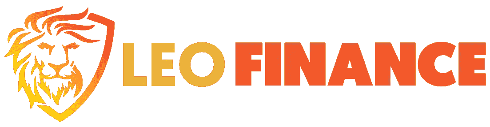

# 作为 UBI 类型的 Swash 和数据所有权— LeoFinance

> 原文：<https://medium.com/geekculture/swash-and-data-ownership-as-a-type-of-ubi-leofinance-9a83bdb3cdc3?source=collection_archive---------25----------------------->

现在，我们生活在一个世界上，全球各地的许多公司和企业能够收集我们的数据，而不用为他们自己的目的付费&对此我们无能为力。也就是说，通过出售自己的数据来赚钱，而不是让公司简单地拿走数据，这不是很棒吗？如果你的数据有价值，难道你和其他人不应该…