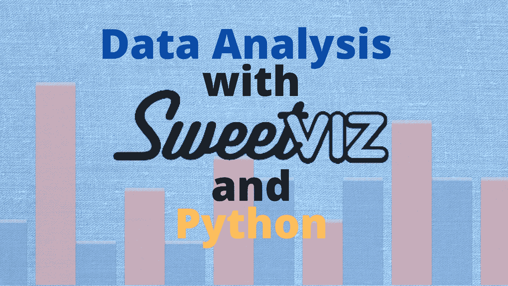
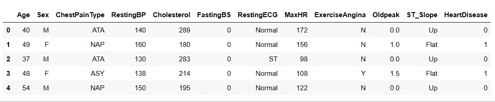
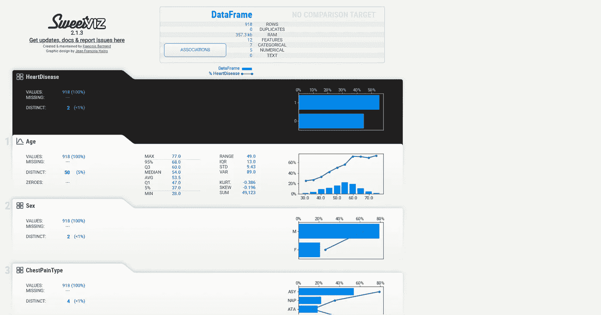
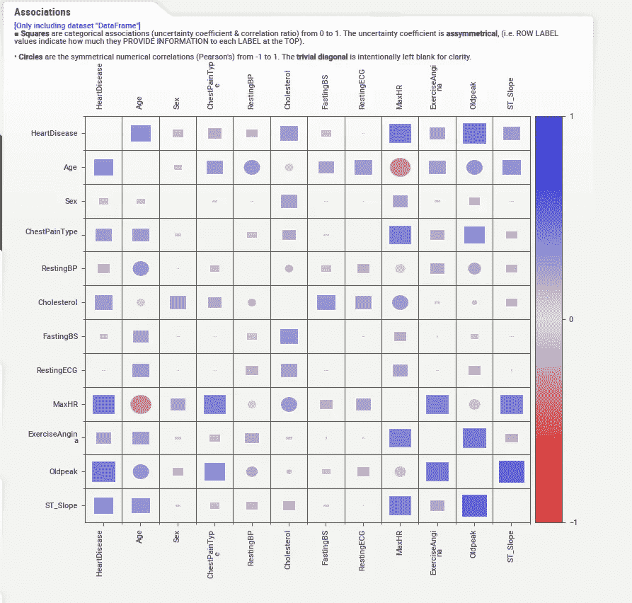
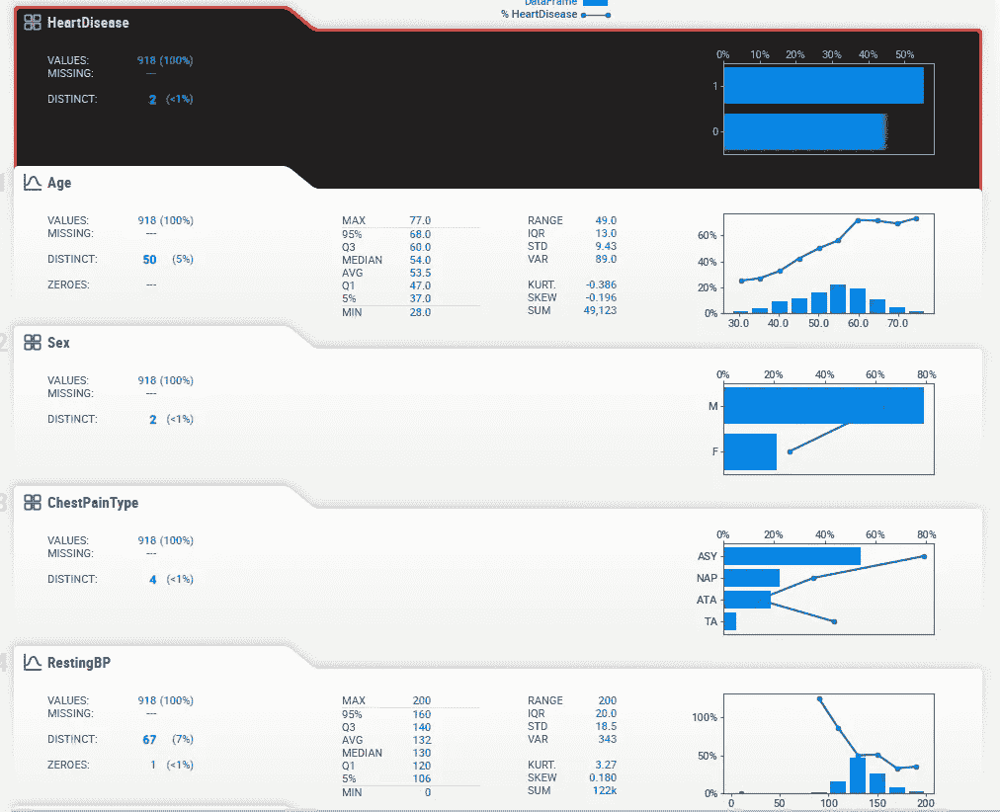
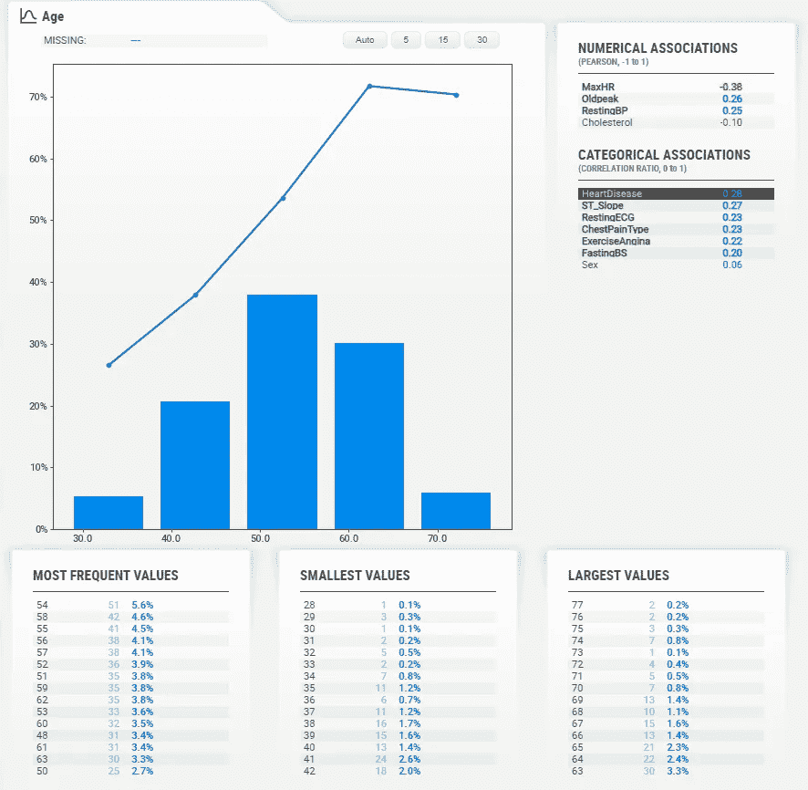
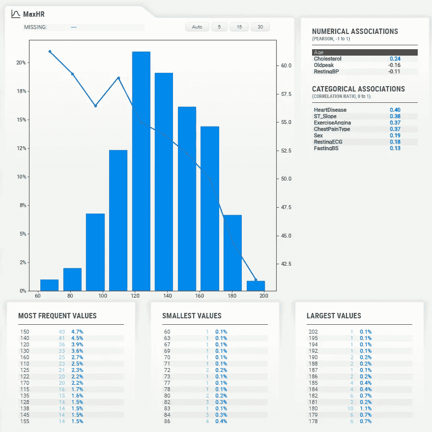
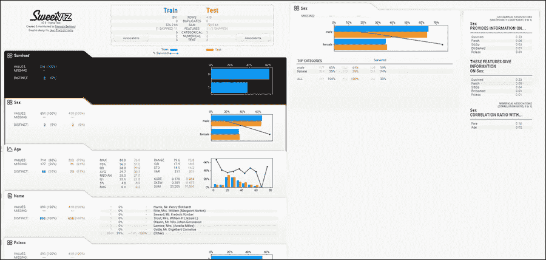

# SweetViz:使用 Python 实现简单的 EDA 和应用数据科学

> 原文：<https://medium.com/geekculture/sweetviz-easy-eda-and-applied-data-science-with-python-e0a665457ad3?source=collection_archive---------8----------------------->



EDA 代表' ***【探索性数据分析'*** 。数据分析是数据科学家/分析师工作的核心部分，可能会是一项非常累人的工作，尤其是当您手头有大量数据且数据类型可变时。

Python 中的数据可视化仍然不是一件容易的事情。有一些 python 数据可视化库，如“ ***matplotlib*** ”库，需要一定的专业知识来操作。如果我们有一个免费的数据可视化工具，一个提供交互式数据可视化的工具，不是很好吗？

**SweetViz** 就是这样一款开源工具，旨在帮助您完成数据分析任务，我的意思是将其全部简化为 2 行代码— *字面意思！！*

如果你喜欢根据你的需求定制你的数据，也许 MatPlotLib 更适合你，你可以在这里[阅读。](https://writersbyte.com/programming/data-visualization-in-python-using-matplotlib/)

[](https://writersbyte.com/programming/data-visualization-in-python-using-matplotlib/) [## 使用 MatPlotLib - WritersByte 在 Python 中进行数据可视化和分析

### 人们经常提出的一个问题是“数据科学 vs 数据分析”。我们已经在许多其他方面讨论了数据科学…

writersbyte.com](https://writersbyte.com/programming/data-visualization-in-python-using-matplotlib/) 

让我们看看这个图书馆有什么魔力。

第一步显然是安装这个库，谢天谢地，这可以用 python 中的一行代码来完成。

```
pip install sweetviz
```

安装完成后，我们可以将这个库导入到我们的 Jupyter 笔记本中。

```
import sweetviz as sv
import pandas as pd
```

我们导入熊猫是因为我们需要加载数据集。

我们使用的数据集是开源的，可以在 Kaggle 上获得。你可以在这里下载[。](https://www.kaggle.com/fedesoriano/heart-failure-prediction)

```
data = pd.read_csv(“heart.csv”)data.head()
```



Data for heart disease classification

现在开始变魔术吧！！

```
my_report = sv.analyze(data, "HeartDisease")
```

就是这样！这就是神奇之处，这一行代码为我们做了一切。

上面的执行将在您的工作目录中创建一个 HTML 文件，但是如果您在 Jupyter 中工作，您可以通过以下命令启动 HTML 文件:

```
my_report.show_html()
```

让我们看看在这个文件中我们得到了什么。



SweetViz HTML report.

在最上面，我们看到了数据框的一个非常简短的摘要。该摘要包括:

*   数据集中的总行数。
*   重复行数。
*   它在 RAM 上占用的内存。
*   总特征(列)及其分布方式(数字、分类、文本)。

在同一个框中，我们看到一个标记为“**关联**”的按钮。单击此按钮将打开另一个框。



Feature associations.

这里我们可以看到每个变量是如何与其他变量相关联的。顶部的描述暗示了正方形和圆形的含义。正方形是数据中的分类关联，圆形是数字数据之间的关联。由于我们的大部分数据都是分类的，我们在上面的表格中看不到大量的数值相关性。

右边的颜色条显示了变量之间的关联程度。我们可以看到' *MaxHR* 和' *Age* 有轻度的负相关。

现在回到主控制面板，我们可以看到一个选项卡列表，每个选项卡代表数据集的一个功能。



Features of the dataset.

单击任何一个特性都会打开对它的详细分析。让我们来看看 ***年龄*** 变量。

[](https://writersbyte.com/datascience/5-data-processing-techniques-for-data-science-beginners-python-and-pandas/) [## 面向数据科学初学者的 5 种数据处理技术| Python 和 Pandas - WritersByte

### 对于所有寻找数据科学工作或数据科学实习的年轻科学家来说，数据处理是一项技能…

writersbyte.com](https://writersbyte.com/datascience/5-data-processing-techniques-for-data-science-beginners-python-and-pandas/) 

Analysis of the ages within the dataset.

年龄以直方图的形式表示。我们可以看到，我们的数据主要由年龄在 48 到 56 岁之间的人组成。下面我们看到最大值、最小值和最频繁出现的值的分布。

[](https://writersbyte.com/datascience/ai-for-beginners-2/) [## 面向初学者的人工智能:机器学习 VS 深度学习

### 在本系列的前一篇文章“人工智能基础”中，我解释了人工智能这个术语

writersbyte.com](https://writersbyte.com/datascience/ai-for-beginners-2/) 

## 目标特征

在上面分享的截图中，你会注意到除了直方图之外，图表上还画了一条线。这一行描绘了我们的 ***目标变量。*** 这是 SweetViz 2.0 中引入的另一项功能，您可以使用该功能检查特定功能相对于数据集中所有其他功能的趋势。

这是一个有用的特性，但在我们的例子中有点难以理解，因为我们的数据主要由分类变量组成，并且将不同类型的变量相互比较没有直观的意义。在上图中，与其他人相比，我们有“**心脏病**”特征。这是一个二元变量，在同一个网格上，把它和连续变量画在一起，实际上没有意义。

然而，为了利用这个特性，我们可以检查它实际上有意义的特性。



MaxHR vs Age

这里我们对最大心率和患者年龄进行了比较。趋势很明显。这两个变量具有负相关性，因为我们可以看到，随着最大心率的增加(正是本文开头讨论的*关联*网格所描述的)，人的年龄会降低。大多数 55 岁以上的人的心率都在 60 到 70 之间。同样，30 岁左右的人，心率达到 200 左右。

## 比较数据帧

SweetViz 还允许我们通过在同一网格上绘制相同特征的两个不同数据集并分析其趋势，从而对它们进行比较。可以用下面的方法来做。

```
sv.compare(data1, data2)
```



snapshot from [the official documentation](https://pypi.org/project/sweetviz/)

上面的快照显示了测试和训练数据帧的比较。

[](https://writersbyte.com/programming/4-key-python-data-structures-e-very-beginner-must-know/) [## 每个初学者都必须知道的 4 个关键 Python 数据结构。- WritersByte

### 最近几年，Python 已经成为最受编程新手欢迎的语言，因为它易于使用，而且…

writersbyte.com](https://writersbyte.com/programming/4-key-python-data-structures-e-very-beginner-must-know/) 

## 结束了

探索性数据分析可能是一项单调乏味的任务，这就是为什么像这样的工具对于快速浏览数据来说非常方便。为了进行深入分析，您必须根据自己的需求和用例编写自己的脚本，但无论何时您时间紧迫或需要快速分析，都可以使用像 SweetViz 这样的工具来简化您的工作。