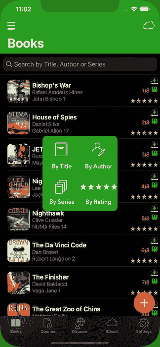
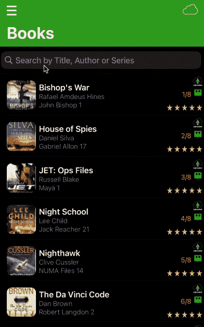
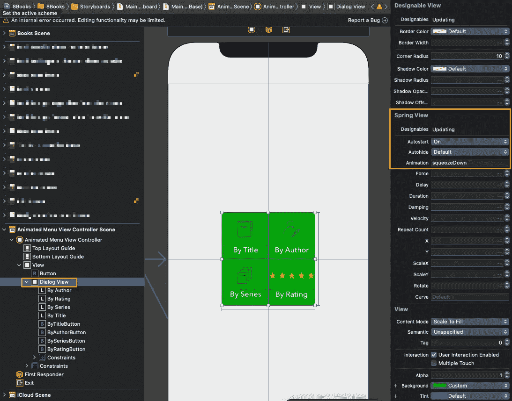
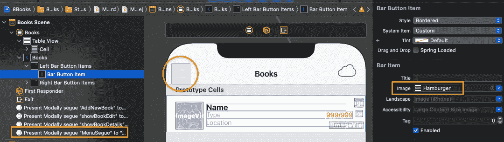
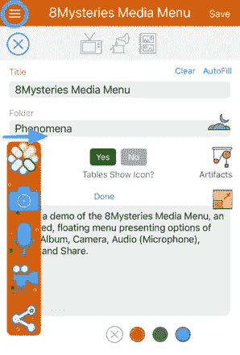

# Swift 动画浮动菜单

> 原文：<https://medium.com/geekculture/swift-animated-floating-menu-38b952bfeffc?source=collection_archive---------16----------------------->

## 向应用程序中的任何视图添加动画浮动菜单

Books Table View Showing the In-Place Sort Floating Menu

# 方案

我们的应用程序将允许用户通过使用一个动画，浮动菜单排序图书表视图。点击“汉堡”菜单按钮就可以触发菜单，并提供 4 种分类标准:按标题、作者、系列和(用户)评级。

GIF Books Table View Animated, Floating Sort By Menu

# 技术

我们在它自己单独的视图中设计菜单，一个**nimatedmenuviewcontroller . swift**，然后在表格视图上覆盖一个透明背景。动画由 GitHub 的孟托的春天包提供。当表格排序“就地”发生时，我们在 **viewWillAppear()** 中刷新表格视图。

**BooksTableViewController . swift**作为**委托**给 AnimatedMenuViewController，这样用户在菜单上的任何动作都可以被 BooksTableViewController 检测到，排序逻辑被执行。

# 观众

本文面向寻求完整、成熟、以代码为中心的解决方案来加速开发项目的 Swift 开发人员。下面的代码片段可以通过最小的定制来使用。

# 应用模型

我们的文章基于苹果应用商店发布的[apps gam Books](https://appsgym.com/projects/books/)模型应用，你可以在 AppsGym.com 上免费下载完整的 [Xcode 项目](https://appsgym.com/appsgym-books-swift-xcode-project-tour/)。

# 用户界面

有 2 个视图需要考虑:菜单**视图**视图(顶部/覆盖)和**表格**视图(底部/底层)。菜单视图将清楚地显示菜单选项，具有透明或半透明的背景，因此它不会覆盖底层的表格视图。

**animatedmenuviewcontroller . swift**将菜单本身作为**designable view**:SpringView(从萌到 GitHub 上的 Spring 包；meng@designcode.io)，从而让**挤下**动画(下图)。当然，你可以选择任何其他的动画包或者你自己的代码。

AnimatedMenuViewController.swift Storyboard, Showing DesignableView Menu

**bookstableviewcontroller . swift**显示我们的应用程序书籍(来自核心数据)，并显示汉堡菜单的左上角图标，这将触发(通过 segue)浮动菜单。

BooksTableViewController.swift Storyboard, Showing Hamburger Menu Icon

# 逻辑

首先，我们设计浮动菜单来执行 4 个动作:按照书名、作者、系列或(用户)评级对底层 UITableView 进行就地排序。我们选择一个正方形的设计，但是你可以把按钮放在任何堆栈中(水平的，垂直的，等等)。).

我们的**animatedmenuviewcontroller . swift**类将有一个**委托协议**，AnimatedMenuViewControllerDelegate，有 4 个函数对应于 4 个菜单操作。

然后，我们为每个被触摸/轻击的按钮构造@**I action**，简单地将哪个菜单按钮被触摸/轻击的指示传递给调用视图(BooksTableViewController)。然后我们关闭浮动菜单，这样 UITableView 知道哪个按钮被触摸/点击，将对显示的记录执行相应的操作。

示例:用户点击(sort) ***By Author*** 按钮，菜单委托协议将把该按钮传递给图书表格视图。UITableView 作为一个委托，将“感知”按钮点击并执行相关的逻辑代码(按作者对显示的图书记录进行排序并刷新视图)。

如果用户决定不使用菜单,我们还需要一种方法让菜单**消失。因此，我们将在菜单后面添加一个透明按钮，看不见但覆盖整个视图，并将其连接到一个菜单解除逻辑。因此，如果用户点击菜单“框”外的任何地方，菜单将被取消，并且不采取任何行动。我们也可以选择让菜单消失，而不是突然消失，在我们的例子中，我们将让它“落下”屏幕。**

# 密码

# 代码:动画菜单

以下 Swift 代码片段摘自**animatedmenuviewcontroller . Swift，**显示菜单并设置代理协议功能。

animatedmenuviewcontroller . swift

# 代码:表格视图

**bookstableviewcontroller . swift**viewwilappear 检查选中的用户菜单排序选项，为每个菜单选项定义排序描述符，检索核心数据记录，对其进行排序，并通过 **reloadData()** 刷新表格视图。

bookstableviewcontroller . swift**viewwilappear()**

准备(为了继续..):检查 segue 标识符是否为‘MenuSegue’并启动菜单。

bookstableviewcontroller . swift**准备(对于 segue:..)**

bookstableviewcontroller . swift**委托** **功能**

以下两个功能是针对 menuviewcontrollerdidtuchbutton 3 中的**系列**和**系列 No** 分类的。

本文介绍了实现动态浮动菜单的完整设置、逻辑和代码。我们使用的例子是书籍的显示表格视图的就地排序。

然而，浮动菜单可以在应用程序的任何视图中使用，从任何方向动画和浮动，并执行任何操作，利用相同的代理和协议原则。例如:在一些应用程序中，我们利用浮动菜单作为媒体菜单，包含相册、相机、音频(麦克风)、视频和共享选项。

希望你发现浮动菜单对你的应用有用。感谢阅读！