# Swift : Apple Pay 集成

> 原文：<https://medium.com/geekculture/swift-apple-pay-integration-3b33da108992?source=collection_archive---------12----------------------->

几天前，我需要在我的一个 swift 项目中实现 apple pay 集成，我试图在互联网上寻找，但要么文档已经过时，要么集成步骤定义没有更新。因此，在这里我提供了最新的步骤，让您可以轻松地创建证书，也可以集成到您的应用程序。

因此，让我们看看在苹果开发门户网站上配置 apple pay 需要哪些步骤。

**第一步→注册商家 ID**

*   在成员中心，选择证书、标识符和配置文件。
*   在标识符下，选择商家 id。
*   点按右上角的添加按钮(+)。
*   输入描述和标识符，然后单击继续。
*   检查设置，然后单击注册。
*   单击完成。

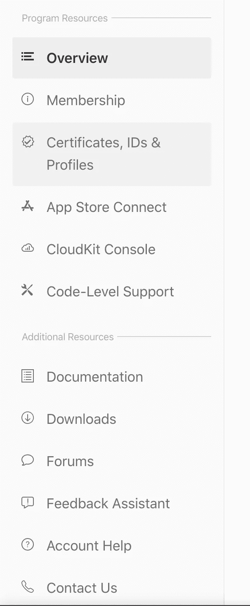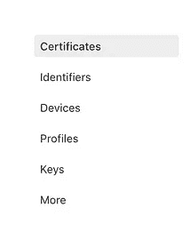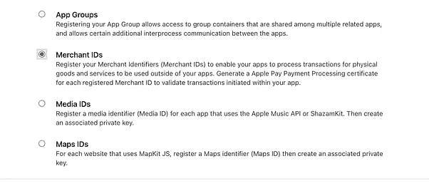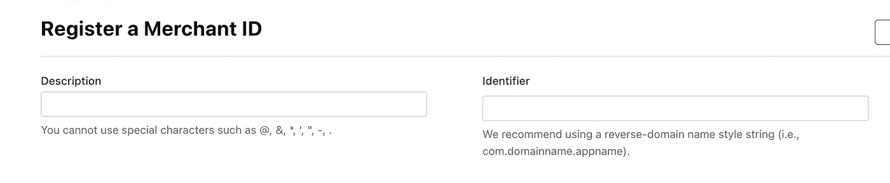

**第二步→创建支付处理证书**

*   在成员中心，选择证书、标识符和配置文件。
*   在标识符下，选择商家 id。
*   从列表中选择商家 ID，然后单击编辑。
*   在付款处理证书部分，单击创建证书。按照说明获取或生成您的证书签名请求(CSR)，然后单击继续。
*   单击选择文件，选择您的 CSR，然后单击生成。
*   通过单击下载下载证书，然后单击完成。

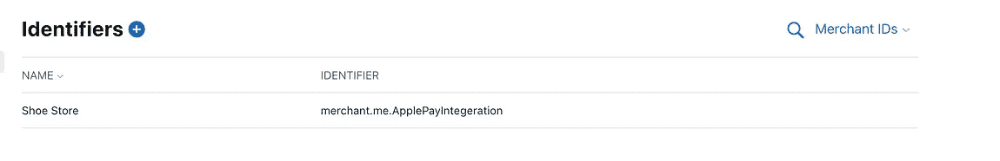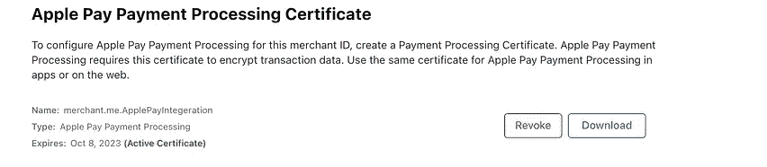

**步骤 3 →沙盒测试账户设置**

要创建沙盒测试者帐户，请按照下列步骤操作:

*   登录 App Store Connect。
*   在主页上，单击用户和访问。
*   在“沙盒”下，单击“测试人员”。
*   单击“+”设置您的测试仪帐户。
*   填写测试人员信息表，然后单击邀请。
*   在所有测试设备上注销您的 Apple ID，然后使用新的 sandbox tester 帐户重新登录。

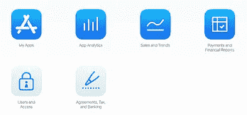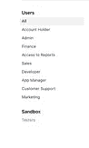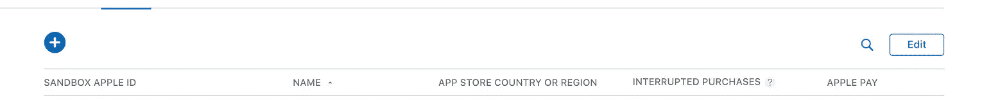

完成所有步骤后，是时候跳到 Xcode 并开始一个新项目了。随便你给它起什么名字。

之后，转到目标，点击签名和功能，然后从下拉菜单中点击苹果支付。请务必在那里检查您的商家 id。

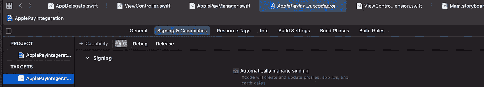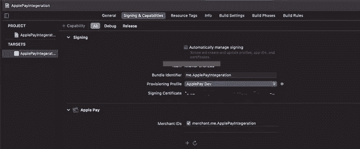

然后打开你的视图控制器，创建你喜欢的 UI。在这里，我创建了一个产品列表，上面有它们的价格，点击购买时，我会调用 apple pay。

以下是实施的屏幕截图:

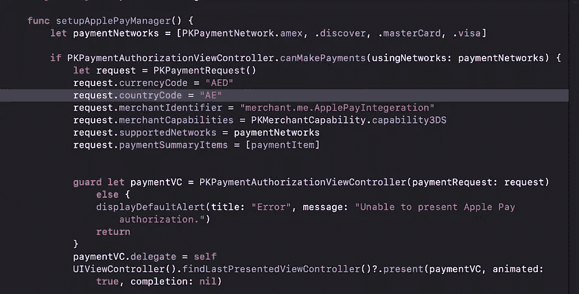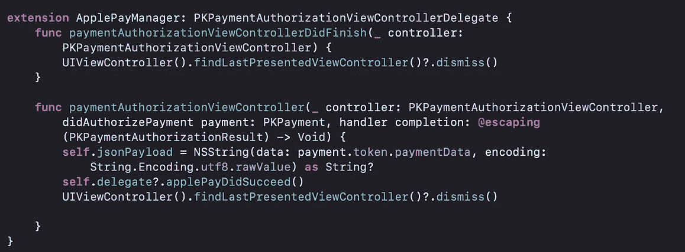

也要记住一件事，总是在真实的设备上测试它，否则你可能在授权支付后得不到有效载荷。此外，对于商户测试信用卡，请遵循苹果文档中的步骤<[https://developer.apple.com/apple-pay/sandbox-testing/](https://developer.apple.com/apple-pay/sandbox-testing/)

对于完整的代码实现，您可以查看我的 github repo。
[https://github.com/farazhaider88/ApplePayIntegeration](https://github.com/farazhaider88/ApplePayIntegeration)