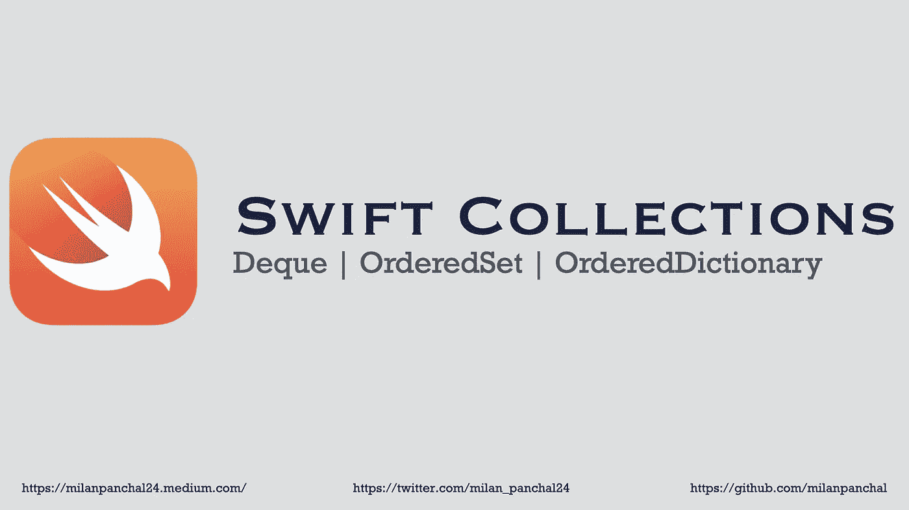

# Swift 集合—扩展 Swift 数据结构

> 原文：<https://medium.com/geekculture/swift-collections-extending-swift-data-structures-787d12e0b2d4?source=collection_archive---------13----------------------->

**Swift Collections — Deque | OrderedSet | OrderedDictionary**

*   [Swift Collections](https://github.com/apple/swift-collections) ，一个新的开源包，专注于扩展可用的 Swift 数据结构集。
*   这个包目前提供了最常被请求的数据结构的实现:`Deque`、`OrderedSet`和`OrderedDictionary`。

## 1)德克

*   `Deques`(读作“deck”)，是双端队列的简称，类似于`Array`，但是支持两端的高效插入和移除。每当我们需要 FIFO 队列时，这使得 deques 成为一个很好的选择。
*   您可以使用`prepend`方法在队列的开头插入一个新元素，使用`append`方法在队列的结尾插入一个元素。
*   类似地，您可以使用`popFirst`和`popLast`从队列末端弹出元素。

Swift Collection — Deque Example

*   *前置一个元素对于* `*Deque*` *是常数时间运算，对于* `*Array*` *是线性时间运算。*
*   *以任意偏移量访问元素对于* `*Deque*` *和* `*Array*` *都是一个恒定时间的操作。*

## 2)订购集

*   `OrderedSet`是`Array`和`Set`的强大混合体。
*   像`Set`一样，它确保它们的每个元素都是唯一的，并为`contains`提供有效的成员测试，同时保留它们被追加的顺序，就像`Array`一样。
*   我们可以用任何符合`Hashable`协议的元素类型创建一个有序集:

Swift Collection — `OrderedSet` Example

*   *追加一个元素，包括保证它的唯一性，是* `*OrderedSet*` *的一个常量时间操作。*
*   *成员测试对于* `*OrderedSet*` *是一个常数时间操作，而对于* `*Array*` *是一个线性时间操作。*

## `3) OrderedDictionary`

*   一个`OrderedDictionary`提供了许多与`Dictionary`相同的操作，同时保留了它们被追加的顺序。
*   它由键的`OrderedSet`和元素的常规`Array`组成，可以使用`.keys`和`.elements`属性有效地访问这两者。

我们可以用任何符合`Hashable`协议的键类型创建一个有序字典。如果添加了一个新条目，它会被追加到词典的末尾。

Swift Collection — OrderedDictionary Example

*   `OrderedDictionary`使用整数索引，第一个元素总是从`0`开始。
*   为了避免基于**键的**和基于**索引的**下标之间的歧义，`OrderedDictionary`不直接与`Collection`一致。相反，它提供了对键值对的随机访问视图:

Swift Collection — OrderedDictionary **key-based** & **index-based** subscripts

*   *在* `*OrderedDictionary*` *中插入一个新的键值对，在常量时间内追加。*
*   *查找一个键的值是一个* `*OrderedDictionary*` *的恒定时间操作。*

# 促成 Swift 收款

[Karoy Lorentey](https://github.com/apple/swift-collections)说，Swift Collections 可在 GitHub 上获得，欢迎投稿，尽管它们应该满足可靠性、性能和内存使用方面的严格标准

# 有问题吗？

如有疑问，欢迎在下方评论，**。**

如果你喜欢这篇文章，请分享给你的朋友，并给我留下评论。此外，单击👏拍拍下面的按钮，表示你有多喜欢这篇文章。

感谢阅读！👨🏼‍💻

# 您可以在以下网址找到我:

[Twitter](https://twitter.com/milan_panchal24)|[LinkedIn](https://www.linkedin.com/in/milanpanchal/)|[GitHub](https://github.com/milanpanchal)|[Medium](/@milanpanchal24)|[hacker rank](https://www.hackerrank.com/milanpanchal)|[leet code](https://leetcode.com/milanpanchal/)|[堆栈溢出](https://stackoverflow.com/users/1748956/milanpanchal)