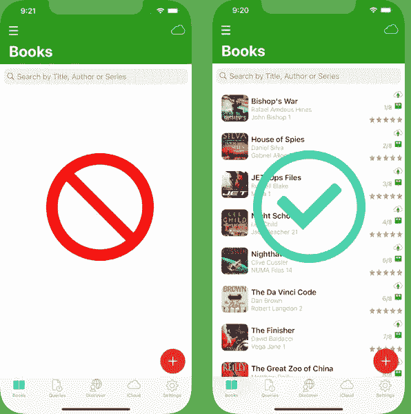

# 应用首次发布时的 Swift 核心数据预加载

> 原文：<https://medium.com/geekculture/swift-core-data-preload-at-app-first-launch-e8b54cc2c3d6?source=collection_archive---------28----------------------->

**样本记录的核心数据预加载在应用程序首次启动时填充视图。**

AppsGym Books App Core Data Preload vs Empty Table View

# 方案

我们的应用程序将在首次启动时填充图书表视图的初始视图，优先于空表视图或带有图像或动画的视图，以提示用户添加记录。这种方法还将帮助用户探索应用程序的特性和功能，以获得良好的第一印象。

# 技术

我们将在视图出现之前和视图加载之后构建核心数据样本记录，然后检查这是否是应用程序的第一次启动，如果是，则从核心数据样本记录填充视图。

# 观众

本文面向寻求完整、成熟、以代码为中心的解决方案来加速开发项目的 Swift 开发人员。下面的代码片段只需很少的定制就可以使用(你的应用核心数据记录)。

# 应用模型

我们基于苹果 App Store 上发布的 AppsGym [Books](https://appsgym.com/projects/books) 模型应用(名为 [8Books](https://apps.apple.com/au/app/8books/id1152860892) ，你可以在[AppsGym.com](https://appsgym.com)上免费下载完整的 [Xcode](https://appsgym.com/appsgym-books-swift-xcode-project-tour/) 项目。

# 用户界面

不需要特定的 UI 设置，因为 UITableView 显示逻辑和代码将显示核心数据记录，无论是应用程序首次启动时的样本记录，还是后续应用程序启动时的完整核心数据记录集。

# 逻辑

**BuildCoreData.swift** 将初始化核心数据实体‘Book’和‘Book photos’，managedObjectContext 和 dateFormatter。

然后，我们将在自己的函数中构建每个图书样本记录和相关的图像，然后在一个主函数中调用所有样本记录函数。然后，我们将设置应用程序 UserDefaults，以表明我们添加了样本记录。

在**bookstableviewcontroller . swift**中，我们将检查 UserDefaults 以确定是否已经添加了样本记录，如果为假，则执行构建样本记录的主函数。

# 密码

BuildCoredData.swift **初始化**

buildcoreddata . swift**add 8 books records()**

buildcoreddata . swift**add 8 book1()**

*使用 add8Books2()，… add8Books8()，对所有样本记录重复上述步骤。*

**bookstableviewcontroller . swift viewDidLoad()**

本文介绍了用 app 样本记录预加载核心数据数据库的完整逻辑和代码。显示应用程序记录的初始 UITableView 将检查这是否是应用程序首次启动，并显示示例记录(而不是空视图或临时图像/动画)。希望你觉得它在你的应用程序中有用。感谢阅读！