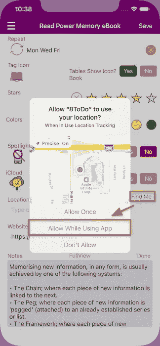
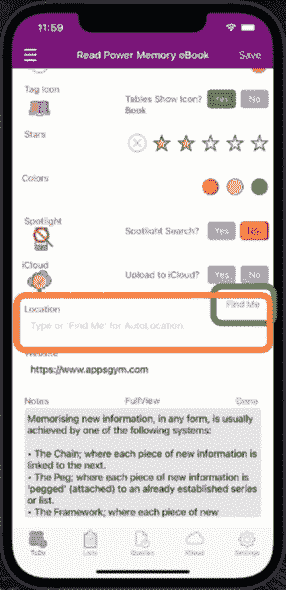
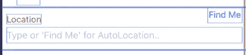

# Swift“找到我”地址位置跟踪器

> 原文：<https://medium.com/geekculture/swift-find-me-address-location-tracker-86d0bca93ab3?source=collection_archive---------15----------------------->

“查找我”功能将查找并显示用户电话位置的地址

AppsGym ToDo App Find Me Feature

# 方案

我们的应用程序主 ToDo 视图将有一个位置文本字段，用户可以在其中输入街道地址。可选地，该应用程序还将提供一个“找到我”按钮。用户将点击/触摸按钮，授权位置跟踪，应用程序将检索当前用户位置的地址，并自动在位置文本字段中填充地址。

# 技术

我们将利用**核心位置**框架、 **CLLocationManager()** ，并进行反向地理编码。**地理编码**是将地址(如街道地址)转换为地理坐标(如纬度和经度)的过程，您可以使用地理坐标在地图上放置标记或定位地图。**反向地理编码**是将地理坐标转换成人类可读地址的过程(参考谷歌)。

在我们看来,“查找我”按钮会将设备位置坐标转换为位置地址文本(反向地理编码)。因此，我们将利用**地理编码器..)**函数，检索一个 **CLPlacemark()** ，一个地理坐标的用户友好描述，然后在一行文本字段中构造地址。

GIF AppsGym ToDo Find Me Button and Address

# 观众

本文面向寻求完整、成熟、以代码为中心的解决方案来加速开发项目的 Swift 开发人员。下面的代码片段可以通过最小的定制(你的应用程序按钮和文本字段)来使用。

# 应用模型

我们的文章基于苹果应用商店上发布的 AppsGym [ToDo](https://appsgym.com/todo-lists-notifications-multimedia/) 模型应用，你可以在 AppsGym.com 上免费下载完整的 [Xcode](https://appsgym.com/downloads/) 项目。

# 用户界面

我们需要一个 UITextField 和一个 Find Me ui button T21。文本字段将存储街道地址，无论用户是手动添加(通过键入)还是通过“查找我”按钮反向地理编码逻辑自动添加。

AppsGym ToDo Location Text Field and Find Me Button

# 逻辑

**noteviewcontroller . swift**将作为**CLLocationManagerDelegate**，因此它可以检索 CLLocationManager 获得的位置信息。

**findMeButtonAction()** 将触发 **findMe()** 函数，该函数将实例化 **CLLocationManager()** ，请求授权，并开始更新位置，将每个位置添加到数组 locations[]中。我们将只选择第一个条目**位置【0】**，然后停止位置跟踪。

现在我们有了位置信息，我们将使用 **reverseGeocodeLocation(..)**将位置转换为一个 [**CLPlacemark**](https://developer.apple.com/documentation/corelocation/clplacemark) ，一个预定义的变量，存储地址的组成部分。我们将检查每个组件，如果有值，就将它存储在相应的文本变量中。最终地址将是所有组件的串联。

CLPlacemark 的主要组成部分有:subThoroughfare、cancel、subLocality、Locality、subAdministrativeArea、postalCode 和 Country。

# **密码**

****noteviewcontroller . swift**初始化& findMeButtonAction()**

****noteviewcontroller . swift find me()****

**noteviewcontroller . swift location manager(..)委派法**

****位置跟踪授权的信息列表**条目**

****

**Info.plist Privacy for Location Tracking Authorisation**

**本文介绍了允许用户自动输入位置地址或检索当前位置地址的完整逻辑和代码。我们称检索位置地址为反向地理编码。用户将点击“查找我”按钮并授权位置跟踪，然后应用程序将检索位置坐标，转换为街道地址并填充位置文本字段。希望你觉得它在你的应用程序中有用。感谢阅读！**