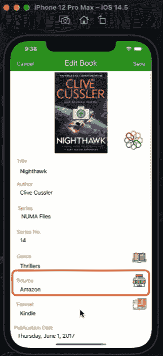
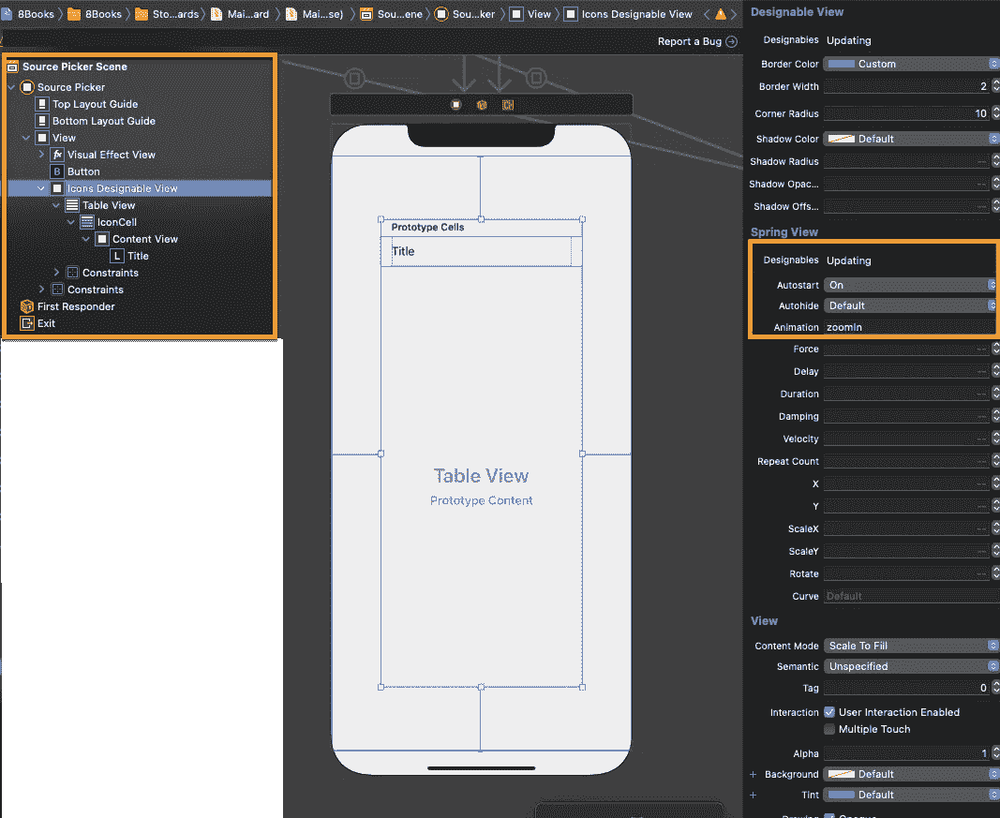
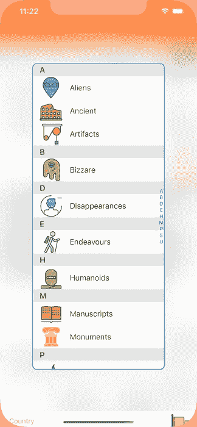

# 带有索引和章节标题的快速浮动弹出选择器

> 原文：<https://medium.com/geekculture/swift-floating-pop-up-picker-with-index-and-section-headers-c71fa7dfe44d?source=collection_archive---------11----------------------->

浮动弹出选择器允许用户从预定义的列表中进行选择，并将选择的值传递回调用视图控制器。

Book Source Animated Floating Pop-Up Picker

# 方案

我们的应用程序将允许用户启动一个弹出选择器，从值列表中选择，然后将选择的值传递回原始视图。在我们的例子中，新书和编辑书籍视图包含 3 个弹出选择器:**流派**、**来源**和**格式**。体裁涵盖了书籍的类别(惊悚、言情等。)，Source 涵盖了来源或出版商(亚马逊、Kobo、公共图书馆等。)和格式涵盖介质(电子书、精装等。).

作为一个实际的例子，本文将关注于**源**，但是这个逻辑适用于您为应用程序选择的任何弹出选择器。

GIF Book Source Pop-Up Picker

# 技术

在两个视图(新建/编辑图书和来源选择器)之间传递数据的概念需要在 Swift 中实施**委托**功能。

因此，我们从定义**SourcePickerViewController**开始，其中的值供用户选择，以及它的**SourcePickerViewControllerDelegate**协议，其中我们编写了当用户选择一个值时触发的函数，并将其传递给调用视图控制器。

然后我们将**NewBookTableViewController**和**EditBookTableViewController**指定为 SourcePickerViewController 的代理，通过协议函数接收其数据(用户选择的值)。

# 观众

本文面向寻求完整、成熟、以代码为中心的解决方案来加速开发项目的 Swift 开发人员。下面的代码片段可以通过最小的定制来使用。

# 应用模型

我们的文章基于苹果应用商店发布的[apps gam Books](https://appsgym.com/projects/books/)模型应用(名为 [8Books](https://apps.apple.com/au/app/8books/id1152860892) ，你可以在 AppsGym.com 上免费下载完整的 [Xcode 项目](https://appsgym.com/appsgym-books-swift-xcode-project-tour/)。

# 用户界面

**source picker viewcontroller**将利用故事板设置实现以下功能:

> 背景的视觉效果模糊，覆盖了整个底层视图
> 
> 背景按钮关闭弹出窗口(没有选择)，它覆盖了整个底层视图
> 
> 可设计的视图来包围数值的表显示，这允许动画
> 
> 显示值(表格的单元格/行)并允许选择的表格视图

可选地，我们可以动画显示弹出选择器的启动和浮动，在我们的例子中，我们将使用 Meng To 的来自 GitHub 的 Spring 包，链接到 Designable 视图。发布动画将是一个“zoomIn”。自然，你可以使用自己的动画包或代码。

最终的**故事板** UI 将如下图所示。如果您使用 SwiftUI，您将需要以编程方式复制该设置。

我们利用一个按钮(图标图像)/序列方法来显示来自两个视图控制器的弹出选择器:**newbooktableviewcontroller . swift**和**editbooktableviewcontroller . swift .**

# 逻辑

首先，我们需要设计 SourcePickerViewController 来显示一个值列表，带有一个索引(源名称的第一个字母)和几个部分。然后设置逻辑来选取一个值，并将其传递回调用视图控制器。

协议**SourcePickerViewControllerDelegate**将有一个函数 *didPick* ，其参数为字符串 *iconName* 。

类**SourcePickerViewController**将构造一个 *iconsDict* ，一个所有 picker 值的字典，带有一个包含节标题首字母的数组*iconserctiontitles，*作为节标题。

在我们的示例中，我们想要实现一个**动画，**因此我们将把值表放在一个 *iconsDesignableView* 中，它是由 Meng To 的 Spring 包(来自 GitHub)制作的动画。需要一个 *closeButtonAction* ，该按钮作为 *iconsDesignableView、*到的背景，允许用户在不选择值的情况下关闭选取器。

我们将所有的选择器列表值添加到一个数组*图标*中。然后我们使用 **UITableView** 函数来显示数组中的表格单元格(行)。

**NewBookTableViewController**类将充当*SourcePickerViewControllerDelegate*并实现 *didPick* 函数，检索选定的值。带有图标图像的“查看源代码”按钮将转到 SourcePickerViewController。

# 密码

# **提货人代码**

**sourcepickerviewcontroller . swift**

# **查看控制器代码**

**newbooktableviewcontroller . swift**(类似于 editbooktableviewcontroller . swift 中的设置，只是 sourceTextField 的初始值是从 viewDidLoad()中的核心数据中检索的)。

本文介绍了实现一个动画、浮动、弹出选择器的完整设置、逻辑和代码，该选择器带有一个索引和部分标题。用户通过点击视图上的按钮来触发选择器，并从选择器列表中选择一个值。选取器将选定的值传输回调用视图控制器。我们使用的例子是图书来源选择器。

# **增强功能**

上面的例子工作得很好，但是它是针对文本硬编码列表的。如果我们想在选择器列表中添加一个**图像**，使其动态化，从**核心数据**实体中检索列表值，并允许用户在列表上执行 CRUD(创建、查看、更新、删除)操作，会怎么样？

这些特性将在下一篇文章中以完整的代码详细介绍。敬请期待！

Pop-Up Picker with Images and Dynamic List from Core Data

希望这篇文章对你的应用有用。感谢阅读！