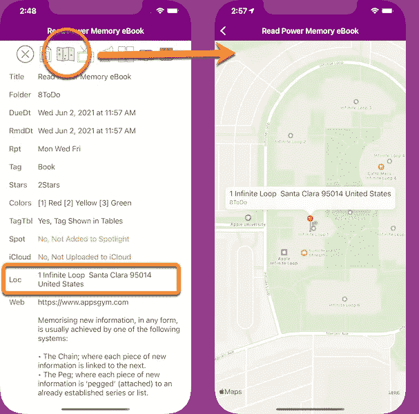
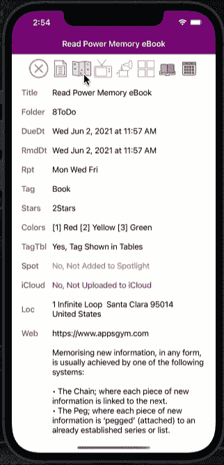
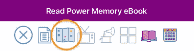
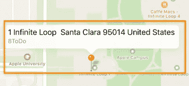
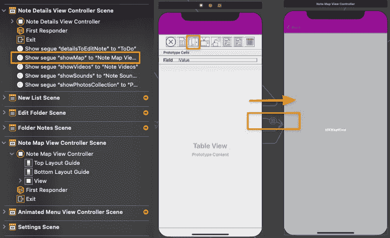
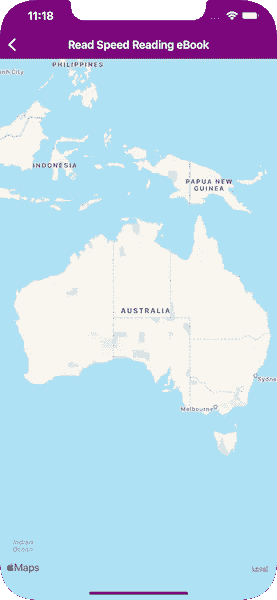

# 位置地址的 Swift 地图

> 原文：<https://medium.com/geekculture/swift-map-of-a-location-address-dadb167786d8?source=collection_archive---------3----------------------->

Swift MapKit 将显示位置街道地址的地图

AppsGym ToDo App Map of a Location Address

# 方案

我们的应用程序待办事项详细信息视图将有一个地图按钮，用户可以点击以显示位置文本字段地址的地图。

# 技术

我们将利用 **MapKit** 框架、 **GLGeocoder()** 和地理编码。**地理编码**是将地址(如街道地址)转换为地理坐标(如纬度和经度)的过程，您可以使用地理坐标在地图上放置标记或定位地图。反向地理编码是将地理坐标转换为人类可读地址的过程(参考 Google)。

在我们的地图视图中，我们将把位置地址文本转换成一个**地标**坐标，然后用于定位和绘制地图。因此，我们将利用**地理编码器 geocodeAddressString(..)**函数，以位置文本为参数，检索一个地标坐标，然后用一个 **MKPointAnnotation()** 绘制一个地图图钉(Annotation)，以位置地址为图钉标题。

GIF Details Map Button Segues to the Map View

# 观众

本文面向寻求完整、成熟、以代码为中心的解决方案来加速开发项目的 Swift 开发人员。下面的代码片段可以通过最小的定制来使用。

# 应用模型

我们的文章基于苹果应用商店上发布的 AppsGym [ToDo](https://appsgym.com/todo-lists-notifications-multimedia/) 模型应用，你可以在 AppsGym.com 上免费下载完整的 [Xcode](https://appsgym.com/downloads/) 项目。

# 用户界面

我们需要一个细节视图上的**地图****ui 按钮**，它将继续到地图视图。笔记地图视图将在整个屏幕上显示地图，使用 **MKMapView，**突出显示红色大头针(注释),其标题作为位置地址。

ToDo Details View Map Button

Map View Pin with Address

细节和地图**故事板**显示细节视图地图按钮和一个简单的“显示”序列，而地图视图只有一个 **MKMapView** 覆盖整个视图区域。

注意:在您的应用程序中，您可以选择一个覆盖部分视图的地图视图，或者甚至作为详细视图的弹出模式(请参考我们关于 Swift 浮动弹出的文章)。

# 逻辑

**note detailsview controller . swift**将包含一个地图 UIButton，它最初将显示是否输入了一个位置(通过将按钮图像从灰色变为彩色)。如果有位置字段文本，该按钮将使用显示“推送”继续到**notemapviewcontroller . swift**。我们可以直接在故事板上建立序列，或者通过编程在 UIButtonAction 中建立序列。我们的模型应用程序使用直接故事板序列，因为这是一个相对简单的设置。*注意*:如果你正在使用 *SwiftUI* ，那么使用编程方式。

由于我们需要 NoteMapViewController 中的实际位置地址，我们可以通过 segue 传递位置文本字段值，或者传递完整的 note 对象。对象方法允许我们访问所有笔记的其他属性，如标题、文件夹、图像等。在我们的模型应用程序中，我们将传递 note 对象以允许将来的灵活性。

**notes mapviewcontroller . swift**作为***MKMapViewDelegate***来绘制地图和定位标注管脚。

我们将使用 note 对象传递 location 属性，因此我们将使用 **geocodeAddressString(..)**将定位文本串转换成一个 [**CLPlacemark**](https://developer.apple.com/documentation/corelocation/clplacemark) ，然后提取 Placemark 坐标来定位标注管脚。

***注意*** :如果您在应用程序中选择一个 *UITextView* ，而不是 UITextField，那么您需要将地址组件连接成一个单独的文本字符串，然后作为参数提交给 geocodeAddressString(..).

# 密码

**NoteDeatils View controller . swift****地图按钮&转到地图视图**

**notemapviewcontroller . swift**初始化

notemapviewcontroller . swift**viewDidLoad()**

notemapviewcontroller . swift**委托方法**

**位置文本无效怎么办？**

如果位置字段文本无效(例如“BlahBlah”)，则 MapKit 将根据用户的总体位置(通常是国家视图)绘制默认地图。

Default Map if Note Location Field Has Invalid Text (User in Australia)

本文介绍了显示注释位置地址文本字段地图的完整设置、逻辑和代码。“注释细节视图地图”按钮将转到一个专用的地图视图，该视图充当 MKMapViewDelegate 并绘制地图和任何带注释的图钉。希望这篇文章对你的应用有用。感谢阅读！