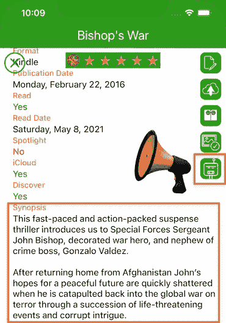
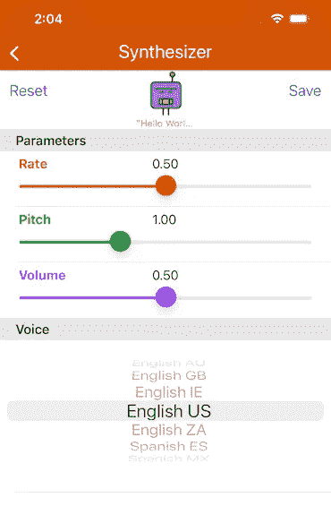

# 快速文本到语音合成器

> 原文：<https://medium.com/geekculture/swift-text-to-speech-synthesizer-ddf4e16f3fc6?source=collection_archive---------8----------------------->

AppsGym Books App Ms. Chips Reading the Book Synopsis

**Swift 的文本到语音合成器可以大声说出文本字段和视图的内容。**

# 方案

我们的应用程序将利用一个文本到语音合成器(也是合成器)，在图书详情视图中，我们将亲切地称之为**女士芯片**。奇普斯女士将大声朗读**剧情简介**字段的文本。

# 技术

我们将利用 Swift 的**AVSpeechSynthesizerDelegate**函数，其中包含概要字段和 Ms. Chips 机器人按钮的 BookDetailsViewController 充当委托。

# 观众

本文面向寻求完整、成熟、以代码为中心的解决方案来加速开发项目的 Swift 开发人员。下面的代码片段可以通过最小的定制来使用(您的应用程序指定为 UITextView)。

# 应用模型

我们基于苹果 App Store 上发布的 AppsGym [Books](https://appsgym.com/projects/books) 模型应用程序(名为 [8Books](https://apps.apple.com/au/app/8books/id1152860892) ，你可以在[AppsGym.com](https://appsgym.com)上免费下载完整的 [Xcode](https://appsgym.com/appsgym-books-swift-xcode-project-tour/) 项目。

# 用户界面

Ms. Chips, AppsGym Books Robot Synthesizer Default Icon

Ms. Chips, AppsGym Books Robot Synthesizer While Speaking Icon

UI 是 Ms. Chips 的图标按钮，带有拨动开关。轻按一次开始讲话，再轻按一次停止讲话。

# 逻辑

**bookdetailsviewcontroller . swift**控制 Ms. Chips 合成器的启动/停止。BookDetailsViewController 充当了**对 **AVSpeechSynthesizer** 的委托**，因此实现了所需的委托函数。

我们迷人的机器人 Chips 女士将由图书详情视图上的一个按钮来表示，它充当一个开关。轻按一次开始，再轻按一次停止。因此，我们需要以下函数: **didStart** 话语:AVSpeechUtterance 和 **didFinish** 话语:AVSpeechUtterance。我们还将更改按钮图标图像来指示状态(沉默或讲话)。

此外，如果用户拒绝查看，Chips 女士应该停止大声朗读。因此，我们需要**视图消失**()来阻止合成器机器人说话。

# **代码**

bookdetailsviewcontroller . swift**viewDidLoad()**

bookdetailsviewcontroller . swift**robotButtonAction()**

bookdetailsviewcontroller . swift**合成器委托函数**

# 对你来说太容易了？

我们可以利用 Swift 的方法来控制**速率**、**音高**和**音量**，让我们的合成器变得更有趣。然后我们换**音**，用不同的方言和语言。您现在可以研究和更新您的应用程序，但我们将在稍后发布一篇专门的文章。敬请期待！

本文在图书详细信息视图中介绍了实现“快速简单”的文本到语音合成器的完整设置和代码。合成器将在文本视图中大声朗读书籍简介的文本。希望你觉得它在你的应用程序中有用。感谢阅读！