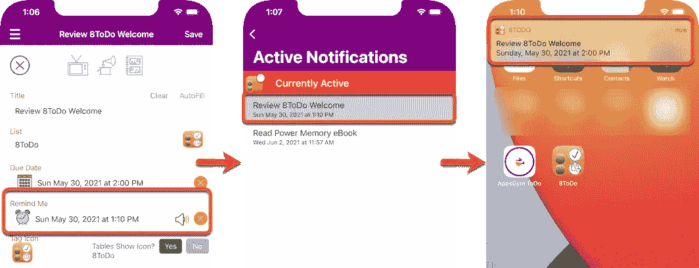
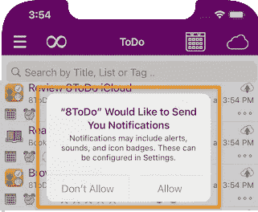
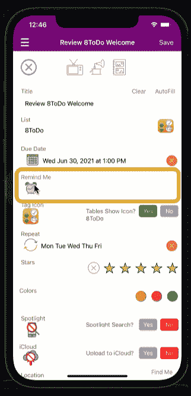
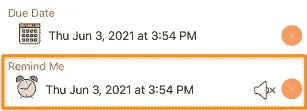
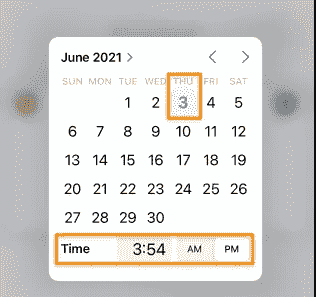
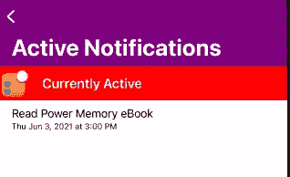
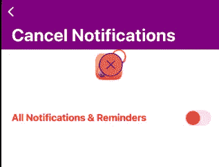

# Swift 用户通知:授权、调度、监控和删除。

> 原文：<https://medium.com/geekculture/swift-user-notifications-authorise-schedule-monitor-and-remove-c6ff4ec808e5?source=collection_archive---------14----------------------->

Swift 用户通知安排通知消息在指定的日期和时间出现在用户设备上。

AppsGym ToDo Remind Me User Notification

# 方案

我们的待办事项应用程序'**提醒我**'功能将安排在用户指定的日期和时间触发用户通知。该应用还将包括一个**活动通知**视图，显示所有当前活动的“提醒我”通知请求，以及设置中的**取消通知**功能。

# 技术

我们将利用 Swift 的**用户通知**框架来授权、请求、安排和(可选)删除“提醒我”用户通知。

**AppDelegate.swift** 将包含用户通知的授权请求，因此弹出警告将在应用首次启动时出现。

First App Launch Authorisation Request

ToDo 主视图**noteviewcontroller . swift**将包含“**提醒我**”**按钮**，点击该按钮的动作将转到**日期选择器**视图。用户将选择日期和时间，该日期和时间将被传回主视图，并作为文本存储在“提醒我”**文本字段**中。保存笔记记录后，我们将检查用户通知授权状态，如果授权，则安排通知。

GIF Remind Me Date Picker and Notification Schedule

# 观众

本文面向寻求完整、成熟、以代码为中心的解决方案以加快开发项目的 Swift 开发人员。

# 应用模型

我们的文章基于苹果应用商店上发布的 AppsGym [ToDo](https://appsgym.com/todo-lists-notifications-multimedia/) 模型应用，你可以在 AppsGym.com 上免费下载完整的 [Xcode](https://appsgym.com/downloads/) 项目。

# 用户界面

在笔记视图中，我们需要一个“**提醒我”ui 按钮**，它将转到日期选择器视图。

Remind Me Button and Text Field

Remind Me Date Picker

我们将为**活动通知**监控设计一个专用视图，并将其添加到查询中(可能还有设置)。

AppsGym ToDo Active Notifications Query

我们还将设计一个专用的视图来显示所有待办事项的**取消通知**，并将其添加到设置菜单中。

AppsGym ToDo Settings Cancel Notifications

# 逻辑

**AppDelegate.swift** 将调用函数**authorizeuser notifications()**，该函数将请求授权，触发初始应用程序加载弹出窗口(如 Info.plist 中的设置)。

**NoteViewController.swift，**处理新的待办事项添加和编辑(更新)**，**将调用:

> **checkUserNotification()** ，检查用户是否有授权通知。
> 
> **scheduleUserNotification()**，设置提醒我日期/时间通知。

如果待办事项处于编辑模式，那么我们首先删除该待办事项 ID 的任何未决通知，然后在保存时重新安排提醒我的日期/时间。

另一种安排是将所有用户通知功能包含在它们自己专用的 **UserNotifications.swift** 文件中，这样它们可以从任何其他视图中被调用。

查询**todosbynotificationstableviewcontroller . swift**将显示所有当前活动的用户通知。

设置**cancelnotificationsviewcontroller . swift**将允许用户取消所有待处理和已发送的用户通知。

# 密码

# 授权通知

**app delegate . swift authorizeuser notifications()**

# 检查、删除和安排通知

noteviewcontroller . swift**viewDidLoad()**

noteviewcontroller . swift**check user notification()**

noteviewcontroller . swift**saverecortocoredata()**

noteviewcontroller . swift**scheduleUserNotification()**

NoteViewController.swift **助手**

# **监视器通知**

**todosbynotificationstableviewcontroller . swift**

# **取消通知**

**cancelnotificationsviewcontroller . swift**

本文介绍了授权、检查、调度、监控和删除用户通知的完整设置、逻辑和代码。主题范围的全面覆盖需要一个冗长的故事，但是我们的目标是在一个地方覆盖 Swift 用户通知活动的整个范围。

希望这些内容对你的应用有用。感谢阅读！