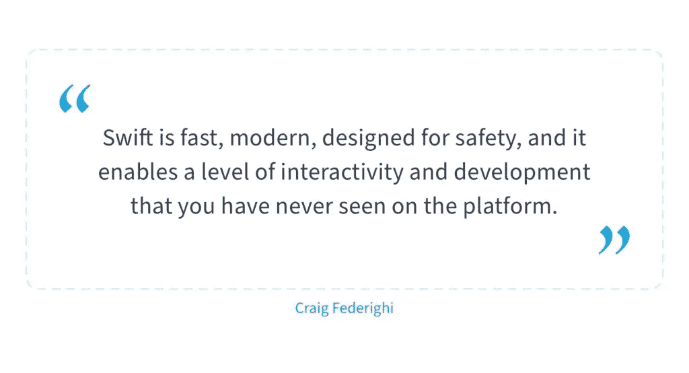
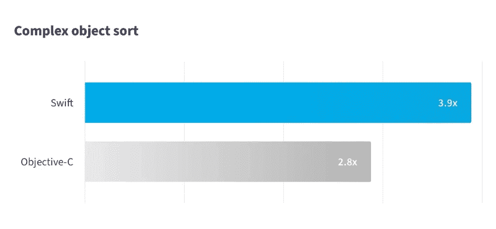
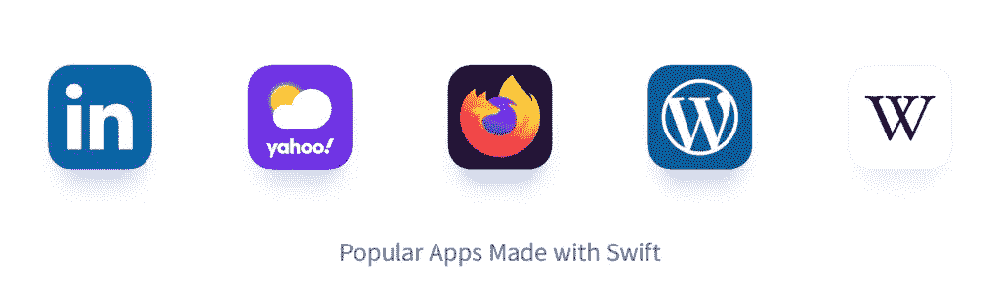

# Swift VS Objective-C:你的下一个移动应用哪个更好？—尼克斯联合公司

> 原文：<https://medium.com/geekculture/swift-vs-objective-c-which-is-better-for-your-next-mobile-app-nix-united-7d7da47fdc1a?source=collection_archive---------32----------------------->

Objective-C 已经为人所知 30 多年了，直到 2014 年，苹果才推出了一种更简单的新方法来创建 iOS 应用程序——Swift。

如果你想知道为什么要比较 Objective-C 和 Swift，我们有两个主要原因。首先，它们都是 iOS 最“原生”的，其次，Swift 不是 Objective-C 的直系后代，它们有差异，但 iOS 移动应用开发者同时使用它们。

您可能正在犹豫哪一款既符合您的需求，又不会破坏您的预算？如果你想为你的 iOS 应用精确地选择 Swift 或 Objective-C，当你读到这篇文章的时候，你就有这个机会了。

**目录:**

1.  [快速客观-快速概述](https://nix-united.com/blog/swift-vs-objective-c-which-is-better-for-your-next-mobile-app/#overview)
2.  [Objective-C 与 Swift 的对比标准](https://nix-united.com/blog/swift-vs-objective-c-which-is-better-for-your-next-mobile-app/#comparsion)
3.  [语言和应用程序的流行示例](https://nix-united.com/blog/swift-vs-objective-c-which-is-better-for-your-next-mobile-app/#popularity_apps_examples)
4.  [结论:何时使用 Swift 和 Objective-C](https://nix-united.com/blog/swift-vs-objective-c-which-is-better-for-your-next-mobile-app/#conclusion)

# 快速客观-快速概述

所以，让我们直接进入 Swift 与 Objective-C 的细节，不要向前看。

# 迅速发生的

与本文中的对应语言不同，全新的开源语言 Swift 的历史很短。Swift 最近一次更新版本发布于 2020 年 4 月 29 日，被称为 [5.2.4。](https://github.com/apple/swift/releases/tag/swift-5.2.4-RELEASE) Swift 由苹果公司创建，于 2014 年世界开发者大会上推出[。Swift 2.0 于 2015 年向市场发布，不仅兼容苹果产品，还兼容 Linux。](https://www.youtube.com/watch?v=f7dD75rPZH4)

# 目标-C

与它年轻的竞争对手不同，Objective-C 自 20 世纪 90 年代以来一直被苹果公司使用，从那时起，这种语言就成了任何想为 OS X 和 iOS 开发应用程序的人的首选。

Smalltalk 和 C 结合起来创建了 Objective-C，使它成为一种具有广泛而复杂语法的语言。苹果公司说，Objective-C 带有面向对象的特性和动态执行。

# Objective-C 与 Swift 的比较标准

如上所述，为了更好地了解哪种技术最适合您的项目，有必要对编程技术/语言进行比较。您可以根据一些特征进行比较。在本文中，我们选择了一些直接影响开发 iOS 应用程序的成本、质量和可用性的基本标准。

## 1.应用程序 UI

所以第一个标准和主要区别是开发者创建 UI 有多容易。既然 Objective-C“和世界一样古老”，那么任何 iOS 版本对你的 app 来说都没问题。而 Swift 至少需要 iOS 7。

对于 UI 设计，有苹果的 Swift UI，内置在 Xcode 11 中，可以与 iOS 13 和更新的版本一起工作。您可以通过编写代码或设置预览来构建自己的用户界面。同时，您可以在代码和预览窗口中看到更改。

有人可能会说，如果没有快速的优势，以及我们的专家认为它只会发展的观点，这两种语言在这个指标上打了个平手。

## 2.表演

谈到 Objective-C 与 Swift 性能，您应该记住，性能越高，UX 越好，重构越容易，以及其他因素。

你可能听说过 [Swift 比 Objective-C](https://www.apple.com/in/swift/) 快 2.6 倍。由于更简单的语法和在编译时执行类型检查，Swift 可以胜过 Objective-C。此外，Swift 支持动态库，这也有助于提高应用程序性能。

很明显，年轻的语言会胜出。此外，我们可以期待在不久的将来会有更快的改进，而老的 Objective-C 已经很久没有更新了。

## 3.安全

了解 Objective-C 安全性的有用之处——空指针的存在。它是 C++和其他基于 C 语言的组件，会带来安全漏洞。虽然乍看之下它似乎很有用，因为它为开发人员提供了拓宽数据访问的机会，但实际上它可能是大量错误的来源。

开发 Swift 是为了提高 iOS 产品的代码安全性。这意味着语言本身可以在不使用指针的情况下防止输入错误。这有助于通过快速查找和修复错误来避免漏洞。结果是一个更干净的代码。由于苹果一直不愿意提高安全性——这一点在 Swift 上也有所体现。

这种没有旧技术缺点的年轻语言也在这里胜出，因为与 Objective-C 相比，开发人员可以很容易地找到错误并修复它们。

## 4.社区和支持

当您拥有行业专家的支持、专业知识和知识时，开发一个成功的项目就更有可能，因为他们给了您做事的信心。

与 Objective-C 不同，Swift 是一种开源语言，这意味着可以详细了解该语言的工作原理，并理解所有的陷阱。开源也意味着更多的人和项目，所以开发者有更多的源代码。

说到 Objective-C 的 30 年，这个数字随着语言年龄的增长而减少，因为新来者越来越多地学习 Swift。

Swift 显然正在赢得另一轮[——社区越多，就越容易为项目找到开发者](https://nix-united.com/blog/average-ios-developer-salary-in-us-and-worldwide-2020/)。

## 5.工具包

标准的第三方框架和库通常不足以进行复杂的开发。其他工具包用于全面配置— Objective-C 或 Swift 工具各不相同。

鉴于 Objective-C 的悠久历史，开发人员可以很容易地找到大量的工具，但不要指望为 Objective-C 开发创造新的工具。

很容易找到第三方公司或苹果公司或开发人员为 Swift 提供的工具，因为这是一个新的大赌注。工具的范围越广，开发效率就越高。

嗯……Objective-C 与 Swift 比较的另一个标准是，Swift 胜出，请记住，将来 Swift 环境会发展，而 Objective-C 环境不会。

## 6.长期观点

如前所述，在很长一段时间内，Objective-C 是 iOS 开发的第一种也是唯一一种语言。随着 Swift 的出现，Objective-C 坐上了苹果世界的第二架飞机。如今，该公司积极培训 Swift 的未来用户，并推出使其成为苹果主导语言的功能。

许多开发人员不想从 Objective-C 转换，因为它是一种成熟的语言，他们已经在学习和开发应用程序方面投入了大量的时间。

另一方面，Swift 不断得到苹果的支持，它是一门年轻的语言，有着强大的社区，它发展得令人难以置信的快，并且不再局限于苹果的生态系统。

我们可以总结说，各种迹象表明 Swift 正在成为一种非常流行的编程语言。

## 7.代码复杂性

Objective-C 代码的复杂性在于冗长的文本字符串，因此通常需要开发人员花费大量的时间和步骤来链接两条信息。因此，破坏顺序或使用错误的字符串词素会导致应用程序崩溃。

Swift 需要的代码更少。Swift 使用字符串插值，这消除了记忆令牌的需要，因此开发人员可以将变量直接插入字符串，如按钮字符串或标签。这避免了在 Objective-C 中发生崩溃的常见原因。但更重要的是，Swift 更简洁，由于开发人员阅读代码的频率是编写代码的 10 倍，很明显 Swift 更容易在视觉上感知，因此使用起来更快。

## 8.内存管理

Objective-C 使用 Cocoa API 中支持的 ARC(Objective-C 和 Swift 语言的一个特性，无需程序员的努力即可管理内存)。这里的问题是这种方法不适用于其他一些 API，比如核心图形。这不仅会影响内存管理，还会导致大量内存泄漏。

同时，Swift 不仅支持 Cocoa Touch API 的 ARC，还支持所有允许类似 Cocoa Touch 的内存管理优化的 API。[“专门针对核心图形，开发者不必手动发布 CGImageRefs”](https://developer.ibm.com/technologies/mobile/tutorials/mo-ios-memory/)。

为了节省开发人员的时间，并帮助他们减少对内存管理的关注，Objective-C 用面向对象的代码路径补充了 ARC。

***目标-C VS 迅捷奖励标准-速度对比:***

来源:

[2014 年世界开发者大会](https://www.youtube.com/watch?v=f7dD75rPZH4)演讲

# 语言和应用程序的流行示例

Swift 与 Objective-C 比较的另一个重要因素是谁以及如何使用特定的语言。

显然，2014 年之前创建的 iOS 应用程序很可能是用 Objective-C 编写的，原因很简单，因为 Swift 并不存在。然而，如今公司考虑将 Objective-C 转换为 Swift 非常普遍，反之则非常少见。此外，您经常会遇到同时用两种语言编写的程序。

优步目前使用两种语言，但像 Lyft 或 LinkedIn 这样的大公司已经完全迁移到年轻而快速的 Swift。随着时间的推移，要找到一家愿意继续使用 Objective-C 的公司会变得更加困难。

作为一家[移动应用开发公司](https://nix-united.com/services/mobile-app-development/)，NIX 专门开发一款既有 [Swift](https://services.nix-united.com/pdf/NIX_Case_Mobile_Gaming_Portal.pdf) 又有 [Objective-C.](https://nix-united.com/success_stories/smartgurlz-iot-smart-toy-with-mobile-application-teaching-girls-to-code/) 的应用

# Vuze 摄像机— NIX 专业技术

Vuze Camera 在摄影领域有专长。他们广泛使用 3D、[计算机视觉](https://nix-united.com/services/cutting-edge/)和图像处理。Vuze Camera 提供了第一台配有双摄像头的 3D 360 相机，显示了强大的功能。用户可以使用这项技术在 360 或 VR180 (3D)照片和视频中捕捉精彩瞬间。

NIX 团队很高兴有机会参与这样一个项目。我们的团队创建了一个应用程序，为 Vuze Camera 提供了附加功能。它让用户能够在纸板或小星球模式下观看视频。此外，还可以制作现场视频剪辑，在 YouTube 或脸书的社交网络上分享。此外，我们添加了一个强大的视频编辑器，它提供了以下很酷的功能:

*   添加艺术滤镜或效果，
*   进行颜色调整，以及
*   添加音频。

了解更多我们的[成功案例](https://nix-united.com/success-stories/)

[Vuze Camera —用 Swift 制作的 NIX App](https://nix-united.com/success_stories/vuze-camera-application-for-a-remote-control/)

谈到 Swift 和 Objective-C 的受欢迎程度，我们来看看 StackOverflow 开发者 [Survey 2020](https://insights.stackoverflow.com/survey/2020) 是怎么说的——Swift 是比 Objective-C 更受欢迎的语言，相差在 30%以上，这已经足够巨大了。

根据【2021 年 4 月 TIOBE 指数 — Swift 也比 Objective-C 好，第一名在第 15 名，Objective-C 在 50 名中第 23d。

你可能会有一个关于 Objective-C 现在是否流行的问题？知名度不好说，但是否相关是肯定的。

Objective-C 编程不会很快过时，因为它有一个庞大的代码库、几个受支持的应用程序和一个第三方框架，其核心是 Objective-C。Objective-C 在某些方面优于 Swift 的一个主要因素是，与该语言相关的解决方案和库不太可能用新语言完全重写。因此，我们可以满怀信心地说，在现阶段，Swift 不会取代 Objective-C。

# 结论:何时使用 Swift 和 Objective-C

回答 iOS 应用 Swift 和 Objective- C 哪个更好的问题，考虑你的团队的经验和项目的规格。

*   你需要支持一个写在 Objective-C 上的现有产品；
*   当大量使用 C 或 C++框架时。

坚持好的老目标——如果:

*   您的应用仅支持 iOS 的新版本；
*   创建现代应用程序；
*   你想从头开始更快更安全地创建一个 app
*   使用对性能敏感的代码时。

在以下情况下使用 Swift:

在 C 与 Swift 的比较目标中，我们希望为您提供尽可能多的信息，帮助您准确选择您需要的产品。然而，如果你对下一个项目的细节仍有疑问，[联系我们](https://nix-united.com/blog/swift-vs-objective-c-which-is-better-for-your-next-mobile-app/#contact-us)，我们的软件顾问将帮助你做出正确的决定。

*原载于 2021 年 4 月 16 日*[*【https://nix-united.com】*](https://nix-united.com/blog/swift-vs-objective-c-which-is-better-for-your-next-mobile-app/)*。*