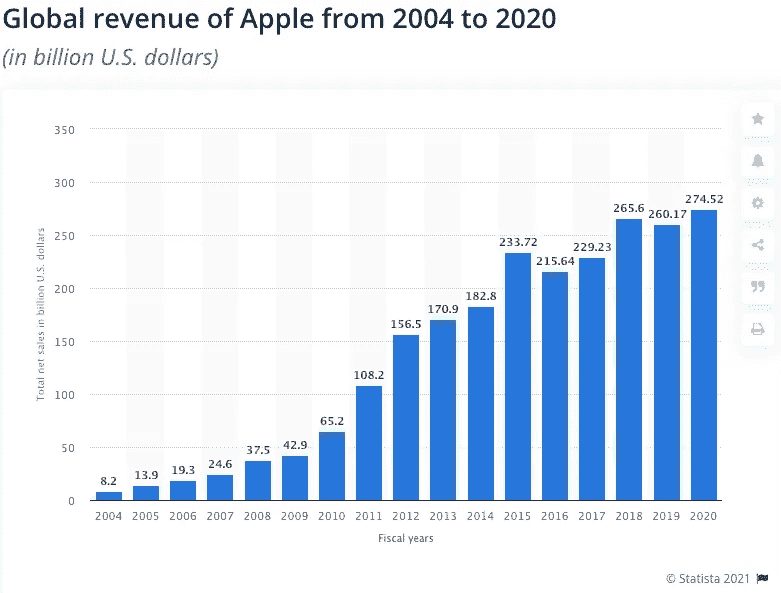
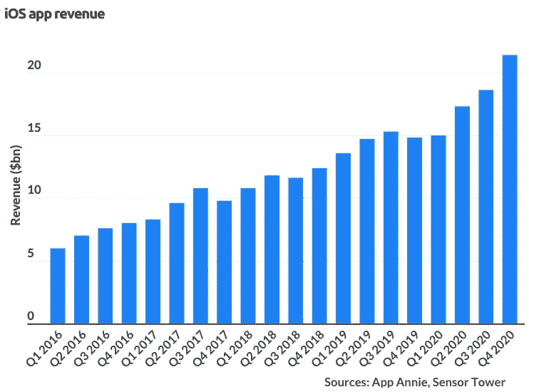

# 斯威夫特？为什么！

> 原文：<https://medium.com/geekculture/swift-why-810d5929c445?source=collection_archive---------61----------------------->

## 编程语言系列

## 理解为什么掌握 Swift 是值得的。

Steve Jobs at the first West Coast Computer Faire, where the Apple II computer was debuted, in Brooks Hall, San Francisco, California, on April 16th or 17th, 1977\. Thanks for the image! Tom Munnecke | Getty Images, and I found it in this article from [CNBC](https://www.cnbc.com/2018/05/10/how-steve-jobs-developed-his-design-philosophy-for-apple.html).

让我们从一个简单的问题开始，为什么 Swift 会存在？然后，让我们来看看它是如何蓬勃发展的，是什么让它如此繁荣，以及它的最新更新！

Swift 是一种为了继承 Objective-C 而诞生的语言。

> “如果我们有 objective-c，但没有 C 的包袱，那会是什么样子”——克雷格·费德里吉

从这些词中，Swift 发布了，自 2010 年以来一直在开发，并于 2014 年在 WWDC 发布。在那之后，Swift 经历了 5 次重大升级，尽管它仅存在了 11 年，但这已经是很大的升级了，尽管如此，这种语言仍在变得更高效、更易用、更直观。也许这是苹果背后巨大财富的力量，也许这是招募优秀工程师的好眼光，也许这是创造一个非常精心设计的流程来发展项目，也许这是所有选项的混合。

为了让事情变得客观，让我们看看苹果在智能手机行业的市场份额。

Thanks for the graph [Statista](https://www.statista.com/)! Great resource if you are looking for very clean graphs.

既然我们已经知道了苹果在整个智能手机市场上占有多少份额，那么让我们来看看这家公司本身。

Thanks for the graph [Statista](https://www.statista.com/)! If you want information clearly explained on a good-looking graph, Statista in my brief experience is amazing.

对于一个成长如此迅速的公司来说，它必须在许多方面做得非常好，保持每年生产更好的产品，让客户对他们收到的产品感到满意，但也渴望更多，我认为这来自史蒂夫·乔布斯的创新精神，这是苹果 DNA 的一部分，这种创新精神的一部分创造了 iPhone，这是手机的里程碑，让整整一代人意识到他们一直缺少一些东西， 触摸屏手机，之前有人知道我们有多需要它吗，我想可能有些人，对于任何事情，总会有人，但不是市场的绝大多数，我们确实需要它，允许这么多不同的设备功能成为一个，但不仅仅是这样，这样一个具有所有功能的设备还使整个“产品”生态系统从他们那里存在，这是应用程序商店，但现在这值得吗？

Thanks, [BusinessOfApps](https://www.businessofapps.com/data/app-revenues/) for this amazing graph!

这确实很有价值，甚至有人争论它们本身是否是一个[市场，反垄断法是否应该适用于它们](https://www.marketwatch.com/story/epic-vs-apple-the-predicted-verdict-is-in-11622224463)，尽管如此，很明显需要诞生一种新技术，一种有助于保持这种增长的新技术。 值得注意的是，除了显示以十亿计的苹果净销售额的图表之外，该图表没有反映 Swift 成立之前的年份，但现在它已经是第五个版本了，并且已经实现了 ABI 稳定性，我们可以打赌它在苹果内部的实际相关性只会变得更大，[然而苹果的未来是不确定的](https://www.wsj.com/articles/amazon-other-tech-giants-could-be-forced-to-shed-assets-under-house-bill-11623423248)，至少对 app store 而言，我想知道这对 Swift 会有什么影响。

Thanks, [Apple developer webpage for the Swift image](https://developer.apple.com/swift/)!

如果你从未看过 WWDC，我推荐你去看任何一个，这种语言正在发生的创新之多令人难以置信，我在 2017 年为 MakeSchool 的这个名为 Summer Academy 的编码训练营项目制作了一个 iOS 应用程序，开始了我的编程生涯，这是我学习 Swift 的第一次经历，而在那之前我从未开发过任何东西，Swift 非常直观，对初学者足够友好，我确实成功地制作了一个应用程序。

从那时起，我用来编写这款应用程序的版本就停止了，再见了 Swift 3，现在是 swift 5，我的大部分代码都需要修复，尽管这是可能的，因为苹果提供了工具，但我从未担心过这种语言最相关的创新，这是其生命周期的里程碑，ABI 稳定性，应用程序二进制接口，这意味着你可以在任何地方，在任何编译器中构建 Swift，二进制框架可以编译并与他人共享，为 OS，macOS，iOS，tvOS 和 watchOS 上的应用程序实现共享运行时。由于开销更少，大大减少了代码量并提高了性能。

Thanks, [Apple developer webpage](https://developer.apple.com/xcode/swiftui/) for the SwiftUI image!

它不断创新，创造出越来越强大的工具来提高生产率，SwiftUI 就是一个例子，这是一种创建视图的声明性方法，视图是组成用户界面的部分。虽然还有许多其他有趣的创新，但这是最相关的创新之一，因为他们的目标是让开发人员有更多的时间专注于重要的东西，他们正在制作的应用程序的特殊之处，创建了这个令人惊叹的框架，可以非常容易和快速地开发所有样板代码，因此您可以更长时间地专注于应用程序中的创意部分。这是在 WWDC19 上发布的，在 youtube 上查找它，或者查看关于该主题的专门文章，这是一条很好的信息，尤其是如果您正在考虑成为 Swift 开发人员的话。

尽管如此，除了他们不断发布的花哨和深思熟虑的技术之外，还有一个更重要的方面需要思考，那就是推动这些发展的能量，这种能量是他们在使 Swift 成为开源的过程中做出的选择，[使各行各业的人们能够参与 Swift 的发展](https://apple.github.io/swift-evolution/)，[让他们的意见有可能被听到，并分享他们关于语言应该或可以改进的理性](https://github.com/apple/swift-evolution)。

刚刚举行了 WWDC20，我个人认为 Swift 的另一个里程碑是他们增加了[并发](https://developer.apple.com/videos/play/wwdc2021/10019/)、[异步/等待](https://developer.apple.com/videos/play/wwdc2021/10132/)和[参与者(一个非常有趣的概念)](https://developer.apple.com/videos/play/wwdc2021/10133/)。虽然我不会深入挖掘 WWDC21 的视频，但你可以通过链接找到一个比我现在能做的更好的描述。

苹果是一家建立在创新者肩膀上的公司，他的遗产将永远嵌入计算机的历史中，他共同创立的公司，被抛弃，建立了另一家公司 NeXTSTEP 被收购，让他回到他最初被抛弃的前公司，我相信这是一种记住增长总是在发生的方式，一扇门关闭并不意味着另一扇门正在打开， 让你的梦想成真，如果你真的通过努力做了一些有价值的事情，即使你死了，你的遗产也会永存。

此外，值得注意的是，庆祝并深深感谢帮助他实现愿景的每一个人也很重要，包括史蒂夫·沃兹尼亚克，以及苹果商业模式整个层级中的每一名员工，这些年来，他们使这个品牌得以生存、发展、自我维护和繁荣。