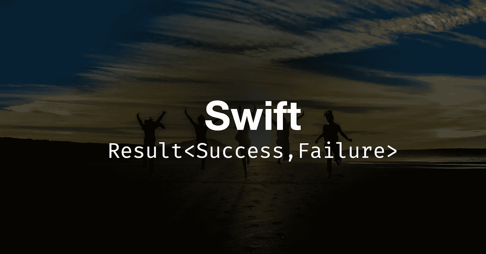

# 使用结果类型编写更干净的代码

> 原文：<https://medium.com/geekculture/swift-write-cleaner-code-using-result-type-a9412cecc205?source=collection_archive---------9----------------------->

## 错误处理甚至可以更加简单和易于实现

[结果类型](https://developer.apple.com/documentation/swift/result)是作为 Swift 5 中错误处理的改进而引入的。已经被 iOS 开发者广泛实现。自从它发布以来，所有第三方库也开始采用它。但是我注意到一些开发人员仍然在使用旧的实现，可能是因为他们已经习惯了很长时间。

在本文中，我们将讨论和修改基本函数和完成方法中结果类型的基本用法。让我们看看没有和有结果类型的实现。

# **不使用结果**

首先，我们将采用一个简单的方法来计算两个数的除法。我们知道数学中的除法法则，除数不能是 0，否则答案是不确定的。

因此，我们将添加一个使用`guard`检查除数的验证，如果失败则返回`nil`。

## 有什么问题？

上面的`divide()`方法看起来很好，直到我们调用它并出错。现在我们发现了问题，并且明白我们不能简单地返回细节错误。

## 可能的解决方案

是的，现在我们会考虑修改方法。我们可以尝试的选择很少。首先，也许我们可以使用一个返回多个值的完成方法，比如答案和错误消息。或者我们可以使用 struct 或 tuple 类型来组合答案和错误。

这正是结果类型所做的，尽管它更通用，更容易实现。

# 利用结果求解

基本上是相同的方法，除了返回类型使用了`Result`。

现在我们可以看到，新的`divide()`方法可读性更好、更简单，并且有适当的错误处理。

# 在异步方法中使用结果

正如我们已经知道的，异步方法需要一个完成处理程序来将结果或值返回给方法调用方。

常见的 API 请求方法基本上会有以下步骤。

1.  检查 URL 验证
2.  使用 URLSession 请求 URL
3.  然后在数据任务完成内部，我们将处理错误和成功数据
4.  解码 try 块中的数据

让我们看看下面的代码和结果实现。除了完成返回值之外，看起来没什么不同。

下面是我们如何调用方法和处理发生的错误。

太好了。我想我们已经完全涵盖了普通函数和完成方法的结果类型实现。我希望每个人都能理解并喜欢这个教程。请确保在您的项目中实现，以便我们可以在开发中应用良好的实践，并使我们的代码更干净。

感谢阅读。编码快乐！

# 参考

[https://developer.apple.com/documentation/swift/result](https://developer.apple.com/documentation/swift/result)

[https://developer . apple . com/documentation/swift/result/writing _ fail able _ asynchronous _ APIs](https://developer.apple.com/documentation/swift/result/writing_failable_asynchronous_apis)