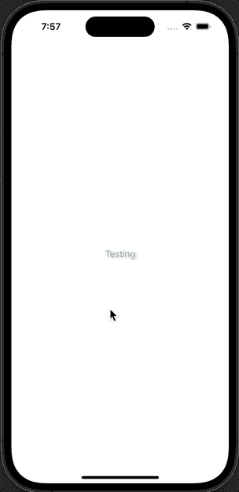
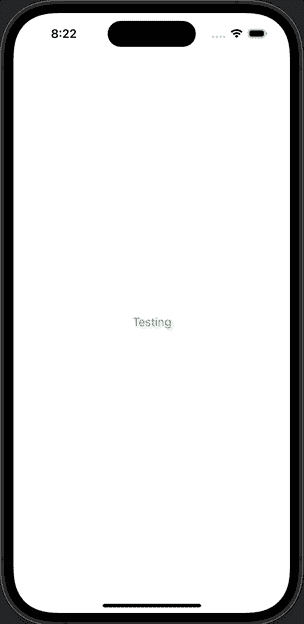
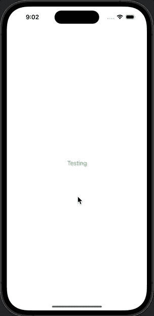

# SwiftUI 动画完成

> 原文：<https://medium.com/geekculture/swiftui-animation-completion-b6f0d167159e?source=collection_archive---------2----------------------->

Photo by [Joao Tzanno](https://unsplash.com/es/@jtzanno?utm_source=medium&utm_medium=referral) on [Unsplash](https://unsplash.com?utm_source=medium&utm_medium=referral)

SwiftUI 的动画中有一点相当恼人，那就是它缺少一个完成块来通知我们动画何时完成。

不幸的是，还没有很好的解决方案，但是我们可以尝试一些方法。

## 概观

这个异步扩展可以让你在动画完成后轻松地执行操作。

# 用例

当您想要在动画完成后执行某个动作或链接动画时，具有完成回调特别有用。

假设一个文本视图有两个动画，应该一个接一个地运行；第一个改变视图的比例，第二个改变它的颜色。我们一点击文本，动画就开始了。

让我们从同时运行两个动画开始。

## 按顺序制作动画

一切正常，除了我们想按顺序运行动画。因为我们没有完成回调，所以我们必须将第二个动画延迟相同的时间。在第二个块中，我们可以触发下一个动画。

到目前为止，一切看起来都很好，但是如果你想在动画完成后更新值，事情会变得更复杂。

让我们试着在两个动画完成后打开一个工作表。这将是一个幼稚的第一次尝试:

这里的问题是，只要我们点击组件，工作表就会显示出来。为了让它正常工作，我们必须触发一个对 main 的异步调度调用，这个调用只在一定时间后执行。延迟时间需要与动画持续时间相匹配。

# 结果

现在，它的行为符合我们的预期，我们可以更进一步，将其抽象为一个异步函数，这将允许我们在动画上使用 await:

要实现这一点，只需添加下面的扩展。

暂时就这样吧！

你喜欢我的内容吗？
帮我继续捐款吧！

 [## 捐赠给爱德华多·多米尼二世

### 通过捐赠或与朋友分享来帮助支持小爱德华多·多米尼。

www.paypal.com](https://www.paypal.com/donate/?hosted_button_id=B3W6GJWSPB4VU)