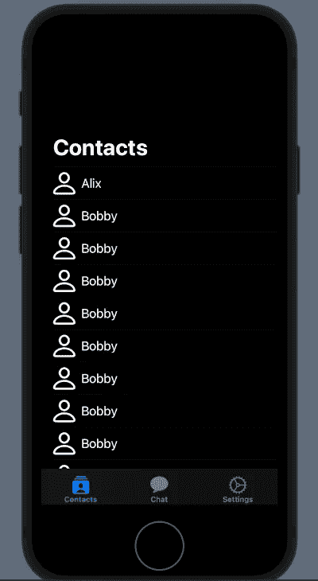
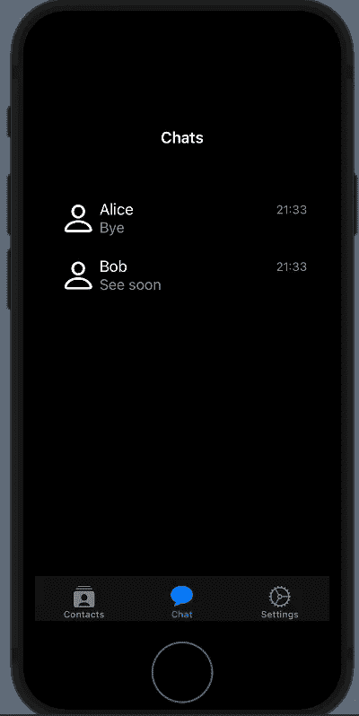
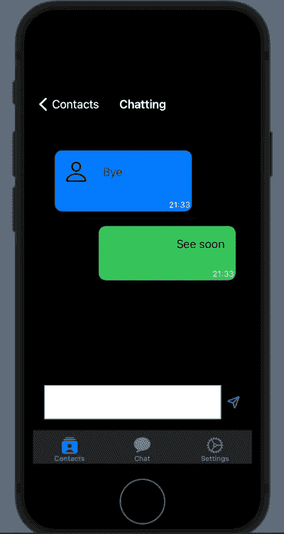

# SwiftUI 应用聊天—第二集—

> 原文：<https://medium.com/geekculture/swiftui-app-chat-episode-ii-2e8a6f188e8b?source=collection_archive---------30----------------------->

在前一集，我们创建了应用程序的结构，但没有漂亮的外观和感觉，在这篇文章中，我们看到如何改善一点。

首先，我记得项目的代码在这里:[https://github.com/niqt/EEnigma](https://github.com/niqt/EEnigma)

# 联系人列表



要更改导航栏，我们必须在 ContentView 中定义一个 init 函数:

```
init() {
        let coloredAppearance = UINavigationBarAppearance()
        coloredAppearance.configureWithTransparentBackground()
        coloredAppearance.backgroundColor = .clear
        coloredAppearance.titleTextAttributes = [.foregroundColor: UIColor.white]
        coloredAppearance.largeTitleTextAttributes = [.foregroundColor: UIColor.white]

        UINavigationBar.appearance().standardAppearance = coloredAppearance
        UINavigationBar.appearance().compactAppearance = coloredAppearance
        UINavigationBar.appearance().scrollEdgeAppearance = coloredAppearance
        UINavigationBar.appearance().tintColor = UIColor.white

        UITabBar.appearance().tintColor = UIColor.white
        UITabBar.appearance().barTintColor = UIColor.black
    }
```

首先，创建一个*UINavigationBarAppearance*并清除任何默认选项，然后我们设置背景颜色和文本颜色。请注意，对于文本颜色，我们需要指定标题小或大时的颜色。

我们为任何可能的情况设置了导航栏的外观。

最后两行是关于 TabBar 的设置。

你可以阅读 https://nicoladefilippo.com/toolbar-and-customization/[的帖子来了解更多关于定制的内容。](https://nicoladefilippo.com/toolbar-and-customization/)

为了完成联系人列表的定制，我们需要在 contacts 视图中进行一些更改:

```
init() {
        UITableView.appearance().backgroundColor = .none
        UITableViewCell.appearance().backgroundColor = .none
    }

    var body: some View {
        List {
            ForEach(contacts) { contact in
                ZStack(alignment: .leading) {
                    RowView(contact: contact)
                    NavigationLink(destination: ChattingView()) {
                        EmptyView()
                    }.buttonStyle(PlainButtonStyle()).frame(width:0).opacity(0)
                }
            }.listRowBackground(Color.clear)
        }.background(Color.black)
        .ignoresSafeArea()
    }
}

struct RowView: View {
    var contact: Contact
    var body: some View {
        HStack {
            Image(systemName: "person")
                .resizable()
                .frame(width: 30, height: 30)
                .foregroundColor(.white)
            Text(contact.aliasName)
                .foregroundColor(.white)
        }
    }
}
```

在 init 函数中，我们移除了 tableview 和视图中单元格的背景。

注意如何使用*。listrow background(color . clear)*移除行的背景，以及我们如何用*为列表设置列表背景。背景(颜色.黑色)*。

奇怪的是这段代码:

```
ZStack(alignment: .leading) {RowView(contact: contact)NavigationLink(destination: ChattingView()) {EmptyView()}.buttonStyle(PlainButtonStyle()).frame(width:0).opacity(0)}
```

为什么我们需要一个 ZStack 来显示列表的行？

在 SwuiftUI 中，我们没有一个简单的方法来移除*公开指示器*(行尾的>)。为了隐藏这个指示器，我们用一个具有 EmptyView(这样我们就可以看到 RowView)和一个宽度为零的 buttonStyle 的 NavigationLink 来覆盖该行。

# 聊天列表

我们想要:



首先，在 init 函数中删除背景:

```
init() {
        UITableView.appearance().backgroundColor = .none
        UITableViewCell.appearance().backgroundColor = .none
    }
```

我们还必须更改列表，以添加背景并删除披露指标:

```
var body: some View {
        NavigationView {
            VStack {
                List {
                    ForEach(chats) { chat in
                        ZStack(alignment: .leading) {
                            RowLastChat(chat: chat)
                            NavigationLink(
                                destination: ChattingView())
                                {}.buttonStyle(PlainButtonStyle()).frame(width:0).opacity(0)
                        }
                    }.listRowBackground(Color.clear)
                }.background(Color.black)
            }.navigationBarTitle("Chats", displayMode: .inline)
            .foregroundColor(.white)
            .background(Color.black)
            .ignoresSafeArea()
        }
    }
```

在这段代码中，我们为前面的视图编写了相同的内容。将来，我们会看到一些重构来避免“重复自己”。

# 闲谈



对于这个视图，我们有相同的代码(或者非常相似)。在 init 中:

```
init() {
        UITableView.appearance().backgroundColor = .none
        UITableViewCell.appearance().backgroundColor = .none
    }
```

在正文中:

```
var body: some View {
        VStack(spacing: 0) {
            // Chat
            List {
                ForEach(chats) { chat in
                    if chat.name == "Bob" {
                        UserRowView(chat: chat)

                    } else {
                        ChatRowView(chat: chat)
                    }
                }.listRowBackground(Color.clear)
            }.background(Color.black)
            .listStyle(SidebarListStyle())
            .ignoresSafeArea()
            .navigationBarTitle("Chatting", displayMode: .inline)
            .onTapGesture {
                self.endEditing()

            }
            // Input
            HStack() {
                TextEditor(text: $writing)
                    .frame(minHeight: 0, maxHeight: 50)
                    .border(Color.gray)

                Button(action: {
                    chats.append(Chat(name: "Bob", image:"", lastMessage: writing, timestamp: Date(), chatId: ""))
                    writing = ""
                    self.endEditing()
                }, label: {
                    Image(systemName: "paperplane")
                })

            }.ignoresSafeArea(.keyboard, edges: .bottom)
            .padding()
            .background(Color.black)
        }
    }
```

# 然后

在下一篇文章中，我们将开始集成图表应用程序的核心。敬请期待！

*注意:英语不是我的母语，所以我对一些错误感到抱歉。如果你能纠正我，我将不胜感激。*

*原载于 2021 年 7 月 8 日 https://nicoladefilippo.com*[](https://nicoladefilippo.com/swiftui-app-chat-episode-ii/)**。**