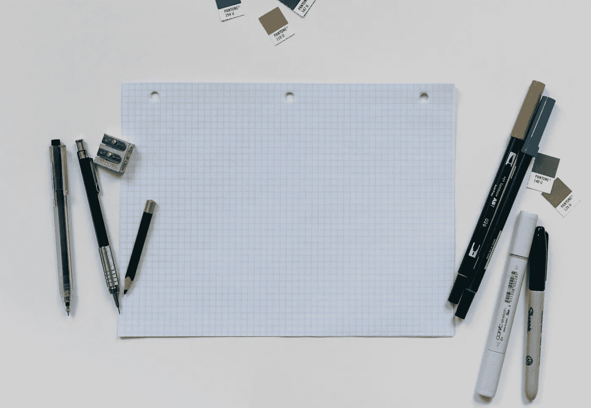
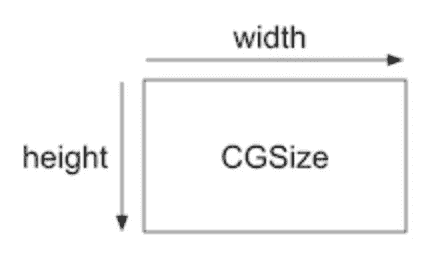
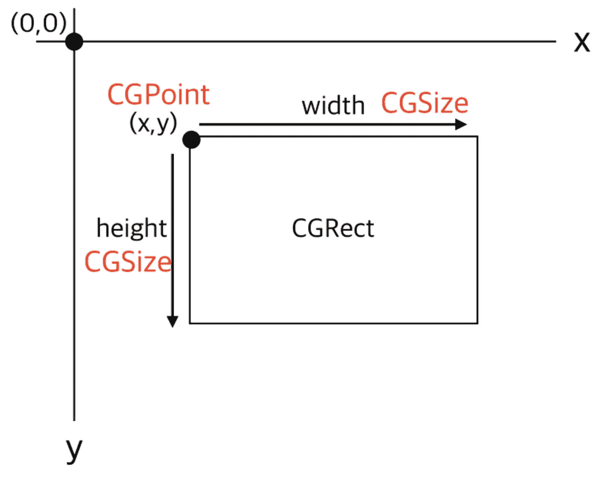
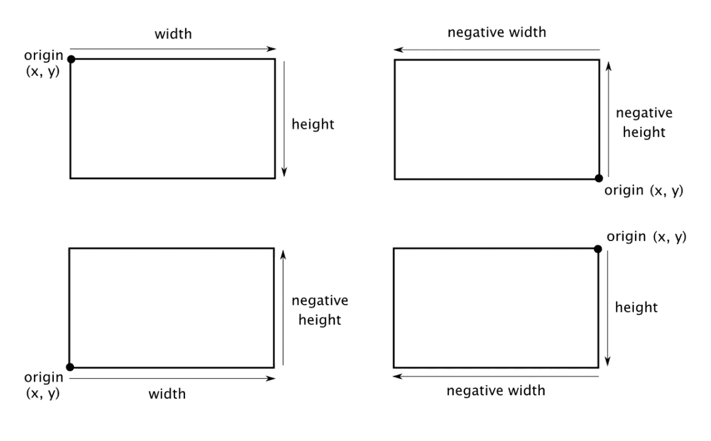

# SwiftUI | CGSize、CGRect 和 CGPoint

> 原文：<https://medium.com/geekculture/swiftui-cgsize-cgrect-and-cgpoint-33c15cb7970e?source=collection_archive---------8----------------------->

## CGSize、CGRect 和 CGPoint 使用指南



# CGPoint

CGPoint 是二维坐标系中包含点的结构。我们来看看 CGPoint 是怎么做出来的。

```
Public struct CGPoint{ 
     public var x: CGFloat
     public var y: CGFloat  
     public init() 
     public init(x: CGFloat, y: CGFloat)
}var Point = CGPoint(x: 10 , y: 10) 
```

# CGSize

CGSize 是一个包含宽度和高度值的结构。我们来看看 CGSize 是怎么做出来的。

```
struct CGSize {
  var width: CGFloat
  var height: CGFloat
}var size = CGSize(width: 50, height: 30)
```

我们需要记住的一点是，CGSize 是宽度和高度的值。它实际上不是长方形。然而，它有时被用来表示距离向量，所以它的值可以是负的。要将 CGRect 结构规范化为正值，必须调用 cgrectname 函数。



# CGRect

与 CGSizem 不同，CGRect 是一个矩形。CGRect 不仅有宽度和高度，而且还有原点。让我们看看这个结构。

```
Public struct CGRect {
   public var origin: CGPoint
   public var size: CGSize
   public init()
   public init(origin: CGPoint, size: CGSize)
}var rectangle = CGRect(origin: CGPoint(x:0,y:2), size: CGSize(width:10, height:20))
```

你可以看到原点的类型是 CGPoint，大小的类型是 CGSize，正常情况下，你只需要宽度和高度就可以画出一个矩形，但是在 IOS 中，你需要知道位置才能画出来。CGRect 通常用于构造 UIView，其坐标相对于父视图的坐标。



# 负宽度和负高度

宽度和高度值可以是负值。你可以用 CGRect 看看这是什么样子。让我们看看原点是如何在不同的边上显示的。

