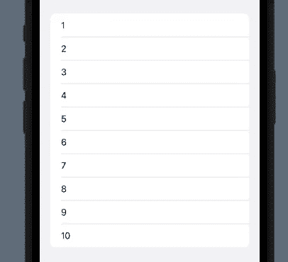
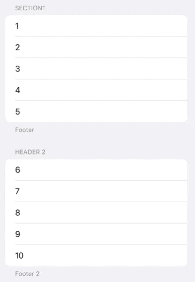
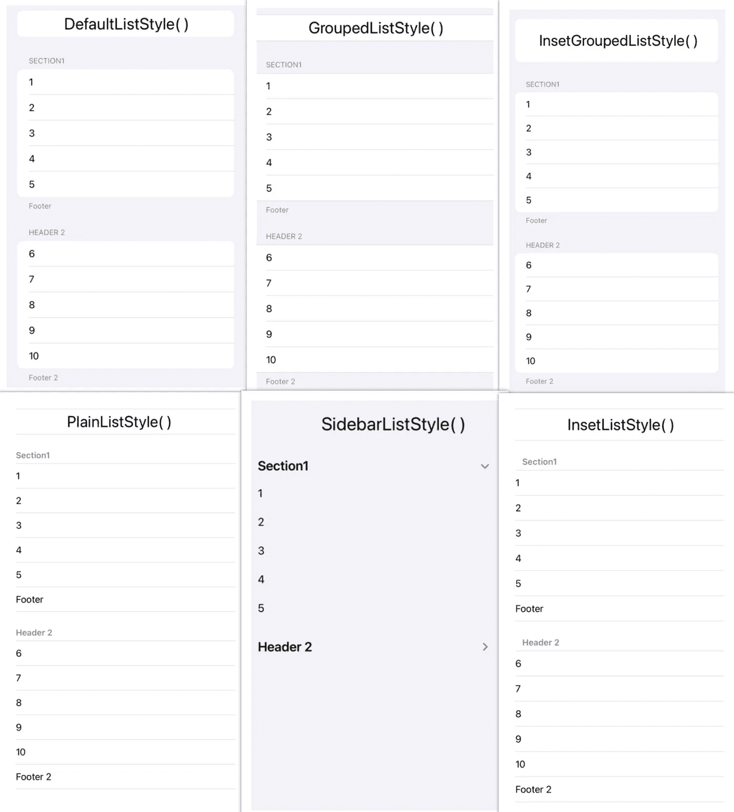
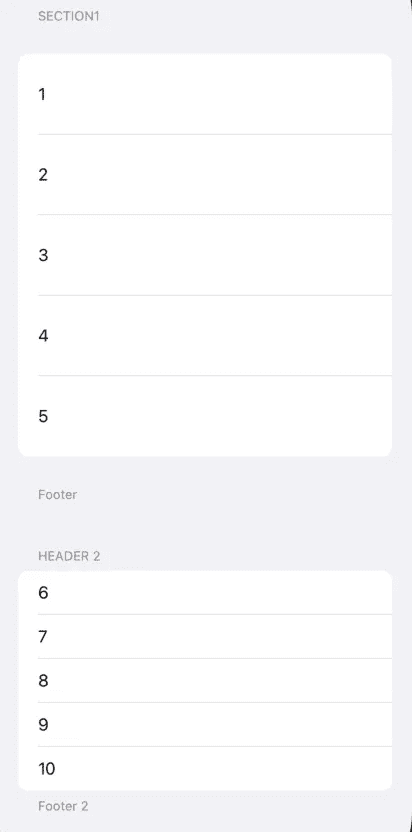
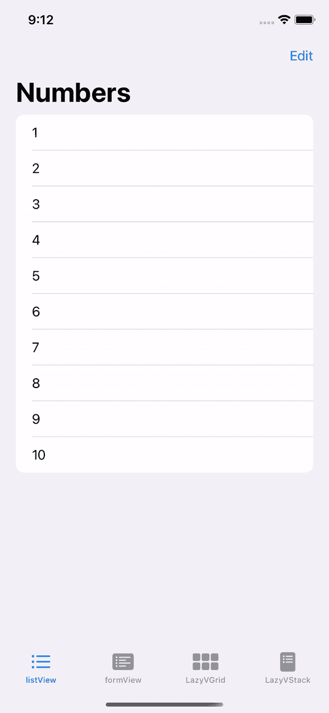
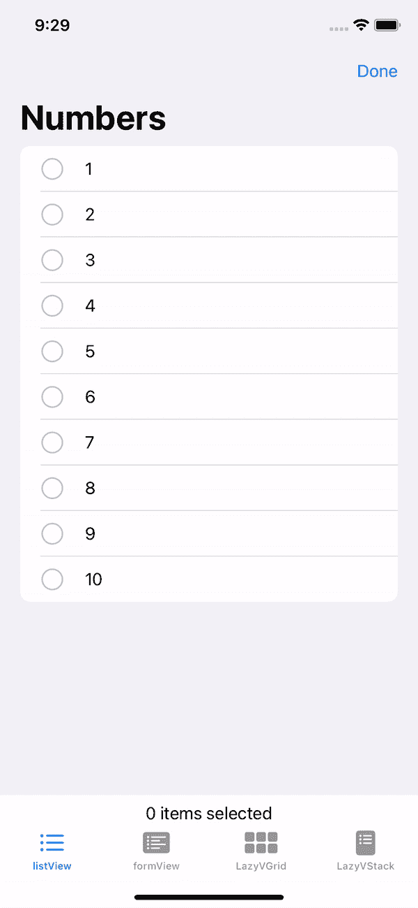

# SwiftUI|列表完整指南

> 原文：<https://medium.com/geekculture/swiftui-complete-guide-to-lists-99448038e7b?source=collection_archive---------2----------------------->


Photo by [Torbjørn Helgesen](https://unsplash.com/@tobben63?utm_source=unsplash&utm_medium=referral&utm_content=creditCopyText) on [Unsplash](https://unsplash.com/s/photos/lists?utm_source=unsplash&utm_medium=referral&utm_content=creditCopyText)

SwiftUI 允许我们以列表的形式展示和操作数据。在 SwiftUI 中实现列表比 UIKit 更容易。您可以通过调用预定义的列表控件来创建一个列表。你如何决定这样做实际上取决于数据的类型，这将在后面的文章中讨论。然而，主要的一点是，列表是在视图中显示数据的一种简单的替代方式。

> 在今天的博客中，我将讨论静态和动态列表、节、列表样式、插入、删除行、移动行和选择行。

# **静态和动态列表**

为了演示静态和动态列表的概念，请记住所有的示例代码都包含下面的列表。



**静态列表**

静态列表是由预定义的 SwiftUI 控件组成的列表。尽管示例代码使用了 Text()，但您也可以使用其他视图，如形状、图像、滑块等。实现静态列表时，必须手动将每一行添加到列表中。

**动态列表**

动态列表由更复杂的数据组成。与静态列表不同，它们接受相同类型的数据，并且可以更有效地创建，因为它遍历它的值。

> 1.Range:它接受类型为 **Range < Int >** 的值，所以每当你想遍历范围从 a 到 b 的值时，就使用这个方法。

范围示例:

> 2.随机访问集合协议:符合随机访问集合的值必须有一个 id。使用以下两种方法之一来实现此协议。

**A. id:** 给定一个值列表，使用。\self 关键字。

id 示例:

**B .可识别协议:**用可识别协议创建一个实例。这允许实例具有预定义的 id 值。创建一个包含这些值的单独列表，并将它们传入。

可识别的协议示例:

**静态和动态列表**

使用 ForEach: ForEach 允许我们使用随机访问收集协议和范围<int>类型。这允许我们向列表中添加不同的值。这也将让我们使用静态变量作为列表中的值类型。</int>

# 添加节、页眉和页脚

我们也可以将列表分成几个部分，并通过调用部分来添加页眉和页脚。请记住，页脚仅在某些列表样式中可用(稍后讨论)。按照以下格式制作单个截面。



格式:

```
List{
   Section(header:Text(""),footer:Text(""){
     ...
   }     
}
```

格式示例:

# 列表样式

总共有 6 种列表样式。简单打电话。listStyle( _)相应地格式化列表。

*   DefaultListStyle():显示页脚
*   GroupedListStyle():显示页脚
*   InsetGroupedListStyle():显示页脚
*   PlainListStyle():不显示页脚
*   SidebarListStyle():不显示页脚
*   InsetListStyle():不显示页脚



格式:

```
List{
...
}
.listStyle(DefaultListStyle()) 
```

示例:

# 列表插入:格式化行

您可以使用向相对于单元格本身的值(包括作为一组的页眉和页脚)添加填充。listRowInset( _)。



使用以下格式

```
List{
...
}
.listRowInsets(EdgeInsets.init(top: CGFloat, leading: CGFloat, bottom: CGFloat, trailing: CGFloat)) 
```

# 添加功能

在实现即将讨论的功能时，调用在导航视图中嵌入列表是很重要的。作为导航属性，可以添加

```
.toolbar{EditButton()}
```

或者

```
navigationBarItem(trailing: EditButton())
```

表示您将向列表中添加功能

## **OnDelete/onMove**

您可以通过实现单独的函数来删除和移动单元格。用。onMove( _)和。onDelete( _)并添加函数名作为参数。

> 列表中的变量应该包含随机访问收集协议。



*   删除行

```
func removeVal(at offsets: IndexSet){ self.list1.remove(atOffsets: offsets)}
```

*   移动行

```
func moveList(from source: IndexSet,to destination: Int){self.list1.move(fromOffsets: source, toOffset: destination)}
```

示例:

## **行选择**

选择行与删除或移动行略有不同。您不必创建单独的函数来实现这个功能，但是您必须创建一个@State 变量，它包含一个 UUID 类型的空集。

```
@State private multilineSelection = Set<UUID>()
```

> 列表中的变量应该是可识别的。



示例:

这就是我对列表的全部了解。总结一下，今天我讲了以下几点。

*   静态和动态数据
*   部分
*   列表样式
*   插入物
*   删除行
*   移动行
*   选择行

感谢您的阅读！如果你有任何问题，请随时给我发电子邮件到 yu24c@mtholyoke.edu。