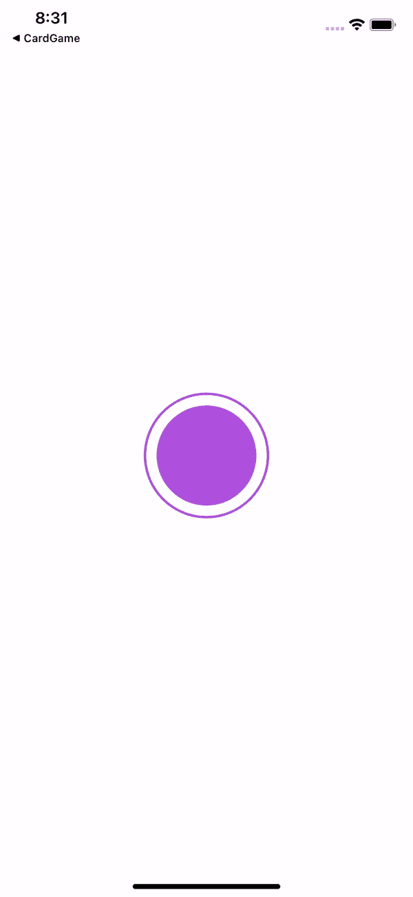

# SwiftUI |隐式和显式动画

> 原文：<https://medium.com/geekculture/swiftui-implicit-and-explicit-animations-ba9ad280f9fd?source=collection_archive---------5----------------------->

## 完全使用指南。动画和带动画的()


Photo by [Matt Moloney](https://unsplash.com/@mattmoloney?utm_source=unsplash&utm_medium=referral&utm_content=creditCopyText) on [Unsplash](https://unsplash.com/s/photos/animate?utm_source=unsplash&utm_medium=referral&utm_content=creditCopyText)

# 隐式动画

## 。动画(_:值:)

这是 swiftUI 视图的修饰符。第一个参数的值是动画行为，包括**线性**(恒速)**【ease out】**(结束时减速) **easeIn** (结束时加速) **easeInOut** (开始慢，加速，结束慢)。第二个参数采用一个不断变化的值。动画反应到。

在这个例子中

如果您点击该按钮，值会增加，因此动画会受其影响并根据更改进行操作。由于我们在 scaleEffect 中添加了动画，按钮的大小将会增加。

**持续时间**

为了更精确地控制我们的动画，我们可以添加**持续时间**。这允许我们的动画持续指定的时间。

```
.animation(.easeInOut(duration: 2), value: value)
```

这将延迟我们的动画到 2 秒。

**。重复 Count/。永远重复**

我们还可以添加 repeatCount(count)或 repeatForever()来重复动画。

```
.animation(.easeInOut(duration: 1).repeatCount(2), value: value)
.animation(.easeInOut(duration: 1).repeatForever(), value: value)
```

添加 **autoverse** 将使动画在重复时从先前视图到当前视图来回跳动。当动画重复播放时，Auto-verse 总是设置为 true。

```
.animation(.easeInOut(duration: 1).repeatCount(2, autoverse = false), value: value)
```

**。onAppear**

当您想要在视图出现时立即启动动画时，请使用. onAppear .操纵变化的值来立即触发该值的动画。在下面的例子中，当视图出现在屏幕上时，圆的笔划立即动画化，因为我们在屏幕出现时改变值。

上面的代码产生了下面的结果。



# 明确的动画

显式动画不是视图修改器。而是调用 withAnimation()并在括号之间添加要制作动画的内容。动画是动画结构的一个函数，所以本质上，你是在调用一个函数。

## 带动画()

让我们以隐式动画部分的第一个例子为例，将隐式动画与显式动画进行交换。价值被操纵的区域被动画包裹着。

使用时。在这种情况下，我们可以在调用时在调用值旁边添加动画。onAppear

需要注意的重要一点是，显式动画不会覆盖隐式动画。