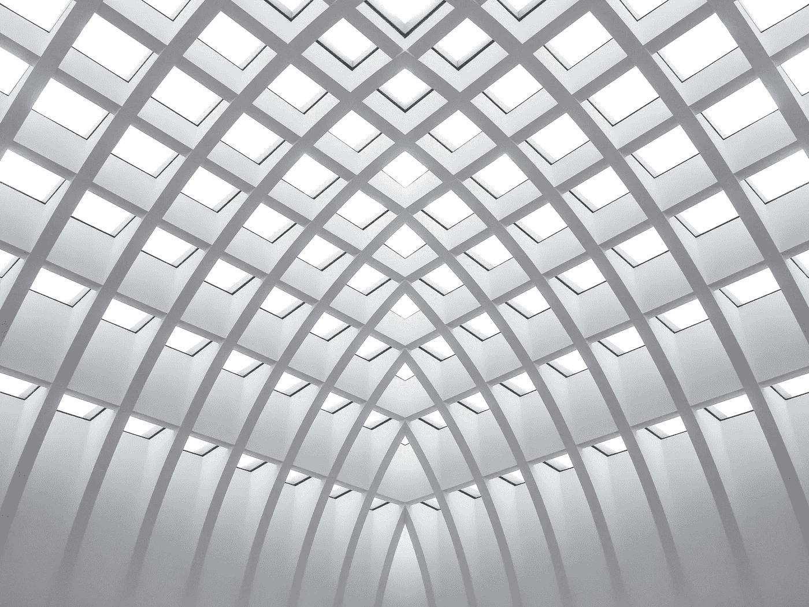
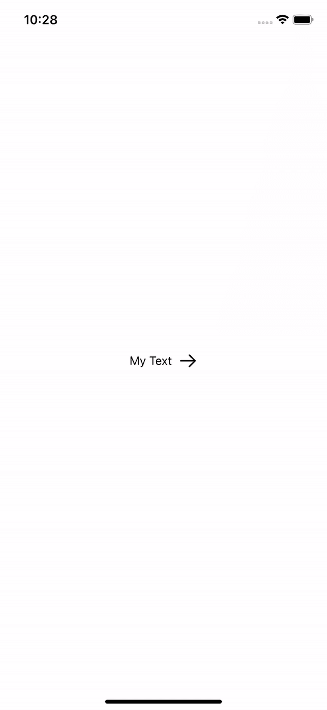
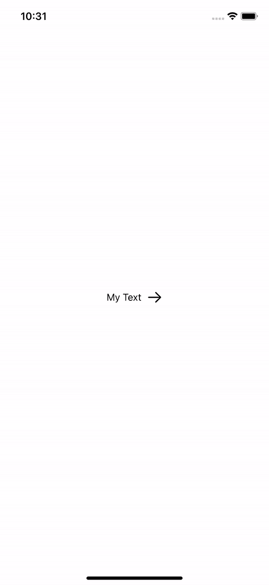

# SwiftUI| matchedGeometryEffect

> 原文：<https://medium.com/geekculture/swiftui-matchedgeometryeffect-20fa63ff9db9?source=collection_archive---------11----------------------->

## 使用 matchedGeometryEffect 和@Namespace 的完整指南



Photo by [Robin Spielmann](https://unsplash.com/@iam_robin?utm_source=unsplash&utm_medium=referral&utm_content=creditCopyText) on [Unsplash](https://unsplash.com/s/photos/geometry?utm_source=unsplash&utm_medium=referral&utm_content=creditCopyText)

如果您想让同一个视图在两个不同的视图之间产生动画效果，请使用匹配几何体效果。当您在两种视图状态之间切换时，这将允许 SwiftUI 无缝地动态显示同步视图。

当您使用 if else 语句在两个视图之间制作动画时，这看起来很不自然，因为两个视图在制作动画时会重叠。matchedGeometryEffect 解决了这个问题。这个修饰符应该使用@Namespace 属性包装器为视图创建一个名称空间。

```
 @NameSpace private var animation
```

然后在所需的视图中添加修改器

```
//Text
.matchedGeometryEffect(id:"text" , in: animation)
//Image 
.matchedGeometryEffect(id:"icon" , in: animation)
```

## 让我们来看一个例子，动画两个视图没有匹配的几何效果。

这段代码看起来像下面这样



如你所见，动画有点笨拙。这两个视图相互重叠，它看起来不像我们希望的那样平滑。

## 让我们看看同样的例子，但是有几何效应

这段代码显示了以下结果



这部动画看起来比上一部好。因此，当你有两个相互动画的视图时，确保使用 GeometryEffect()