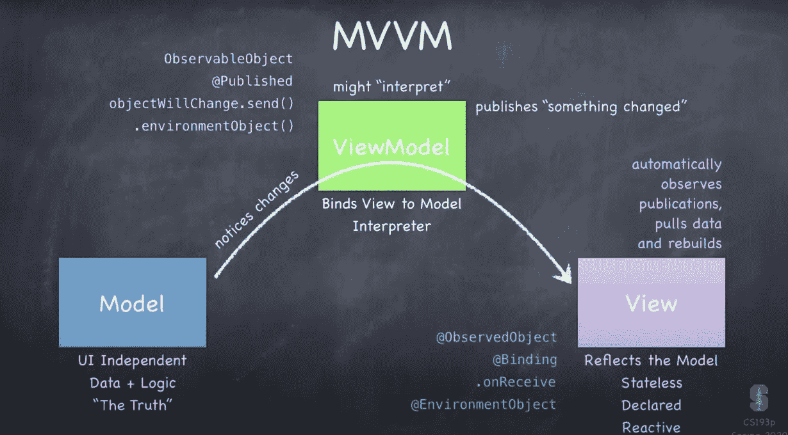
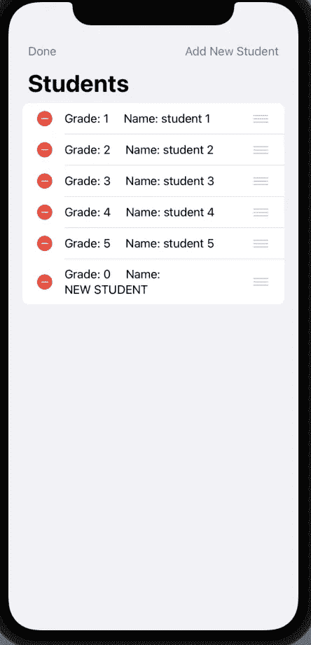

# MVVM 建筑

> 原文：<https://medium.com/geekculture/swiftui-mvvm-architecture-d00a29812d90?source=collection_archive---------5----------------------->

## 了解 SwifTUI 的标准架构

Diagram from Standford’s CS193p class

MVVM 是 SwiftUI 开发的标准软件架构模式。它代表模型-视图-视图模型，由苹果公司在 2019 年首次推出，当时他们首次推出了 SwiftUI。

示例代码构成了以下结果。请记住这一点，并遵循。

# 型号:

它负责业务逻辑。它保存应用程序所需的任何数据和逻辑。为模型编写代码时，不导入 SwiftUI。

*   应该是一个结构

# 查看模型:

该模型不直接与视图进行数据通信，而是使用一个反应式视图来这样做。模型告诉视图模型对数据的任何更改，视图模型然后将这些更改“发布”到视图。该视图使用订阅者(如 ObservableObjects 或 EnvironmentObjects)来观察这些更改。视图中的任何功能都在视图模型中实现，比如从列表中删除、添加和移动单元格。为模型编写代码时，不导入 SwiftUI。

*   应该是符合 ObservableObject 协议的类，因为它应该是引用类型
*   应该将来自模型的对象作为@Published 类型，以便它可以传递给视图

# 查看:

视图基本上就是用户在屏幕上看到的任何东西。用户接口组件。它反映了模型中的任何内容。因为数据只存在于模型中，所以数据总是从模型流向视图。导入 SwiftUI。

*   应该是一个结构

谢谢你阅读我的博客！

这就是我对 MVVM 的全部。今天我用模型、视图和视图模型的代码例子介绍了 MVVM 建筑的概念。