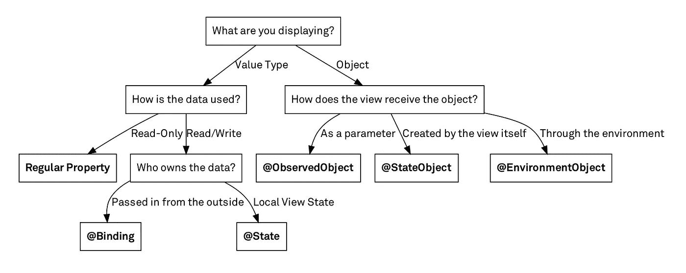

# SwiftUI 属性包装

> 原文：<https://medium.com/geekculture/swiftui-property-wrappers-395e2ce5dccf?source=collection_archive---------3----------------------->

## 知道何时使用@State、@Binding、@StateObject、@ObservedObject 和@EnvironmentObject



Diagram by [**Chris Eidho**](https://twitter.com/chriseidhof)**f** from [**objc.io**](https://www.objc.io/)

我将把这篇博客分成两部分，一部分是值类型，另一部分是对象。请跟着例子读下去。

# 值类型

如上所述，属性包装可以大致分为两个部分。在这一节中，我将讨论值类型。值类型是已经存在的任何快速类型，例如整数、字符串、布尔、整数类型的数组等等。

## **@状态变量**

@State 变量是 SwiftUI 使用的最基本的属性包装器。这些变量响应任何变化，这意味着它们能够读取和写入视图。在下面的例子中，视图读取状态变量，并在每次按钮被按下时将该值更改为从 0 到 100 的任意随机整数。

何时使用状态变量

*   当视图拥有变量时
*   当您需要响应变量的变化时

## **@绑定变量**

@绑定变量是值类型(整数、字符串、数组..等等)，它们是由另一个视图传入的。与@State 变量不同，调用它们的视图并不拥有这些变量的所有权。使用绑定变量在需要从其他视图访问@State 变量时使用。它们读取并更新这些变量，因此您可以操作它们并更改它们的值。

以便连接两个状态和绑定变量。创建一个绑定变量，并在从主视图调用它时将其作为参数传递。使用$并传入您想要绑定的@State 变量。

```
binding(value: self.$number)
```

何时使用绑定变量

*   您需要读写另一个视图拥有的变量
*   视图不拥有该变量。

# 对象类型

从现在开始将要讨论的属性包装器是您定义的对象。在我们深入探讨之前，让我们先来谈谈**可观测对象**和**@已发布的**变量。ObservableObject 是属于 Combine 框架的协议。任何符合 ObservableObject 协议的对象都会跟踪对@Published 变量所做的任何更改。

让我们定义一个名为 myObject 的对象。

```
myObject(name: "Elizabeth", value: 10)
```

## @StateObject 变量

状态对象类似于@State 变量，但用于 ObservableObject 协议创建的对象。

```
@StateObject var object1 = myObject(name: "Elizabeth", value: 10) 
```

因为“name”没有发布，所以它是一个只读属性，所以一旦初始化，我们就不能更改它。但是，我们可以更改“value”的值，因为它被声明为@Published 变量。

何时使用@StateObject 变量

*   您希望响应由 ObservableObject 协议对对象所做的更改。
*   视图拥有对象(对象在视图中初始化)

## @ObservedObject 变量

@ObservedObjects 是作为@StateObjects 从其他视图传入的 ObservableObjects。视图对变量没有所有权，并且可以从 ObservableObject 中更改任何已发布的变量。

在下面的例子中，注意包含@ObservedObject 的视图是如何不需要用$来传递的。@ObservedObjects 的行为类似于@Binding 变量，但连接方式不同。

```
observedObject(object2: self.object1)
```

何时使用@ObservedObject 变量

*   您希望响应通过 ObservableObject 协议由对象所做的更改
*   视图不拥有该变量

## @环境对象变量

@EnvironmentObjects 类似于@ObservedObjects，但是在许多视图之间共享特定对象时使用。这些变量不需要用$符号传递。

一个不同之处是，您必须像下面这样添加参数

```
viewContainingEnvironmentObject.environmnetObject(parameter)
```

何时使用@ObservedObject 变量

*   您希望响应通过 ObservableObject 协议由对象所做的更改。
*   您希望在许多视图中访问它。
*   视图不拥有该变量。

今天我谈到了 SwiftUI 的属性包装器。虽然我没有涵盖全部，但我涵盖了常用的几个，分别是 **@State、@Binding、@Published、@ObservedObject、@StateObject、**和 **@EnvironmentObject。**

这就是我所有的属性包装器。如果你有任何问题，请发电子邮件给 yu24c@mtholyoke.edu！感谢您阅读我的这篇长文！