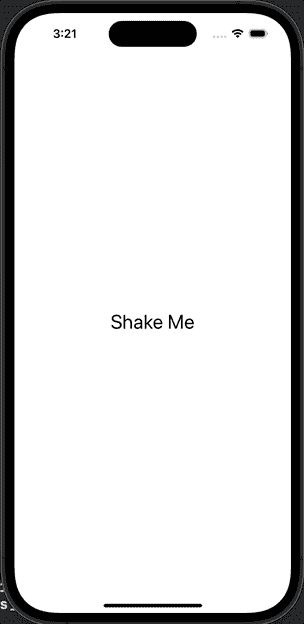

# SwiftUI 摇动动画

> 原文：<https://medium.com/geekculture/swiftui-shake-animation-d3da53f57df?source=collection_archive---------12----------------------->

Photo by [Guilherme Stecanella](https://unsplash.com/@guilhermestecanella?utm_source=medium&utm_medium=referral) on [Unsplash](https://unsplash.com?utm_source=medium&utm_medium=referral)

这是一个在 SwiftUI 中使用完成块完成的摇动动画的快速示例。

## 用例

这个 API 使用起来很简单，你只需要在任何视图上调用`.shake()`，同时传递一个`State`变量，以及一个可选的在动画完成后执行的完成块。

## 履行

完整代码如下:

你喜欢我的内容吗？
帮我继续捐款吧！

 [## 捐赠给爱德华多·多米尼二世

### 通过捐赠或与朋友分享来帮助支持小爱德华多·多米尼。

www.paypal.com](https://www.paypal.com/donate/?hosted_button_id=B3W6GJWSPB4VU)