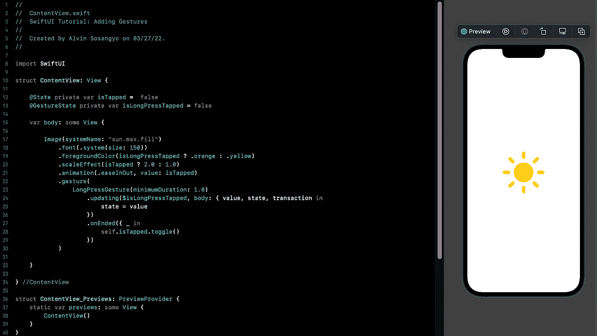

# SwiftUI 教程:添加手势

> 原文：<https://medium.com/geekculture/swiftui-tutorial-adding-gestures-9eb8d74dced9?source=collection_archive---------8----------------------->

## 在 SwiftUI 中使用各种类型的手势

Figure 1.

SwiftUI 通过简化手势的编码方式来完成繁重的工作，从而提高开发人员的工作效率。该框架有几个内置的手势，常用于苹果设备，如点击，长按，拖动和放大。在本文中，我们将讨论如何在 SwiftUI 中处理这些手势。