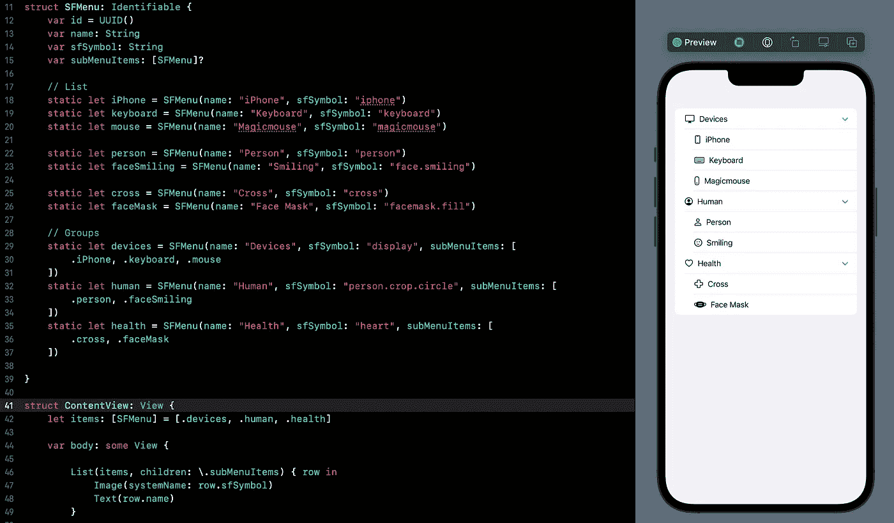

# SwiftUI 教程:创建可扩展列表

> 原文：<https://medium.com/geekculture/swiftui-tutorial-creating-expandable-list-ec16e13d1ba4?source=collection_archive---------4----------------------->

## 如何在 SwiftUI 中使用 OutlineGroup 和 DisclosureGroup

Figure 1.

在你的应用中使用可扩展的[列表](/dev-genius/swiftui-tutorial-working-with-list-using-foreach-a4b7451fbcf0)视图可以让你的用户在一定程度上控制他们可以在屏幕上看到什么。这种简单而巧妙的方法提升了更好的用户体验，尤其是当屏幕需要处理太多数据的时候。