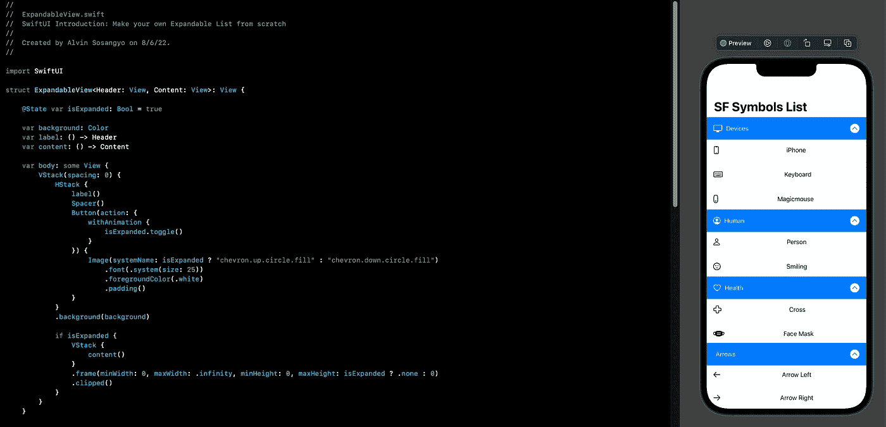

# SwiftUI 教程:从头开始创建自己的可扩展列表

> 原文：<https://medium.com/geekculture/swiftui-tutorial-make-your-own-expandable-list-from-scratch-e574205571a7?source=collection_archive---------4----------------------->

## 如何为 iOS 13 制作一个可扩展列表

Figure 1.

每一年，SwiftUI 都变得越来越好，内置了更多的修饰符，使开发人员的工作更加高效。但是因为这个框架还是新的，你还不能在生产中使用所有的东西。