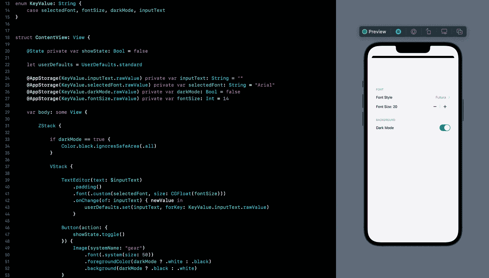

# SwiftUI 教程:使用 UserDefaults 和 AppStorage 持久化数据

> 原文：<https://medium.com/geekculture/swiftui-tutorial-persistent-data-using-userdefaults-and-appstorage-c17a94e131cf?source=collection_archive---------0----------------------->

## 如何在您的 apple 设备中本地存储更改

Figure 1.

在我的[之前的](/geekculture/swiftui-working-with-form-d4d19c47883f) SwiftUI 相关教程中，我们创建了一个笔记应用程序，用户可以选择更改应用程序的外观。虽然应用程序运行良好，但关闭它会将所有更改恢复到默认值，包括写在…