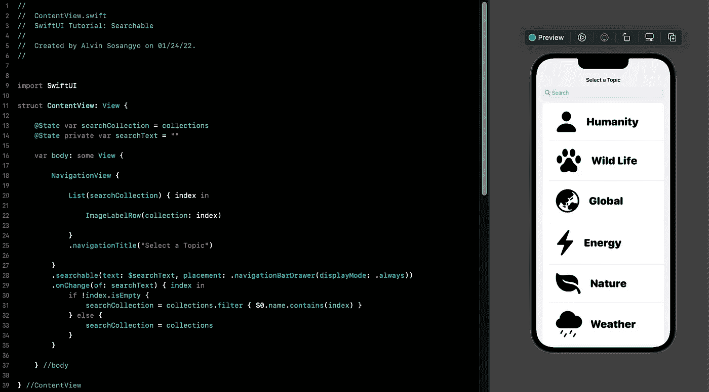

# SwiftUI 教程:可搜索

> 原文：<https://medium.com/geekculture/swiftui-tutorial-searchable-d71b42ab0e2f?source=collection_archive---------4----------------------->

## 只用几行代码创建一个搜索栏

Figure 1.

在 iOS 15 之前，SwiftUI 没有任何内置的搜索修改器。最常见的创建方法是在 TextField 上硬编码一个搜索功能，然后创建一个显示搜索结果的视图。当大多数苹果用户在不久的将来迁移到 iOS 15 时，所有这些都将成为过去。因为有一个…