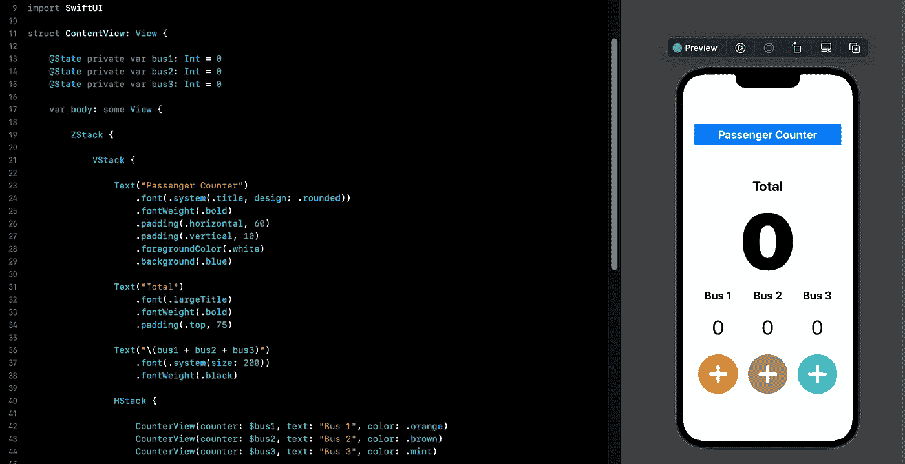

# SwiftUI 教程:状态和绑定

> 原文：<https://medium.com/geekculture/swiftui-tutorial-state-and-binding-b7e80b4de622?source=collection_archive---------5----------------------->

理解状态和绑定的工作原理

Figure 1.

一般来说，状态和绑定是处理读写值的属性包装器。这是在 SwiftUI 中创建应用程序的一个重要核心概念。

> 本教程是我的 [SwiftUI 教程](https://arc-sosangyo.medium.com/list/swiftui-tutorial-03734e631240)系列的一部分。

# 什么是状态？