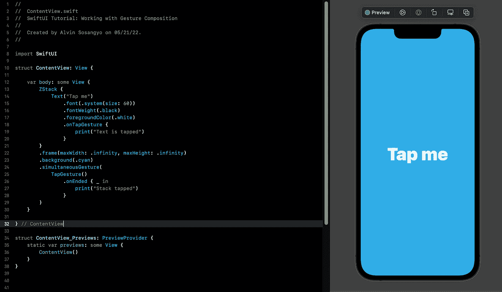

# SwiftUI 教程:使用手势合成

> 原文：<https://medium.com/geekculture/swiftui-tutorial-working-with-gesture-composition-3418f52225d?source=collection_archive---------3----------------------->

如何在 SwiftUI 中组合多个手势

Figure 1.

SwiftUI 的手势修改器默认情况下一次只能检测一个手势动作。组合手势要求您使用手势合成来定义多个手势如何相互交互。在本教程中，我们将借助手势合成来解决如何在同一个视图中使用多个手势的问题。