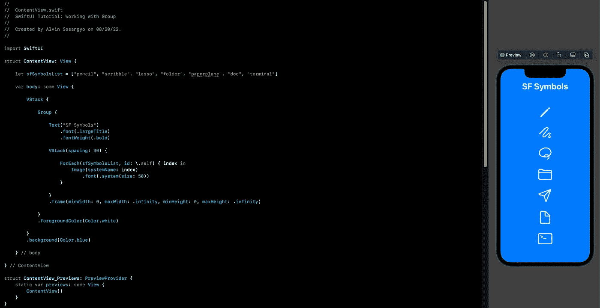

# SwiftUI 教程:使用组

> 原文：<https://medium.com/geekculture/swiftui-tutorial-working-with-group-58aace3addda?source=collection_archive---------9----------------------->

## 如何在 SwiftUI 中制作不可见的布局容器

Figure 1.

组视图基本上是一个不可见的容器，用于将多个视图放在一起。为了理解它的重要性，它基本上用于以下情况:

*   作为 10 个孩子观看限制的解决方案。
*   用于消除代码重复。