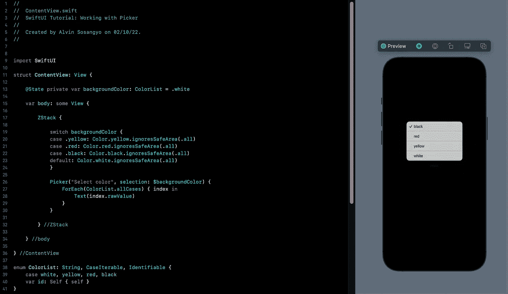

# SwiftUI 教程:使用选择器

> 原文：<https://medium.com/geekculture/swiftui-tutorial-working-with-picker-f3e68a0c2724?source=collection_archive---------6----------------------->

## 创建选取器的不同方法

Figure 1.

SwiftUI 的选择器是使用选项的标准方式。它允许开发人员拥有 UIKit 的 UIPickerView 和 UISegmentedControl 的功能，而无需了解这些视图是如何工作的。

> 这篇文章是我的 [SwiftUI 教程](https://arc-sosangyo.medium.com/list/swiftui-tutorial-03734e631240)系列的一部分。