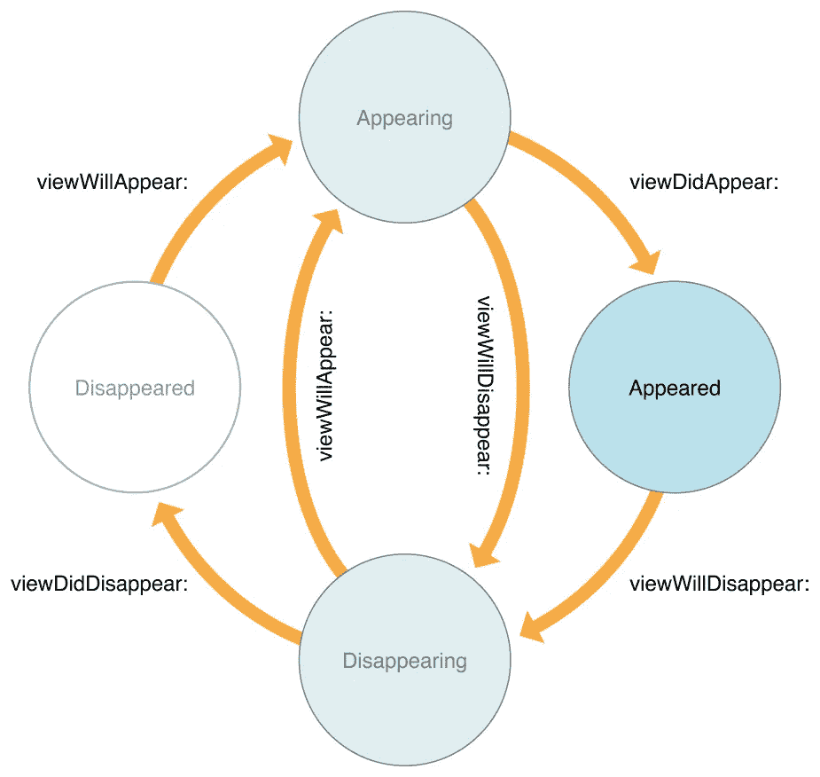
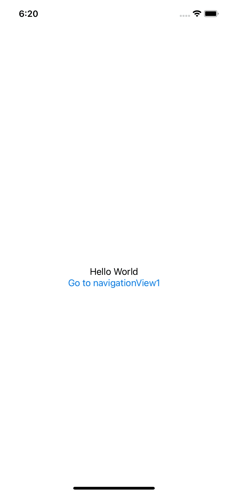
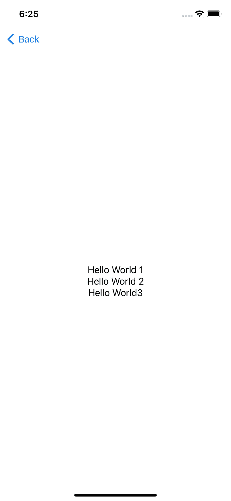

# SwiftUI |查看生命周期

> 原文：<https://medium.com/geekculture/swiftui-view-life-cycles-d3b5e88d3c69?source=collection_archive---------4----------------------->

## 从实例中学习。


Photo by [Fernando Meloni](https://unsplash.com/@f_meloni?utm_source=unsplash&utm_medium=referral&utm_content=creditCopyText) on [Unsplash](https://unsplash.com/s/photos/cycle-circle?utm_source=unsplash&utm_medium=referral&utm_content=creditCopyText)

# 基础知识

在我们开始之前，我想谈谈**视图**和**视图控制器。**视图基本上是可以在屏幕上绘制的对象，如文本、按钮、导航视图、标签等。另一方面，视图控制器是处理视图状态和功能的类。视图监听视图控制器的事件，并相应地采取行动。视图控制器还负责确定视图在什么特定时间出现和从屏幕上消失。

如果您使用过 UIKit，您将会熟悉下面的图表，它决定了一个视图的不同生命周期。如果没有，不要担心， **SwiftUI 不使用这些生命周期。**



Apple: UIViewController Reference Documentation

# SwiftUI 生命周期

SwiftUI 没有视图控制器，就像我之前提到的那样，不使用 Apple 随 UIKit 提供的标准生命周期。相反，SwiftUI 使用。onAppear 和。onDissapear 方法。在深入探讨之前，我们先来看看苹果官方提供的定义。

**。onAppear(执行:)**

> 添加视图出现时要执行的操作— Apple

**。onDissapear(执行:)**

> 添加视图消失时要执行的操作-苹果

# SwiftUI 生命周期示例

关于 SwiftUI 中的生命周期，有一点需要注意。当您实现。onDissapear 方法。您可能希望视图调用。当您导航到 navigationLink 但它没有时。

仔细想想，navigationLink 仍然在 navigationView 中，所以我们没有必要离开主视图。当我们在模拟器中运行时，“显示器上的主视图”将不会打印在控制台上。即使我们离开应用程序。

既然我们已经讨论了所有的事情，让我们从头开始吧。一旦我们运行代码，模拟器将显示内容视图，看起来像这样。



控制台将打印以下内容

```
 Main View onAppearnavigation Text onAppear
```

现在，让我们看看 navigationView1 的代码片段。

一旦我们单击导航链接(“转到导航视图 1”)，模拟器看起来就像这样。



控制台打印出以下内容。请记住，我们只实现了。onAppear 和。“你好，世界 3”的电话。

```
Hello World onAppear
navigationView1 onAppear
navigation Text onDissapear
```

最后，当我们返回时，控制台打印出以下内容。

```
navigation Text onAppear
Hello World onDissapear
navigationView1 onDissapear
```

今天到此为止。我真的希望这个例子能帮助你理解 SwiftUI 中生命周期的概念。如果你有任何问题，随时给我发电子邮件到 yu24c@mtholyoke.edu。

# 参考

*   [苹果开发者文档:UIViewController](https://developer.apple.com/documentation/uikit/uiviewcontroller)
*   苹果开发者文档:onAppea
*   [苹果开发者文档:onDissapear](https://developer.apple.com/documentation/swiftui/view/ondisappear(perform:))