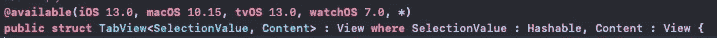
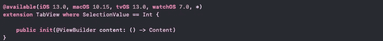

# SwiftUI| ViewBuilder

> 原文：<https://medium.com/geekculture/swiftui-viewbuilder-c28440d59c2d?source=collection_archive---------7----------------------->

Photo by [Callum Hill](https://unsplash.com/@inkyhills?utm_source=unsplash&utm_medium=referral&utm_content=creditCopyText) on [Unsplash](https://unsplash.com/s/photos/builder?utm_source=unsplash&utm_medium=referral&utm_content=creditCopyText)

视图构建器:我能想到的有两个定义。

*   在闭包中组成视图的定制参数属性
*   在传递给某种参数的闭包内构建子视图时使用。

让我们来看看 tabView 是如何制作的。在文档中，我们看到以下内容。

在这里，我们可以看到 tabView 有两个通用类型 SelectionValue 和 Content。

*   **选择值**符合散列值
*   **内容**符合观点

现在，我们已经记住了这一点，让我们看看初始化

您可以看到，当创建一个 tabView 时，它首先由闭包初始化，因此您需要一个@ViewBuilder 关键字。

当您查看 tabItem 的文档时，它是视图扩展的一个函数，您可以看到@ViewBuilder 再次出现。

这个函数有一个泛型类型，就是 V

*   **V** 符合视图

这里，函数的参数是一个返回视图的闭包

让我们看一些示例代码

*   当我们初始化一个 tabView 时，我们调用了 View1()和 View2()，它们都是视图。
*   当我们调用 tabItem 函数时，我们创建了一个标签，它也是一个视图。

现在我们已经了解了这一点，让我们创建自己的视图生成器

在这个例子中，我创建了自己的视图 LargeOrangeContent。如您所见，它首先由一个闭包初始化，该闭包接受一个通用视图并返回一个视图。然后，它接受输入视图，增加其中视图的大小和颜色。

结果

