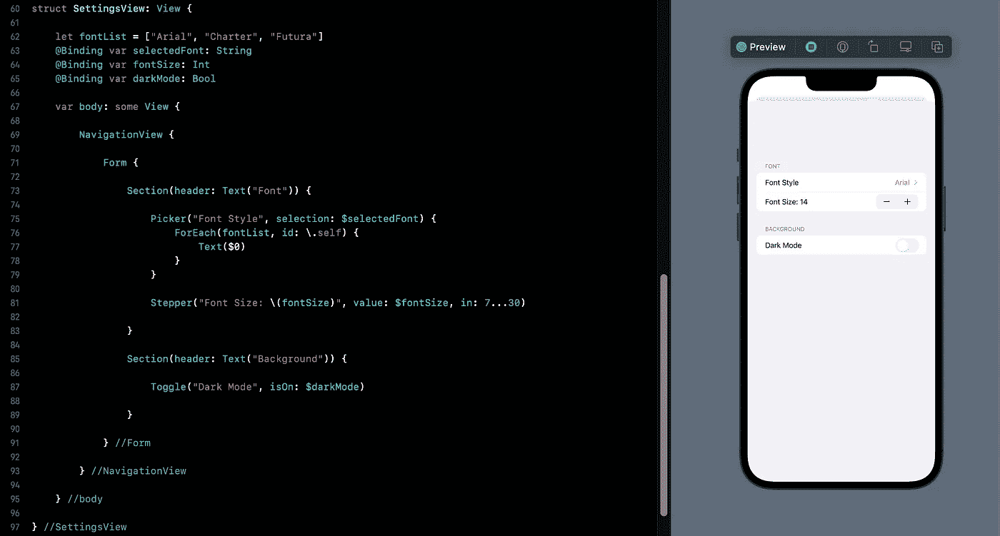

# SwiftUI 教程:使用表单

> 原文：<https://medium.com/geekculture/swiftui-working-with-form-d4d19c47883f?source=collection_archive---------8----------------------->

## 创建一个改变外观的简单笔记应用程序

Figure 1.

SwiftUI 中的 Form 是一个[结构](/@arc-sosangyo/swift-programming-tutorial-structs-6521663fee84)，它的工作方式类似于一个对控件进行分类的容器。最初，表单的标准用途是拥有一个专用的视图，用于向用户提供某些输入。一个例子是一个购物应用程序，它通过表单请求支付和运输信息。但是因为形式基本上只是一个…