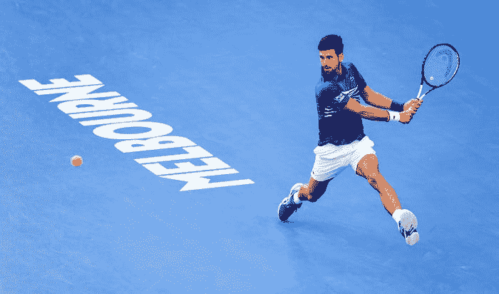
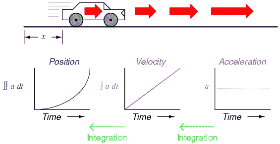
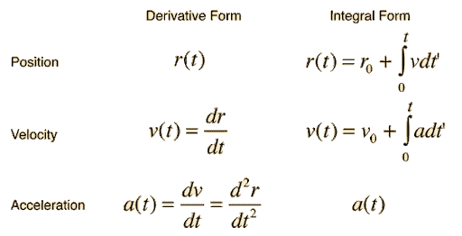
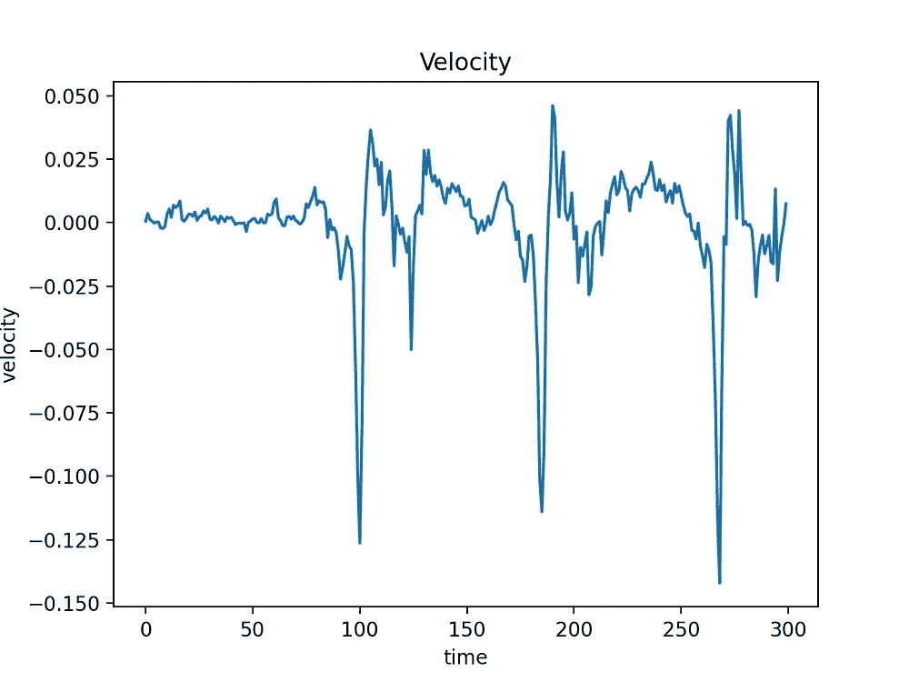
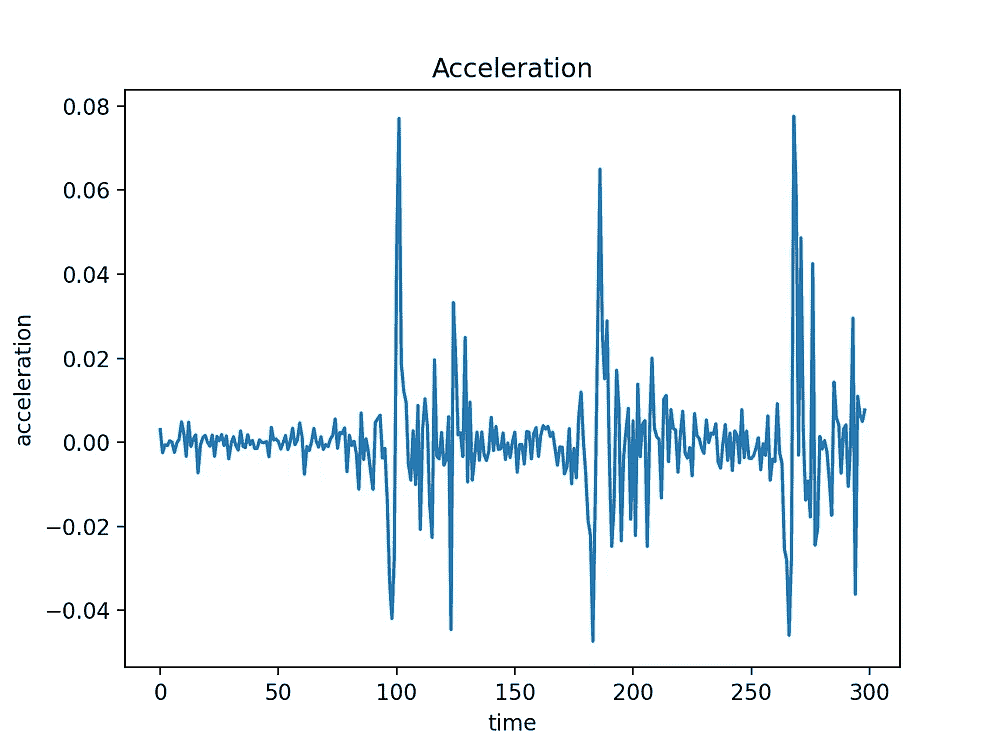
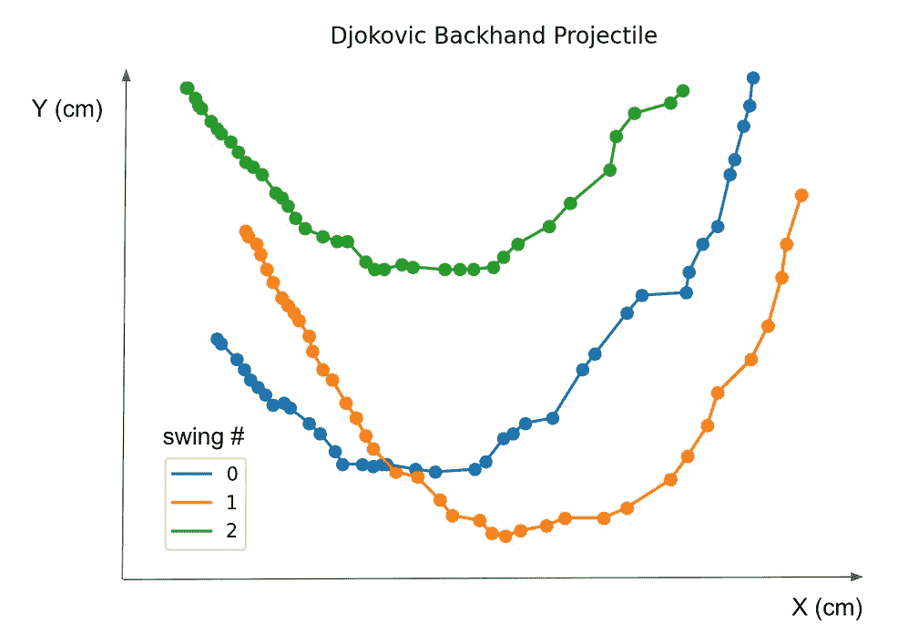
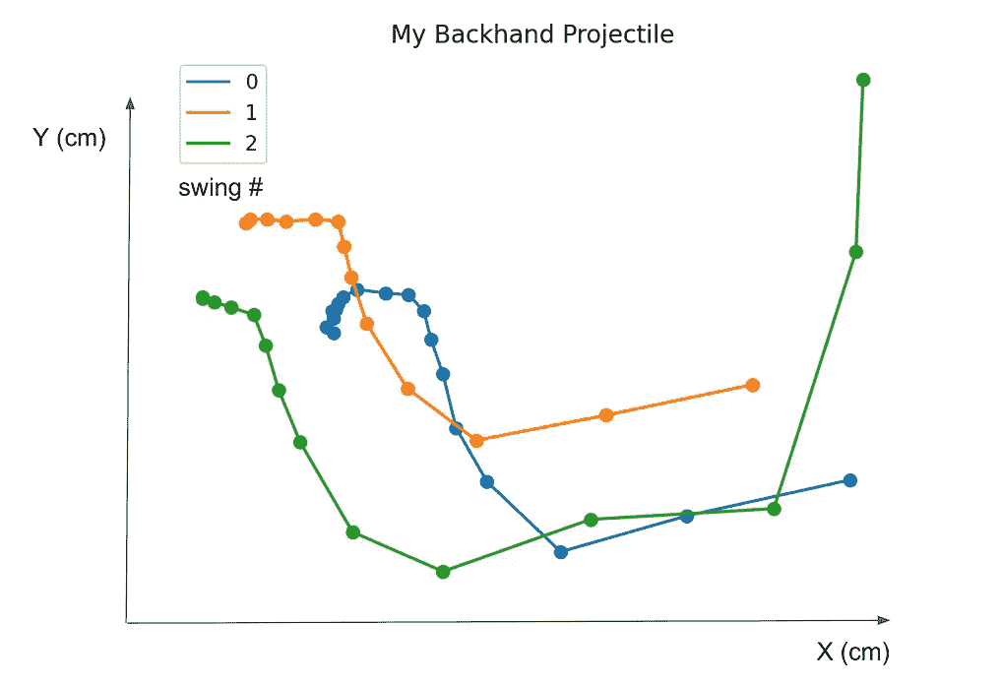

# 借助计算机视觉像冠军一样挥杆|反手跟踪器

> 原文：<https://medium.com/geekculture/swing-like-a-champ-with-computer-vision-backhand-tracker-543534536912?source=collection_archive---------6----------------------->

[Photo by James D. Morgan/Getty Images](https://www.gettyimages.co.uk/detail/news-photo/novak-djokovic-of-serbia-during-the-mens-singles-final-news-photo/1125290115)

看了 2020 年东京奥运会、美网和 ATP 巡回赛后，我迷上了网球。我没有意识到网球比赛会如此激烈。三平后的胜利时刻再好不过了。即使我坐在柔软的沙发上看比赛， ***我的手心也在冒汗，就好像我真的在赛场上打*** 。为了在现实生活中体验同样的感觉，除了开始学习网球，别无选择。

到目前为止，我认为这是相当成功的。经过几个月的学习，我的技术有了很大的提高——可以控制并以适中的速度击打高低球。

然而，我并不满意，我一直在思考如何改进我的游戏。在 youtube 上浏览网球比赛和教程可能有些重复——每看一次，你学到的东西就少一点。我想要别的东西，能让我更上一层楼的不同的东西。

> 我意识到我可以整合计算机视觉来即兴创作我的网球比赛。

以下是我选择计算机视觉的几个原因:

1.  计算机视觉在寻找人类关节的关键点方面非常出色。
2.  有许多开源软件可供使用。我不需要从头开始训练一个模特就能检测出人类的姿势。
3.  我可以很容易地分析我的挥杆，并与他人进行比较。

希望这篇文章能成为我的网球比赛中计算机视觉的众多实现之一。在这篇文章中，我将展示一种跟踪反手挥杆动作的方法，并分析我的挥杆与这一行业中最好的德约科维奇有何不同。

# 媒体管道[1]

在开源社区中有各种各样的姿势评估可供选择。举几个例子，OpenPose[2]、HRNet[3]、DeepCut[4]和 Deep Pose[5]被广泛使用。

> 查看此[链接](https://viso.ai/deep-learning/pose-estimation-ultimate-overview/)以获取关于人体姿态估计概述的更多信息

对于本文，我将使用 Google 提供的 MediaPipe。它为直播和流媒体提供可定制的深度学习解决方案，包括人脸检测、人脸网格、姿态检测、3d 对象检测等。此外，它还提供了一个可以在非 GPU 环境中使用的训练模型。换句话说，可以使用便携式设备(笔记本电脑、智能手机等)实时检测物体。

从个人经验来看，[网站](https://google.github.io/mediapipe/)很好地记录了初学者如何轻松地使用和实现他们的项目。

## 中间管道姿势

MediaPipe 姿势是一种**自上而下的方法。**更具体地说，它利用了两步检测器。首先，它在图像中定位人的感兴趣区域(ROI)。然后，它使用**ROI 裁剪帧作为输入来预测 ROI 内的姿态界标。**

我用 **MediaPipe Pose** 来定位影片中被检测玩家的 33 个关节。

MediaPipe Pose 33 landmarks.

# 反手跟踪器

反手追踪不需要全部 33 个关节。因为我的右手是优势手，我简单地用我的左腕关节来说明我接近球时的挥杆动作。

这个追踪器最具挑战性的部分是找到我挥杆的起点和终点。 *我的意思是每次挥杆都不一样*。挥杆速度、角度和高度根据不同的来球进行调整。因此，一个简单的基于规则的算法不足以跟踪各种类型的挥杆。

唯一一次我没有在物理 101 课上睡着，我记得我学习了变化率。例如，如果我们知道一个粒子相对于时间的位置，我们就知道一个粒子的速度，因为我们知道这个粒子运动的速率。使用同样的概念，加速度可以被发现为速度的变化率。

Relationship among position, velocity, and acceleration in respect to time. Source: University of Cambridge Department of Engineering.

从姿态检测器，**我手腕的位置已经给定。**使用速度和加速度方程以及下图，我能够估算出每次挥杆的起点和终点。

Graph of velocity and acceleration of my swings.

这些图表是根据三次连续摆动绘制的。我们可以明确地看到一次挥杆的速度和加速度模式，并且可以掌握如何精确定位每次挥杆的起点和终点。

回想这篇文章的主要目标，我想追踪反手击球。**更具体地说，我感兴趣的是当我向前挥拍时，我能伸出或送出多少球拍。**

> TMI:我习惯于缩短我的挥杆，用更小的力度击球，让对手更容易回应。

## 结果

结果是用 TensorFlow Lite XNNPACK 检索的(没有 GPU！)，由 MediaPipe 提供。结果是相当可以接受的，因为它跟踪手腕的位置。跟踪线是我所期望的——形成一条双曲线。

A backhand is tracked with a blue line.

Comparison between Djokovic’s and Sam’s backhand profiles.

*请注意，我的挥杆不是用 slow-mo 录的，而德约科维奇的视频要慢很多。因此，你在我的反手击球图上看到的点数较少。*

正如你在图表上看到的，与德约科维奇相比，我的挥杆非常不同。**德约科维奇是流畅的 U 型挥杆，而我是 L 型挥杆。**我可以从图表中找到一些有趣的事实:

1.  德约科维奇的挥杆更加一致。
2.  德约科维奇马上向下挥杆，而我拖一点然后向下挥杆。这个微妙的变化可能意味着一切，因为我可能会在“滞后”区失去力量。
3.  我倾向于在挥杆开始时移动上半身。换句话说，我的站姿并不是在每次挥杆之前就确立的。
4.  我的挥杆要短得多。德约科维奇一直保持网拍速度直到挥拍结束。我倾向于更早地失去网拍速度。

## 讨论

对我来说，用计算机视觉分析我的挥杆动作是一个有趣的练习。令人惊讶的是，分析给了我比我预期更多的见解，并指导我如何纠正我的站姿、姿势和挥杆。

使用计算机视觉的一个缺点是数据的质量。必须保证数据的质量。如果影片有噪声且模糊，关节会在帧间跳跃，导致结果不准确。我也建议用慢动作拍摄，以获得更一致的效果。

我期待着在我的网球比赛中加入额外的计算机视觉实现。你们可以跟着我了解最新情况！

如果你们有任何关于这个追踪器的建议或想法，请在下面评论。我很想听听。

感谢大家花时间阅读这篇文章。快乐摇摆:D

**参考文献**

[1]media pipe:【https://google.github.io/mediapipe/ 

[2]open pose:【https://github.com/CMU-Perceptual-Computing-Lab/openpose】T4

[3]HRNet:[https://arxiv.org/abs/1908.07919](https://arxiv.org/abs/1908.07919)

【4】深切:[https://arxiv.org/abs/1511.06645](https://arxiv.org/abs/1511.06645)

【5】深度姿势:[https://arxiv.org/abs/1312.4659](https://arxiv.org/abs/1312.4659)