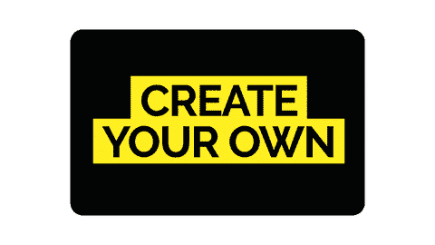
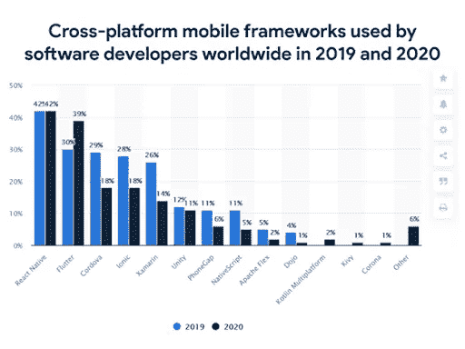
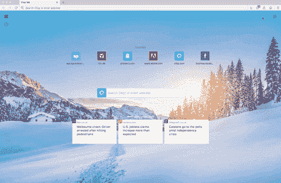

# 转向颤振开发以获得 10 大商业优势

> 原文：<https://medium.com/geekculture/switch-to-flutter-development-for-10-major-business-advantages-e6672f2af3b5?source=collection_archive---------12----------------------->

几年前在 2017 年推出，Flutter 作为一个软件开发工具包很快就获得了**的愤怒和流行**。谷歌作为创造者帮助 Flutter 进入了每个人的视线。

然而，这个科技巨头的名字主要是对跨平台框架的初步推动。Flutter 拥有大量的特性，这些特性帮助它成为投资者和开发者团队的首选。

这个博客列出了 flutter 开发对企业的 10 大好处。为了真正理解转向颤振开发的价值，您需要分析它的多个方面。

让我们先讨论最重要的事情。

# 什么是颤振？

Flutter 是 Google 设计开发的软件开发工具包。这是一个开源的、跨平台的软件开发工具包，**为不同屏幕尺寸和浏览器的应用开发提供了便利。**

无论是 web 应用还是移动应用，Flutter 对两个平台都是有价值的。使用相同的代码库，应用程序可以兼容 **iOS、Android、Windows、macOS、Linux、嵌入式系统等。**

# 投资 Flutter 的十大好处

**1。** **大规模节约成本的选择**

Flutter 对于预算有限的编程项目来说是一个福音。该框架以下列方式节省了投资公司的开发成本:

*   首先，它是一个**开源平台，**这意味着购买一个软件开发包是零费用。
*   它**支持多种平台**，这意味着你可以以更低的成本接触到更多的受众。
*   需要**更少的开发工时**，当您选择外包/外包的小时模式时，这直接节省了成本。计时模式要求公司根据工作时间支付工资。

**2。** **相对更快的上市时间**

软件上市时间是一个编程项目概念化后完成所需的总时间。

当您在简单的软件上尝试新的和创新的特性，或者用全新的想法构建完整的软件时，更快的上市时间会提高软件的成功率。

SDK 并不要求编码团队提出特定于平台的代码。此外，在移动应用程序的情况下，它们可以在 Android 设备和苹果设备上运行。

根据麦肯锡的研究报告，更快的上市时间使软件产品在市场上获得了最终优势，并可以将投资回报率大幅提高至 33%。

**3。** **根据业务需求定制 UI**

软件的用户界面在软件的整体受欢迎程度中起着至关重要的作用。根据[应用开发](https://www.standardfirms.com/top-app-development-companies/)统计，一个设计良好的用户界面可以将转化率提高到 **200%。**

开发团队花费了大量的时间来开发一个直观且用户友好的界面。你可以很容易地[雇佣应用程序开发人员](https://www.pixelcrayons.com/hire-app-developers)来定制简单到复杂的用户界面和吸引人的动画。

Flutter 还提供了 Skia 图形引擎、分层架构、支持高级用户界面专用开发的各种工具。

**4。** **体验原生 app 般的性能**

谷歌广告、闲鱼(阿里巴巴旗下的一款移动商务应用)、汉密尔顿等。，是使用 Flutter 开发的一些顶级的世界级应用程序。在手机上运行它们会给你带来零技术故障和快速渲染性能的体验。

这是可行的，因为与其他跨平台 SDK 和框架不同，Flutter 不依赖于中介。Flutter 应用程序开发直接在机器代码中完成，这有助于避免性能问题。

**5。** **来自科技巨头谷歌的可靠支持**

Flutter 由数字世界的顶级科技巨头创建，享有不懈的支持。自 2017 年推出以来，多家定制软件开发公司已经采用了这项技术。

您可能会惊讶地发现，在最常用的跨平台移动框架列表中，令人惊叹的软件开发工具包仅次于 React Native。值得注意的是，React Native 是在 2015 年 Flutter 之前两年推出的。看看下面的信息图:

来源: [Statista](https://www.statista.com/statistics/869224/worldwide-software-developer-working-hours/)

上面的信息图描述了 Flutter 框架在全球开发者社区中的流行程度。

**6。** **开发软件的顺利维护**

无论是网站、web app，还是手机 app，期望一口气有一个 **100%理想的产品**是不务实的。Evan 是一款运行流畅的软件，实现了所有期望的功能，一旦发布到用户手中，就需要更新。

主要是因为软件技术的快速发展。维护在软件的长期运行中起着至关重要的作用，在激烈的竞争中决定着它的命运。

有时升级似乎比开发新软件更昂贵，因此旧软件就过时了。然而，使用 Flutter 应用程序，开发团队可以通过使用多个插件、小部件等来轻松升级应用程序。

解决技术故障、错误等。，也方便开发者团队用 Flutter 做 SDK。

7 .**。** **热重装功能减少代码开发时间**

缺少热重新加载特性的软件开发工具包需要开发者团队等待几秒到几分钟来观察所应用的代码修改。

热重新加载特性的可用性方便了团队立即寻找应用的代码修改效果。这是可能的，因为机器不是重新运行整个代码，而是以下面的方式运行

*   主机用修改后的代码检查库。
*   然后它会检查应用程序的主库。
*   最后，受影响的应用程序库。
*   然后，新代码被上传到正在运行的 DVM (Dart 虚拟机)中。
*   框架自动实现 ode 修改，以允许实现修改后的代码。

**8。** **依靠单一代码进行前端&后端**

Flutter 依赖于一种语言来编码前端和后端软件，这就是 Dart。开发 Dart 语言是为了给开发人员提供最大的便利，并促进平稳和专用的软件开发。

**Dart 本身对开发的项目有如下多重好处:**

*   用 Dart 开发的应用程序和网站为用户提供了增强的速度性能。
*   它是一种稳定的编码语言。
*   Dart 是实时应用程序的首选选项。
*   它支持继承、接口等。
*   它有一个简单的学习曲线。

**9。****fire base 的最佳可扩展性级别**

可伸缩性在软件的发展中起着至关重要的作用。随着业务的增长，不时地更新软件是不现实的。因此，可伸缩性是商业企业软件开发的关键因素之一。

幸运的是，Flutter 附带了 Firebase，它以**性能和可伸缩性而闻名。** Firebase 通过随数据大小线性扩展软件来提供可扩展性。这使得开发的软件无需任何代码修改就可以满足几百万到几百万用户的需求。

**10。** **兼容未来操作系统紫红色**

对未来范围的规划总是令人兴奋的，并且是有效商业策略的一部分。Fuchsia 是由科技巨头谷歌开发的开源操作系统。这是一个有前途的操作系统，因为它能够在所有设备上运行。

Flutter 与 Fuchsia 操作系统兼容，从长远来看，它可以保护您的业务项目。

# 最后的话

这就是你应该转向 Flutter 的 10 大原因。对于负担得起的服务，你可以信任印度的[颤振开发公司。由于市场竞争激烈，印度公司的报价很低。](https://www.pixelcrayons.com/mobile-app-development/flutter-app-development-company-india)

我希望这篇博客对你有深刻的见解。