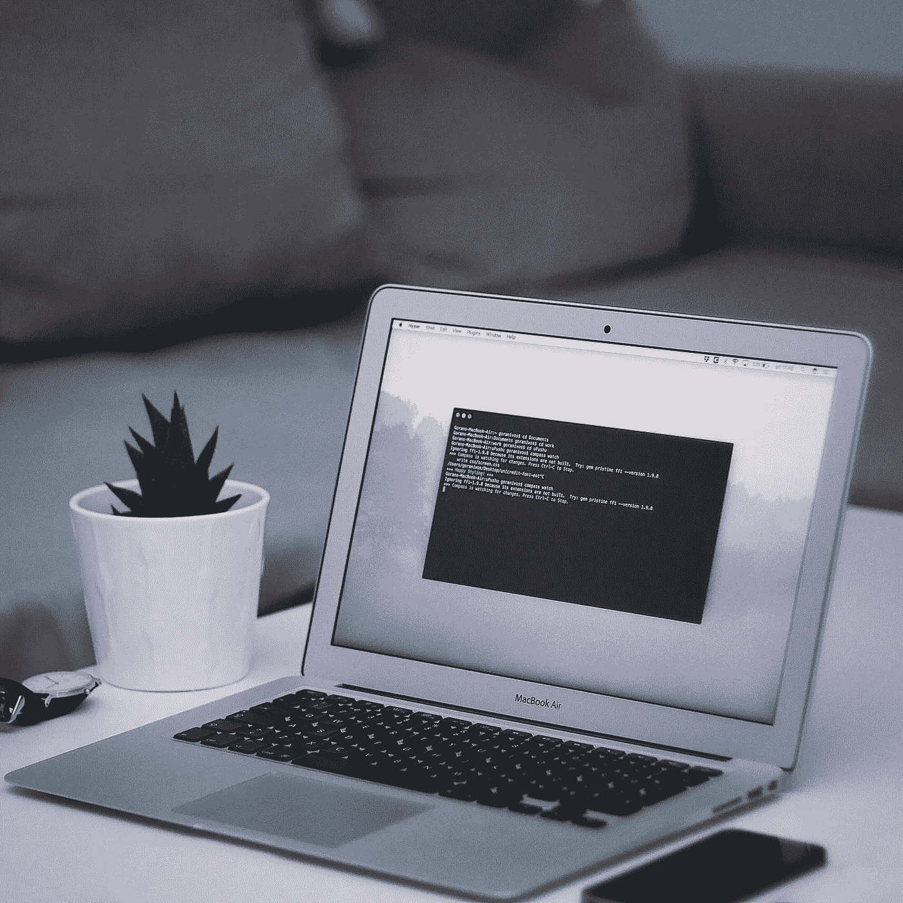

# 将我的 Mac 终端切换到 ZSH

> 原文：<https://medium.com/geekculture/switching-my-macs-terminal-to-zsh-55d0ee04a76b?source=collection_archive---------0----------------------->

[Goran Ivos](https://unsplash.com/@goran_ivos)

几个月来，我一直在 Mac 的终端上收到警告，告诉我默认的 shell 不再是 bash，让我转而使用 zsh。

我试图尽可能长时间地忽略它，因为我害怕它会打破或改变太多的东西，但我最终被激怒了，以至于做出了改变。实际的开关本身非常简单，只需在终端键入一条命令。