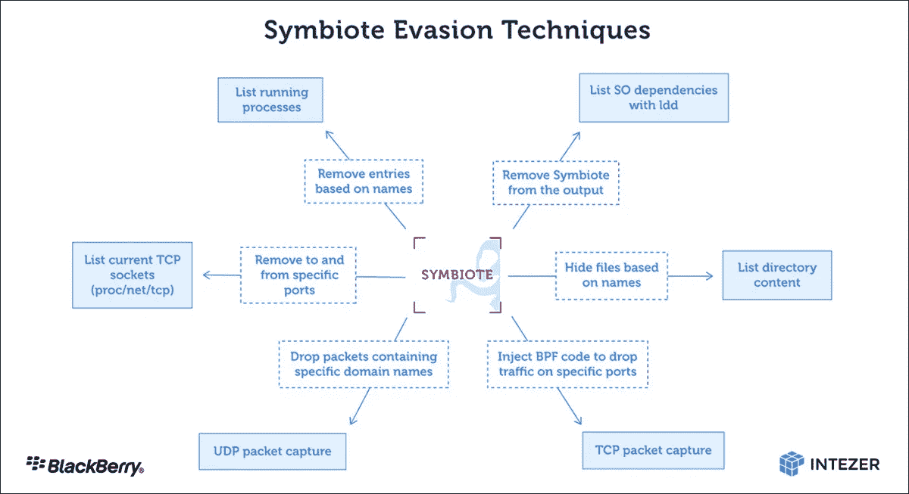

# Symbiote:一种几乎无法检测的 Linux 恶意软件

> 原文：<https://medium.com/geekculture/symbiote-a-nearly-undetectable-linux-malware-fcf4f4e13b4f?source=collection_archive---------9----------------------->

## 一种隐秘的恶意软件在网络威胁的新时代大获全胜

source: [Pixabay](http://pixabay.com)

普通的个人电脑用户不得不担心特洛伊木马、网络钓鱼诈骗和其他不好的东西，但看起来在金融领域工作的人们正面临一种新的威胁。它被称为 Symbiote，是一种基于 Linux 的恶意软件，专门针对金融领域。更可怕的是，安全研究人员表示，这种恶意软件几乎不可能被检测到。

根据黑莓研究公司的一篇博客文章，该恶意软件于 2021 年 11 月首次披露。Symbiote 感染正在运行的进程而不是独立的可执行文件的策略使其不同于其他 Linux 恶意软件。

Symbiote 通过挂钩 libc 和 libpcap 函数来掩盖其可见性。然后，它使用这些函数向操作系统隐藏它的进程。该恶意软件使用几个 C&C 服务器；但是，它们在端口号和用于通信的协议方面都有所不同。

# Symbiote 恶意软件使用共享对象库(SOs)

Symbiote 恶意软件是一种系统范围的感染，能够隐藏管理员权限。它还能够绕过防病毒检测。

该恶意软件使用一个名为 LD_PRELOAD 的指令来劫持操作系统中与安全相关的功能，并注入恶意代码，这使得它可以获得相对于其他共享对象的优先级。

Symbiote 恶意软件使用的共享对象库(SOs)比其他任何库都要先加载，这意味着它们比其他库具有更高的优先级，甚至是防病毒产品使用的库。

例如，Symbiote 的 SO 库可以是“libc6-dbg”，这使得管理员很难在他们的系统上检测到同名的恶意软件。这使得恶意软件可以隐藏在系统的不同位置，而不会被防病毒产品检测到。

source: [Blackberry](https://blogs.blackberry.com/en/2022/06/symbiote-a-new-nearly-impossible-to-detect-linux-threat)

# 动态链接器劫持

共生体用来感染机器的攻击方法叫做动态链接器劫持。动态链接器是操作系统的一部分，它将共享库加载到进程的地址空间中，并解析这些库中的符号。Symbiote 通过将恶意代码插入动态链接器的共享库缓存来劫持这个进程。然后，恶意软件等待易受攻击的可执行文件运行，这样它就可以将自己注入进程的地址空间，并开始执行恶意代码。

# 共生体能够掩盖网络活动

第一种方法涉及挂钩 fopen 和 fopen64。当一个进程试图打开一个已知包含网络流量的文件时，比如一个 HTTP 请求，Symbiote 会拦截这个请求并返回自己的响应。这使得恶意软件能够对安全研究人员隐藏其活动。

Symbiote 隐藏其网络活动的第二种方法是捕获任何注入的包过滤字节码。许多恶意软件开发人员已经使用 Linux 内核提供的扩展 Berkeley 包过滤(eBPF)功能实现了他们自己的包过滤模块，该功能支持用户空间中的包过滤。这就是共生体的用武之地。它包含一个模块，将自己注入到运行 eBPF 字节码(sk_buff)的进程中，然后在执行之前修改 eBPF 字节码，为自己添加一个额外的过滤器规则。这样，当有人试图分析恶意软件生成的网络流量时，他们只会看到来自其他应用程序或进程的合法数据包。

第三，恶意软件通过挂钩 libpcap 函数隐藏其网络流量，以过滤出其列表中域名的 UDP 流量。

# BPF (Berkeley 包过滤)挂钩技术

BPF 挂钩技术是一个强大的工具，可以用来绕过许多安全沙箱。BPF 代表 Berkeley Packet Filter，它是 Linux 内核的扩展，允许您创建虚拟网络接口，可以拦截任何网络数据包，并在将它们传递到最终目的地之前对它们进行处理。

BPF 挂钩技术首先创建一个名为“bpf0”的 BPF 设备(第一个设备)。然后，该设备被用作通过系统的所有流量的过滤驱动器。所有数据包在通过内核堆栈时都被重定向到该设备。BPF 挂钩技术利用这一特性在某些数据包到达最终目的地之前对其进行重定向，并在运行时向其注入恶意代码。

BPF 最初旨在作为网络过滤和流量分析的工具，但它也可能被用于恶意目的。监控和修改网络流量的能力导致了基于 BPF 的恶意软件的兴起，这些恶意软件经常使用 BPF 钩子从用户进程中捕获敏感信息，如密码和会话 cookies。

# 攻击者可以通过挂接一些 Linux 可插拔身份验证模块(PAM)函数来远程访问 Linux 机器

Linux 可插拔认证模块(PAM)是一个为应用程序提供认证服务的库。这是一个可扩展的系统，它允许应用程序插入自己的自定义例程来执行与身份验证相关的各种操作，例如验证用户的身份。

Symbiote 恶意软件以 PAM 为目标，在 Linux 机器上执行权限提升攻击。攻击者可以通过挂接一些 PAM 函数来远程访问 Linux 机器。该恶意软件将自身解密到内存中，并在用户试图登录时挂钩 PAM 中的 getpwnam()函数来执行恶意代码。

该恶意软件使用一种称为“进程空洞化”的技术来实现这一点。这个过程包括生成另一个处于挂起状态的进程，并在合法进程恢复执行时用恶意代码覆盖其内存。这种技术经常被银行特洛伊木马程序用来逃避防病毒软件的检测，因为它对受感染系统的文件结构造成的更改很小，并且使取证调查人员很难检测到受感染计算机上的可疑活动。

# 检测共生体

虽然恶意软件几乎不可能被检测到，但研究人员认为网络遥测可以帮助发现异常，作为一种预防性的最佳做法，建议将 EDR 等安全工具与防病毒软件相结合，以便两个系统可以共享每个端点上检测到的威胁信息。

# 结论

随着计算机变得越来越安全，恶意行为者继续寻找新的和创新的方法来危害系统。Symbiote 恶意软件就是这种威胁的一个例子。Symbiote 几乎可以安装在任何一台 Linux 机器上，并允许一个邪恶的角色获得控制权。它很难被发现，因为它巧妙地隐藏其活动，并使用某些战术来逃避检测。

开源系统的广泛采用使得网络攻击变得更加隐蔽和艰巨。此外，需要高效的威胁检测、缓解和响应机制来避免具有代码执行能力的攻击，这些攻击可能会中断组织的业务运营。网络安全专业人员必须找到应对这一新挑战的方法，比攻击者领先一步，规避他们先进的恶意软件战术。