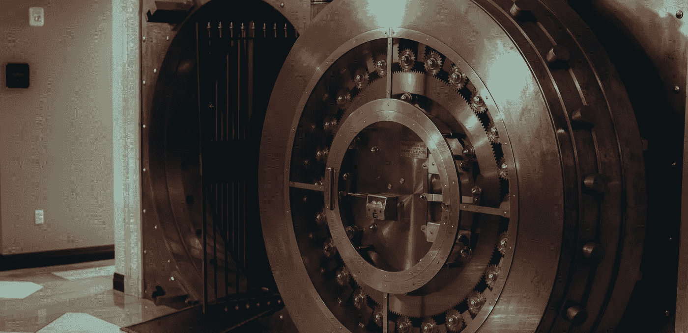

# Symfony 秘密金库在不到 5 分钟内解释

> 原文：<https://medium.com/geekculture/symfony-secrets-vault-explained-in-less-than-5-minutes-131649ce2cab?source=collection_archive---------12----------------------->

## 了解 Symfony 的保险库如何在您的咖啡冷却时保护您的生产敏感信息

Photo by [Brock Wegner](https://unsplash.com/@isthatbrock?utm_source=unsplash&utm_medium=referral&utm_content=creditCopyText) on [Unsplash](https://unsplash.com/s/photos/vault?utm_source=unsplash&utm_medium=referral&utm_content=creditCopyText)

## 一点背景知识

将敏感信息保存在安全的地方总是有点棘手。您将生产数据库密码存储在哪里？在哪里…