# 浓缩咖啡机中 O 型圈故障的症状

> 原文：<https://medium.com/geekculture/symptoms-of-o-ring-failure-in-an-espresso-machine-2c5bae49cb21?source=collection_archive---------15----------------------->

## 咖啡数据科学

## 哦，杠杆机器的乐趣

我最近发现我心爱的金快车的 O 型圈开始变坏。失败的最后一个症状是，当我拉下控制杆时，水通过弹簧和机器的顶部上升，导致压力下降和一大堆热咖啡，但我不想达到这一点。

这一次，我意识到我看到了至少已经持续了几周的其他症状。我拍摄了所有浓缩咖啡的视频，用于故障分析，所以我能够及时回去查看这些反复出现的症状。

# 症状

1.  从淋浴屏幕上滴下的水随着时间慢慢增加。
2.  一些视频证据带有难以看到的症状。
3.  如果没有锁定移动式过滤器，一些蒸汽或水就会从淋浴帘中流出。
4.  清洗淋浴帘后，水滴得更多，流进了泉水。

# 视觉证据

我举了多个例子来说明同一点上的问题，这有助于我识别问题。如果我早点发现的话，我就可以早点更换 O 型圈，而不至于降低拍摄质量。

对于这个镜头，在左边的尺寸，有早期金发。我认为这是由于拍摄准备或淋浴屏幕，但我现在怀疑 O 型圈是有缺陷的一面。

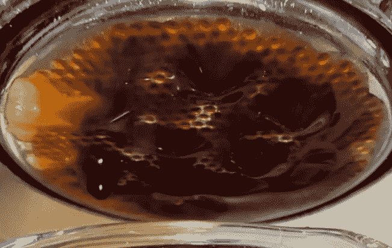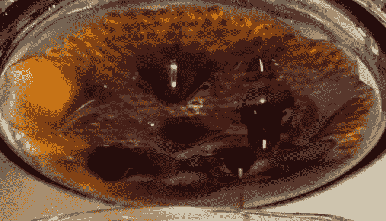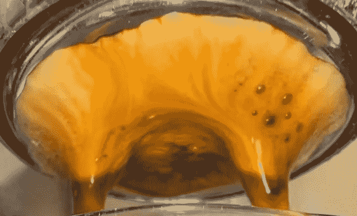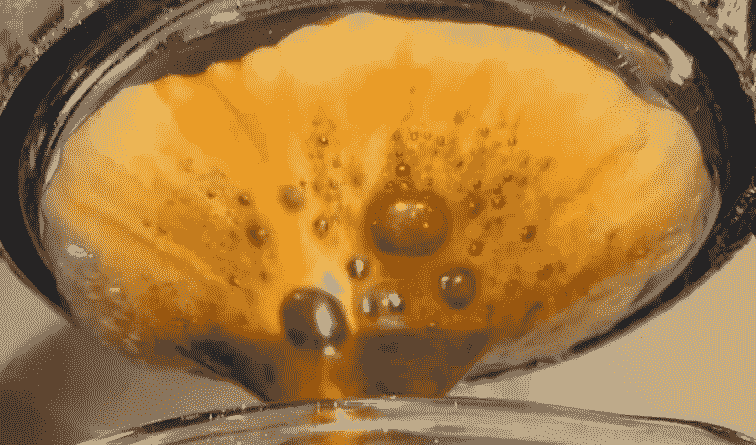

这个镜头中也出现了类似的早期金发问题。

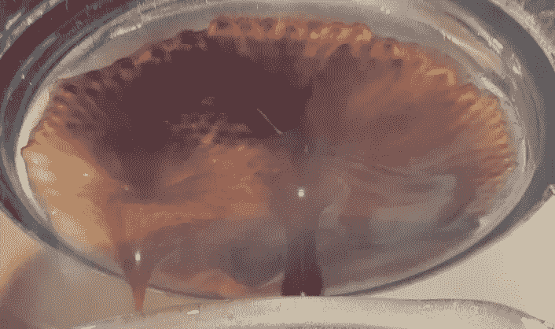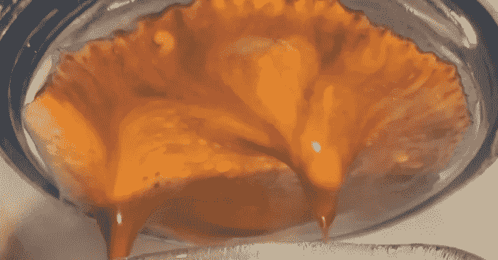

这显示了更多的金发在左侧。

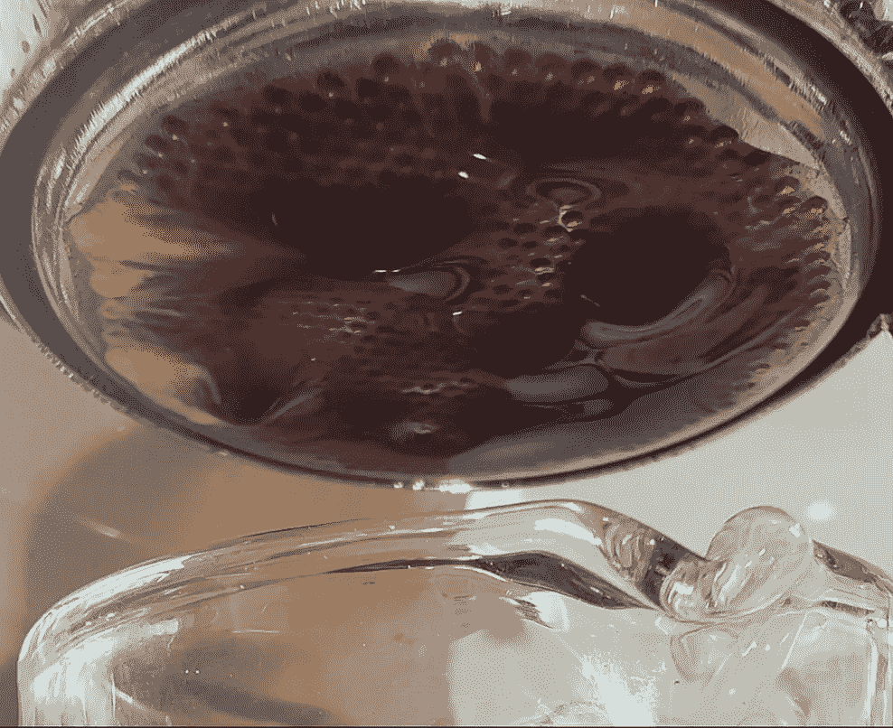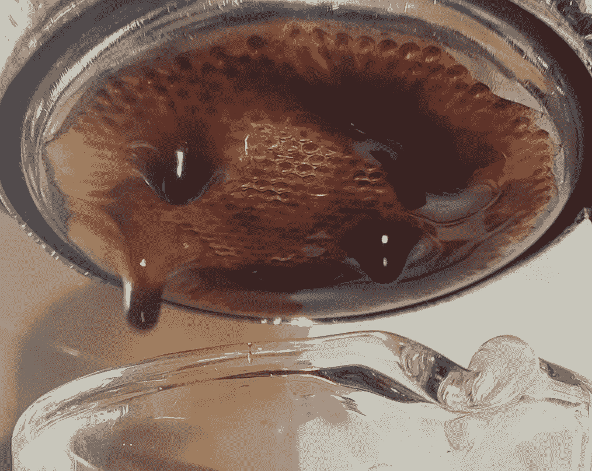

这个镜头是高度提取，但有几个斑点的金发两侧。

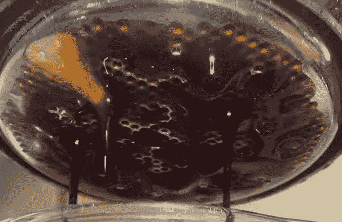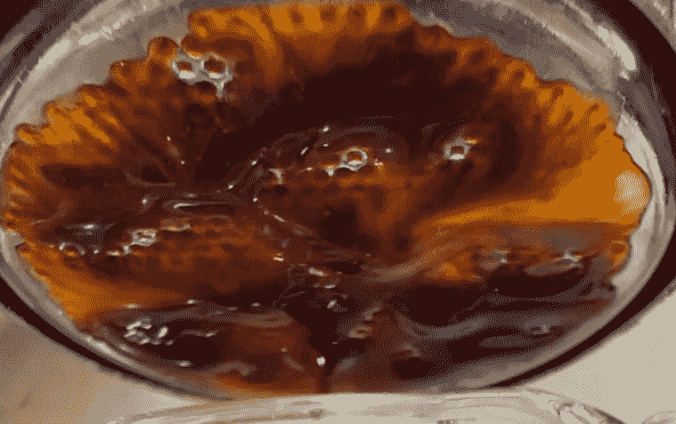

这个镜头流得比较慢，结果，左边的金发更加明显。

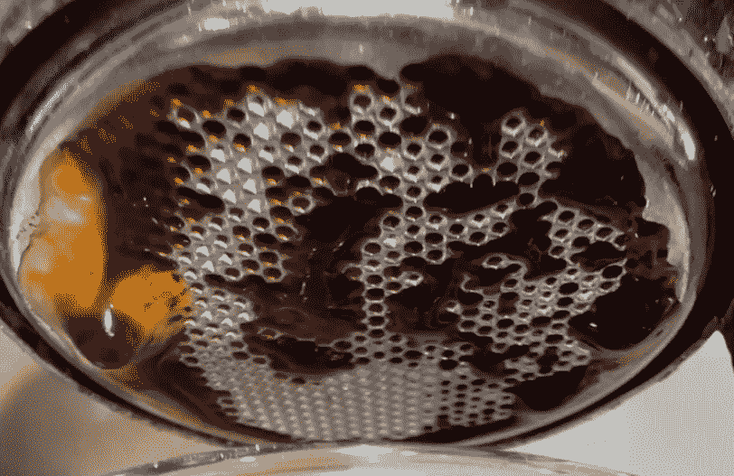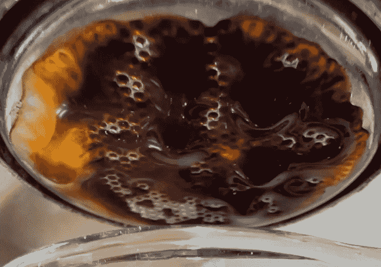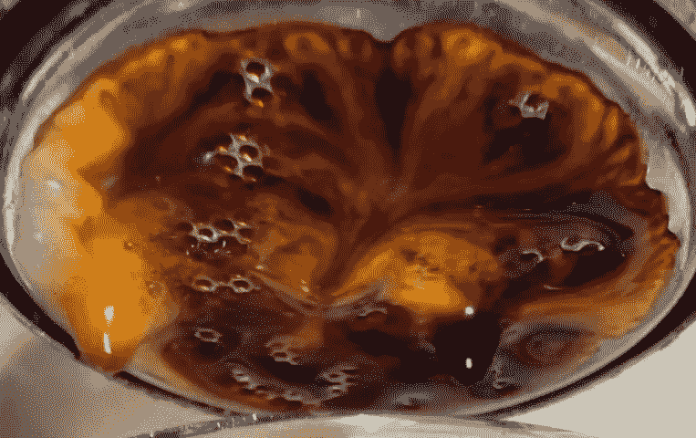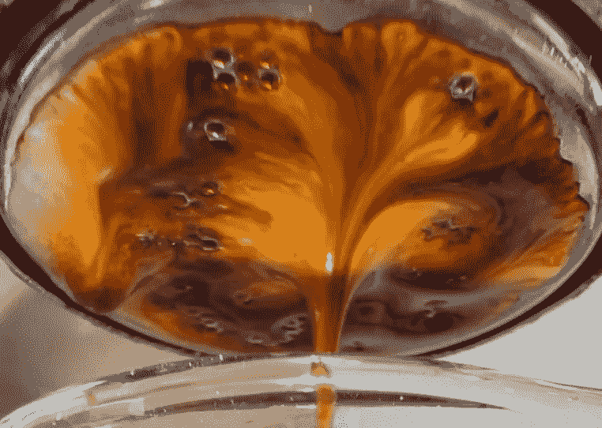

# 概括起来

这些图像都有助于更好地诊断系统性问题。

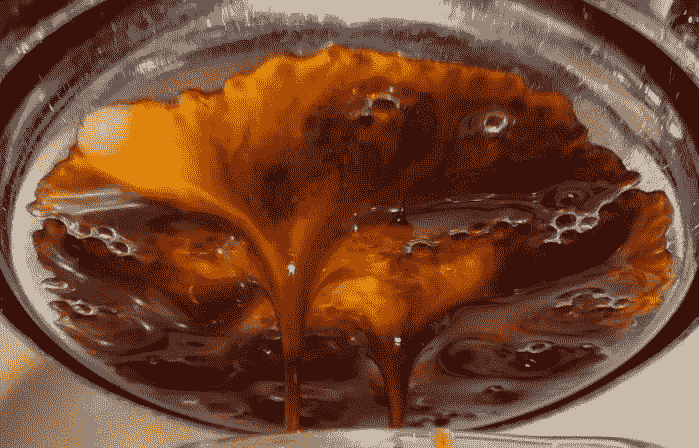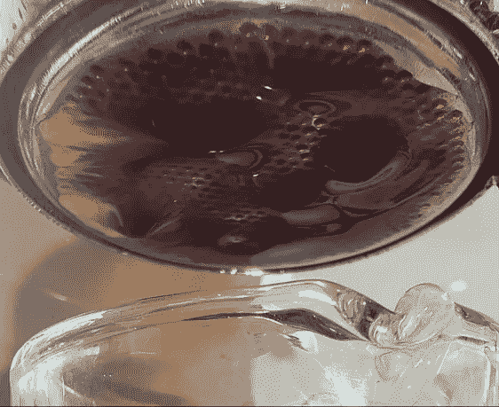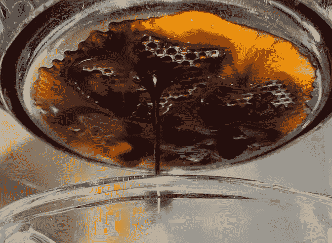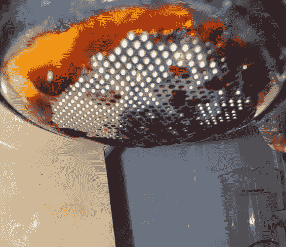

数据对于提高我的浓缩咖啡照片和避免像下面这样的失败非常重要。我可以通过更长时间的预灌注和轻微的压力脉冲来挽救一些镜头，但这是不可持续的。

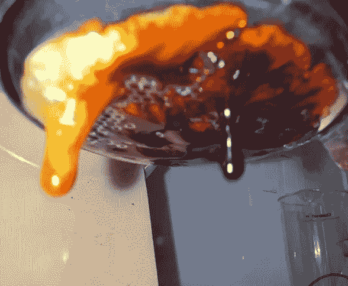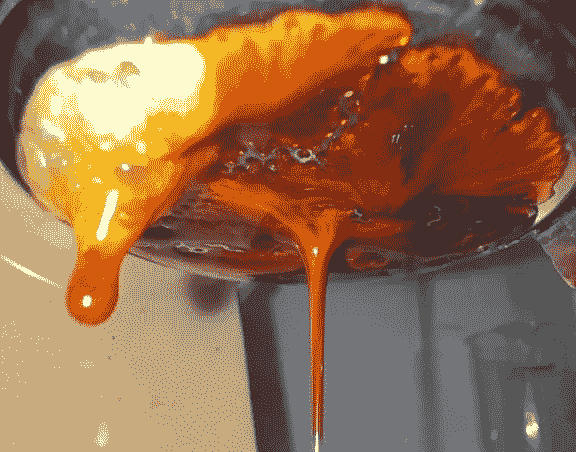

希望视频证据可以帮助其他人诊断不仅仅是糟糕的拍摄准备，还有机器维护问题。

如果你愿意，可以在推特、 [YouTube](https://m.youtube.com/channel/UClgcmAtBMTmVVGANjtntXTw?source=post_page---------------------------) 和 [Instagram](https://www.instagram.com/espressofun/) 上关注我，我会在那里发布不同机器上的浓缩咖啡照片和浓缩咖啡相关的视频。你也可以在 [LinkedIn](https://www.linkedin.com/in/robert-mckeon-aloe-01581595?source=post_page---------------------------) 上找到我。也可以关注我在[中](https://towardsdatascience.com/@rmckeon/follow)和[订阅](https://rmckeon.medium.com/subscribe)。

# [我的进一步阅读](https://rmckeon.medium.com/story-collection-splash-page-e15025710347):

[我未来的书](https://www.kickstarter.com/projects/espressofun/engineering-better-espresso-data-driven-coffee)

[浓缩咖啡系列文章](https://rmckeon.medium.com/a-collection-of-espresso-articles-de8a3abf9917?postPublishedType=repub)

[工作和学校故事集](https://rmckeon.medium.com/a-collection-of-work-and-school-stories-6b7ca5a58318?source=your_stories_page-------------------------------------)

个人故事和关注点

[乐高故事启动页面](https://rmckeon.medium.com/lego-story-splash-page-b91ba4f56bc7?source=your_stories_page-------------------------------------)