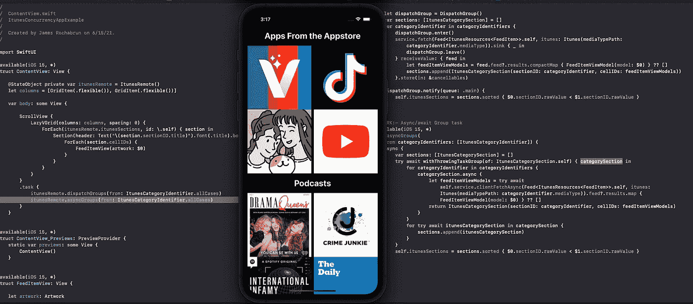
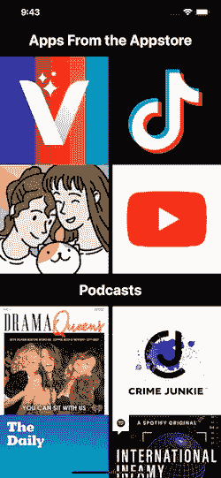

# 使用 iOS 15 组任务 API 同步异步网络调用。

> 原文：<https://medium.com/geekculture/synchronizing-asynchronous-networking-calls-using-ios-15-group-task-api-1f5b764c731d?source=collection_archive---------20----------------------->



[https://github.com/jamesrochabrun/iOSConcurrency](https://github.com/jamesrochabrun/iOSConcurrency)

今天我想展示我如何在一个示例项目**、**中使用新的**组任务 iOS 15 API** 来执行一组对 Itunes API 的网络调用。

该项目非常简单，看起来像这样…



Itunes feed resources

它显示了您可以从 Itunes API 中找到的不同类别的提要。为了获得每个类别，我们需要执行一个独立的 API 调用，然后我们需要以某种方式混合每个类别的结果，这样我们就可以将它们加载到同一个提要中。

首先，让我们看看如何使用 [**DispatchGroup**](https://developer.apple.com/documentation/dispatch/dispatchgroup) ，来实现这一点，然后我们将看看如何使用组任务来实现相同的结果。

如果你想跳过这篇文章的其余部分，你可以在这里找到这个教程的完整实现

在回购协议上，你会发现…

ItunesCategoryIdentifier.swift

**itunes categoryidentifier**代表我们将在应用程序中显示的类别。

1.  类别。
2.  我们将为每个部分显示的标题。
3.  一个静态属性，表示我们将从每个 API 调用中检索的项数。(为简单起见，我们将要求 4 个项目)
4.  要获取的媒体类型，iTunes API 端点将媒体类型作为参数，我们创建了一个 enum 来轻松访问媒体类型，要查看其实现，请访问 repo 内的 **FeedGenerator.swift** 。

如您所见**itunes categoryidentifier**使符合 **CaseIterable** ，这将允许我们遍历所有案例以获取每个类别**、**，它还有一个**Int**raw**value**、**，这将帮助我们按照我们想要的顺序显示结果。**

**现在我们需要探索一下 ItunesRemote 的类。**

1.  ****ItunesRemote** 使与 **ObservableObject** 一致，将结果发布到我们的 **SwiftUI** 视图**中。(**我们将在这里使用 **SwiftUI** ，但是我们也可以在 **UIKit** 应用**中使用这个对象)。****
2.  ****ItunesCategorySection** 是一个代表每个类别的节的结构，它有代表节标识符的 **sectionID** 属性和代表该节内项目的 **cellIDs** 属性。它符合 **IdentifiableHashable** (由 **Hashable** 和**identificate**组成的协议，有助于避免样板代码，如果您希望它在 repo 的**Identifiable has hable . swift**文件中，请检查它🤓)，这种一致性是必需的，因此这个对象可以在一个 **SwiftUI** 视图中使用。**
3.  **ItunesClient 是一个使用通用网络层从服务器获取项目的客户端，如果您有兴趣了解更多关于使用 combine 实现网络层的信息，您可以访问[此处](/if-let-swift-programming/generic-networking-layer-using-combine-in-swift-ui-d23574c20368)，或者如果您想了解如何使用 async/await，您可以访问[此处](https://jamesrochabrun.medium.com/create-a-generic-networking-layer-using-async-await-9168b6281721)。**
4.  **发布结果所需的发布者和可取消对象。**

**好了，现在我们要在 **ItunesRemote** 中创建一个函数，使用 **Dispatchgroup** 来执行我们的任务组…**

**DispatchGroup implementation**

1.  **调度组的实例。**
2.  **节的数组，我们将在这里存储我们的节。**
3.  **遍历作为参数传递的所有类别标识符数组。**
4.  **我们从一个调度组调用 enter 方法，将请求引入该组。**
5.  **我们为每个类别执行一个网络呼叫。**
6.  **通话结束后，我们离开小组。**
7.  **使用 Combine，我们接收某个类别的提要，然后将它们转换成视图模型，然后创建 section 对象并将其添加到 sections 数组中。**
8.  **使用一个通知闭包，该闭包将在循环中的所有网络任务完成后执行，我们用按 **sectionID** rawValue 排序的部分数组来设置 **Published** 属性 **itunesSection** 。**

***排序是必需的，因为当我们在一个调度组中执行不同的异步任务时，我们不能保证每个请求的响应顺序。解决这个问题的一个方法是使用一个带有整数原始值的枚举作为部分标识符，通过这样做，我们可以对部分进行排序，并根据我们的需要轻松地修改顺序。这是一种方法，我相信还有很多其他的方法，如果你想分享你的方法，请在评论中分享！。😉***

**在开始使用 iOS 15 组任务实现之前，让我们在 **SwiftUI** 视图中使用它…**

```
**@available**(iOS 15, *)**struct** ContentView: View {@StateObject **private** **var** itunesRemote = ItunesRemote()
**let** columns = [GridItem(.flexible()), GridItem(.flexible())]**var** body: **some** View {
    ScrollView {
           LazyVGrid(columns: columns, spacing: 0) {
                ForEach(itunesRemote.itunesSections, id: \.self) { section **in** Section(header: Text("\(section.sectionID.title)").font(.title).bold().padding(15)) {
ForEach(section.cellIDs) {
                   FeedItemView(artwork: $0)
                }
           }
       }
    }
}
.task {
     itunesRemote.dispatchGroups(from:ItunesCategoryIdentifier.allCases)
  }
 }
}
```

**正如你在这里看到的，我们在一个 **LazyGrid** 中用不同的部分显示我们的类别，每个部分上显示的项目都来自我们的 **itunesSections** 数组属性。**

**好了，现在让我们创建一个使用组任务的新函数…**

1.  **可悲的是，需要将这个功能标记为 iOS 15 可用，因为这些新的 API 在以前的版本中不可用。😭(这已经不成立了！现在我们可以有一个使用异步 API 的变通方法，正如你在约翰·桑德尔的[帖子](https://www.swiftbysundell.com/articles/making-async-system-apis-backward-compatible/)中看到的。**
2.  **将逻辑封装在一个**任务**块中会在一个同步上下文中“桥接”一个异步调用，如果你想知道这意味着什么，你可以到[这里](https://jamesrochabrun.medium.com/create-a-generic-networking-layer-using-async-await-9168b6281721)。**
3.  **一个数组，我们将在其中存储我们的部分类别。**
4.  **一个组任务启动一个新的作用域，在这个作用域中可以产生动态数量的抛出任务。它将某个子任务的结果类型作为参数，并将一个组任务的值作为闭包，在本例中“categorySection”是一个抛出的任务组，如下所示…**

```
ThrowingTaskGroup<ItunesRemote.ItunesCategorySection, Error>
```

**5.我们遍历类别标识符数组，为每个类别执行一个子任务。**

**6.在 add task 块中，该组执行一个子任务，在本例中是一个执行网络请求的 throwable 异步调用。稍后，我们使用来自该请求的 feed 结果来创建视图模型，然后创建我们的 **ItunesCategorySection** 对象。**

**7.这是一个 **AsyncSequence** 实现，它基本上是我们如何在一个序列中执行异步函数，它们通过使用 **await** 关键字挂起每个元素，并在底层迭代器产生一个值或抛出时恢复。关于**异步序列**的更多信息，请查看此 [WWDC 2021 视频。](https://developer.apple.com/videos/play/wwdc2021/10058/?time=17)**

**8.在节数组中追加 iTunes 类别节。**

> **需要知道的一件很酷的事情是，通过使用 AsyncSequence 设计，我们还可以在编写可变值时避免竞争情况。关于这方面的更多内容，请进入 [***探索 Swift 中的结构化并发来自 WWDC 2021***](https://developer.apple.com/videos/play/wwdc2021/10134/)***。*****

**9.与调度组实现相同，我们用按 **sectionID** rawValue 排序的部分数组来设置 **Published** 属性 **itunesSection** 。**

**现在，在我们的 **SwiftUI** 视图中，让我们使用这个新方法，移除调度组调用，并将这个调用添加到 **ContentView** 结构中的 **task** 闭包内…**

```
.task {🎉itunesRemote.asyncGroups(from: ItunesCategoryIdentifier.allCases)   
}
```

**现在，如果你运行应用程序，你会看到应用程序中的类别，但这一次使用的是小组任务！**

**有关 Swift 并发的更多信息，您可以在这里找到 WWDC 2021 的[精选视频列表](https://jamesrochabrun.medium.com/create-a-generic-networking-layer-using-async-await-9168b6281721)。**

**帖子更新于 2022 年 1 月 3 日。**

***感谢*。🤖**