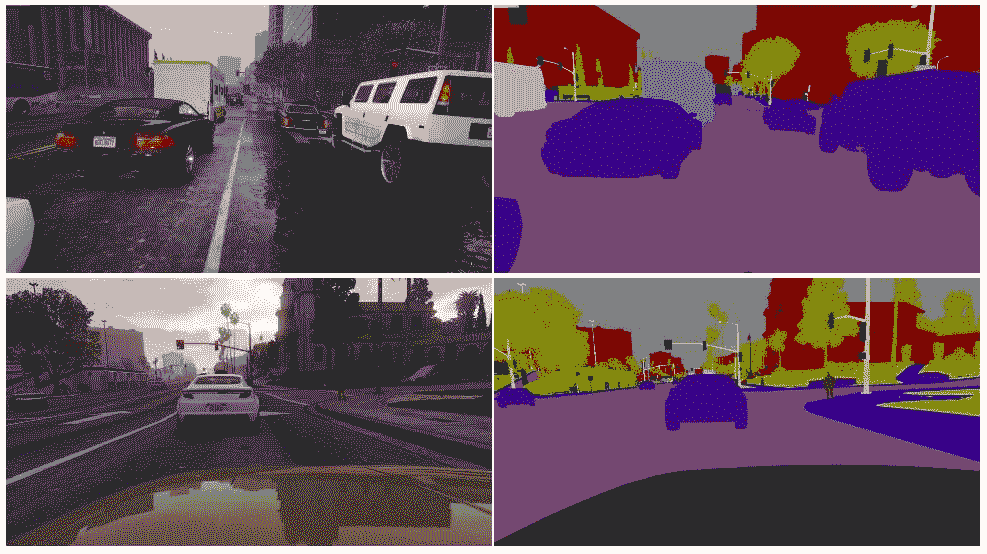
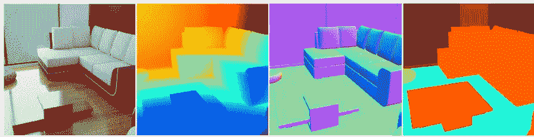
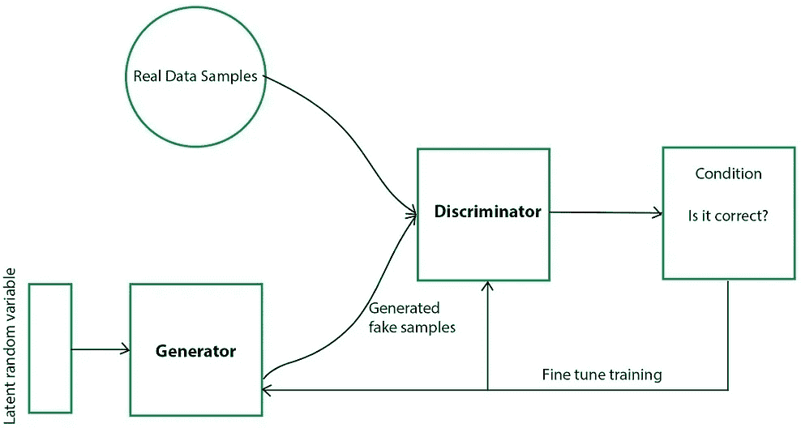
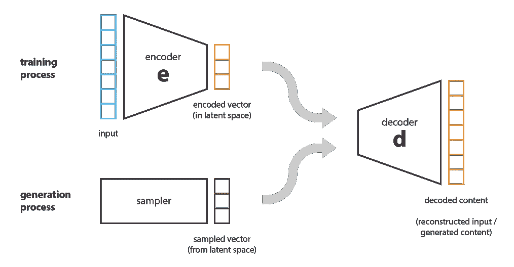
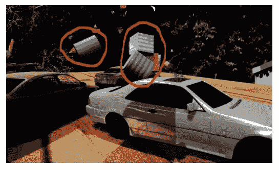

# 计算机视觉的合成数据:你想过吗？

> 原文：<https://medium.com/geekculture/synthetic-data-for-computer-vision-have-you-given-it-a-thought-b775dfb3b428?source=collection_archive---------11----------------------->

## 计算机视觉合成数据生成领域的一个窗口。

Source: [Analytics India magazine](https://analyticsindiamag.com/how-synthetic-data-sets-can-improve-computer-vision-models/)

今年早些时候，我与 Cognizant 的一位经理进行了一次对话，他负责深度学习协会团队。他的团队使用深度学习算法创建概念证明(*试点项目，以展示商业机会*)。他注意到他的团队面临的主要挑战之一是获取此类概念验证的数据。获取针对某个问题的代表性数据是一项艰巨的任务。此外，利用真实世界的数据来测试系统是否正在提供期望的输出在大多数情况下是不可能的，因为它强加了与隐私相关的问题。在我们结束谈话时，他指出一个可能的解决方案是生成合成数据，他的团队已经开始研究这个问题。这次谈话是我对“合成数据”的介绍。

在我处理人工智能模型的两年中，我对输入这些模型的数据的关注从未超出数据增强过程，直到那时。在等式中，AI 系统=模型+数据，我们通常保持数据不变，并继续调整参数以提高模型性能。[吴恩达最近在 LinkedIn](https://www.linkedin.com/posts/andrewyng_would-love-your-feedback-on-this-ai-systems-activity-6802688102847643648-YJb1) 上发帖称，他正在考虑组织比赛，我们采用一种流行的架构并保持不变，并要求团队处理数据——试图刺激以数据为中心的人工智能开发。

> “在大多数情况下，架构远不如数据集重要&拥有高质量、有代表性的数据集始终是一项不错的投资，在大多数情况下，这可能比升级到最新的检测器更重要。”
> — [约瑟夫·尼尔森](https://medium.com/u/690e8d667b35?source=post_page-----b775dfb3b428--------------------------------)，联合创始人/首席执行官@ Roboflow。

从我的研究中，我意识到缺乏高质量的正确注释的数据实际上是全球人工智能团队面临的最大挑战，它阻碍了深度学习发挥其全部潜力。

**我相信读者可以将这篇文章作为了解计算机视觉合成数据生成(SDG-CV)领域的一个窗口。SDG-CV 上有很多资源，但是由于这个领域最近越来越受欢迎，你可能会迷路。在本文中，我试图写下我对合成数据生成及其用例的理解。**

## **计算机视觉任务中的合成数据:**

合成数据是通过计算机程序生成的数据。这些程序可以是生成性深度学习算法(*甘的、的、自回归模型*)或产生 3D 模拟的 CGI 和游戏引擎(*虚幻、统一、Blender 等等*)。计算机视觉的合成数据可以是 RGB 图像、分割图、深度图像、立体像对、激光雷达或红外图像**。**

Figure1 : Synthetic RGB image, depth image, surface normal, semantic labels (Source: [BlenderProc](https://sim2real.github.io/assets/papers/2020/denninger.pdf))

为了建立稳健、高性能的深度学习模型，你需要大量带注释的数据。你会惊讶地发现，在大多数情况下，这些模型不需要真实的训练图像就能表现良好。比起照片真实感，他们更喜欢数据的多样性，尤其是对于物体检测。然而，分割任务需要高度的纹理真实感，因为分割模型严重依赖于纹理。

下面是几个例子，说明为什么采用合成数据是有益的。

## **合成数据使用示例:**

假设你为每年地球上乱扔的塑料瓶数量感到苦恼。所以你决定训练一个机器人来检测塑料瓶。现在，这些瓶子可以以数千种不同的方式起皱。收集瓶子的图片并对它们进行注释不仅仅是一项单调乏味的任务，但是用这样的数据集训练你的模型并不能涵盖所有可能的场景。然而，它太贵了。这些瓶子可以出现在不同的地形上，在不同的光照条件下，放在各种其他物体旁边。更简单的替代方法是使用任何图形引擎——即 Unreal、Unity 或 Blender——合成数千个伪造的皱巴巴的瓶子图像。

让我们来看看一个棘手的问题，合成数据可以帮助解决这个问题——自动驾驶汽车经过训练可以识别道路上的其他汽车。很明显，这种系统已经在大量的汽车图像上进行了训练，很可能它们在识别汽车方面非常准确。但它能探测到翻车吗？(*这是我从* [*沉浸式极限*](https://www.youtube.com/channel/UC1c0mDkk8R5sqhXO0mVJO3Q) *得到的一个有趣的例子。*)。在现实世界中拍摄成千上万张翻转汽车的图像是不现实的。然而，通过使用任何 3D 渲染软件，我们可以合成尽可能多的翻转汽车，我们希望有许多变化。

## **合成数据与增强图像有何不同？**

当我最初开始阅读合成数据时，我脑海中出现的一个疑问是，合成数据的好处难道不能通过数据增强来实现吗？好吧，这就是答案。

数据增强是 DL 和 CV 工程师广泛使用的一种技术，通过将图像旋转几度、放大一点或翻转图像来修改真实数据。这种技术创建了数据集中现有图像的变体，并且可以被视为生成更多标记数据的廉价替代方案。

**Figure (2a):** Original input image. **Figure(2b):** Augmented images of the dog. **Figure(2c):** Target object-Dog on a different background. (**Source for Fig (2a) & (2b)**: [Towards Data Science](https://towardsdatascience.com/image-augmentation-14a0aafd0498), **Source for Fig (2c):** [Google Images](https://www.google.com/imgres?imgurl=https%3A%2F%2Finstant-bollywood-1.s3.ap-south-1.amazonaws.com%2Fwp-content%2Fuploads%2F2021%2F04%2F25055744%2Funnamed-2.jpg&imgrefurl=https%3A%2F%2Fwww.instantbollywood.com%2Funnamed-21%2F&tbnid=IMMswbIeSZ32gM&vet=10CA8QxiAoAWoXChMIoJfvwNGU8QIVAAAAAB0AAAAAEAc..i&docid=UzCNXmGBe0bFqM&w=900&h=900&itg=1&q=dog&hl=en&ved=0CA8QxiAoAWoXChMIoJfvwNGU8QIVAAAAAB0AAAAAEAc))

但是，如果我们的目标对象出现在不同的背景上，在不同的照明条件下或在不同的背景下，如图(2c)所示，会怎么样呢？

在这种情况下，合成数据占了上风。另一个例子是，假设你正在训练一个无人机系统来监控高尔夫球场的维护。在这种情况下，您的训练数据是草坪的图像，数据扩充几乎没有任何用处。此外，在给定的一天，根据天气和一天中的时间，照明可能会有所不同。使用 3D 场景渲染软件，您可以模拟虚拟高尔夫球场，并提取训练图像。这肯定不像听起来那么简单，但这是一次性投资，将来会为你节省很多钱和时间。

## **生成合成数据:**

如前所述，合成数据可以通过两种方法生成:

**1。基于深度学习的方法** 在这种方法下有两种方法可以采用:

**a)使用 GAN 模型中的生成式对抗网络** :
，我们创建一个生成式模型，该模型采用随机样本数据并生成与真实数据非常相似的合成数据。Discriminator 根据之前设置的条件，将这种合成生成的数据与真实数据集进行比较。

**b)使用变分自动编码器** :
在 VAE 模型中，编码器将真实数据集压缩成紧凑形式，并将其传输到解码器。然后，解码器生成表示真实数据集的输出。通过优化输入和输出数据之间的相关性来训练系统。

Figure (3a): **Generative Adversarial Networks (course:** [**AI Multiple**](https://research.aimultiple.com/synthetic-data-generation/)**)** Figure (3b): **Variational Autoencoders (course:** [**Towards data science**](https://towardsdatascience.com/understanding-variational-autoencoders-vaes-f70510919f73)**)**

**2。基于 3D 渲染的方法** 基于 3D 渲染的标清生成的基本工作流程相当简单:

准备并程序化地生成物体的 3D 模型，将它们放置在模拟场景中，设置环境(*摄像机视点、照明等)。*)并渲染合成图像进行训练。基本上，创建一个逼真的虚拟世界，并提取他们的图像。当您拥有 3D 渲染的合成数据时，3D 渲染器也会自动为您进行注记。

在接触一些合成数据初创公司和公司时，我发现他们中的大多数都依赖基于 CGI 或 3D 渲染的方法来生成合成数据。避免基于深度学习的方法的原因很容易猜到:**首先，不容易优化 GANs** 。
**其次，GANs 带来了模式崩溃的问题**。这意味着你的发生器崩溃，产生有限种类的样本，即。只生成几类数据。这是不可取的。毕竟，将多样性和角落案例引入训练是使用合成数据集的全部理念。然而，这些公司更多地使用对抗性网络进行领域适应。

## **合成数据的优势，以及为什么您必须考虑在培训和测试中采用它们。**

以下是您必须采用合成数据进行训练和测试的几个原因:

*   合成数据**减轻了数据集偏差**。这对于人脸识别等与人类相关的计算机视觉任务尤为重要。
*   在真实数据采集不切实际的情况下，合成数据**能够覆盖极限情况**。很多时候，真实数据集不够多样化。合成数据**包含更多的用例与模式**。通过这种方式，您的模型可以处理很少发生的紧急情况。
*   数据收集和标记是一项费力、昂贵且耗时的任务(例如:用于面部关键点检测的注释)。您可以为您的数据集实现**自动像素完美标记**。这**为您节省了大量时间**并加快了**您产品的上市时间**。
*   它解决了隐私或法律问题，使得真实数据的使用变得不可能或极其困难。例如在医疗和金融应用中。
*   在渲染级别，合成数据生成**可以随机化照明条件、摄像机视点、物体方向、改变图像分辨率等**。

请做好准备，我们将进一步研究一种用于增强或改善合成数据的技术。这种技术在减少合成数据中的真实差距方面起着不可或缺的作用。我简单描述一下是什么，详细解释改天再说。

*   **域随机化**
    在该技术中，通过在渲染或 3d 场景中创建变化，合成数据被随机化并变得更加多样化。这迫使网络学会关注图像的本质特征。这种技术的一个例子是在 3D 场景中随机放置干扰物对象。

Figure 3: Circled in red are the distractor objects (Source: [https://arxiv.org/pdf/1804.06516.pdf](https://arxiv.org/pdf/1804.06516.pdf))

## **概要:**

以下是我个人感觉在视觉训练的合成数据方面做了一些令人印象深刻的工作的几家创业公司和公司——**[**AI 遐想**](https://aireverie.com/data-generation) ， [**Chooch AI**](https://chooch.ai/computer-vision/synthetic-data-webinar-faster-ai-model-generation-more-accurate-computer-vision/) ， [**Datagen**](https://www.datagen.tech/) ， [**并行域**](https://paralleldomain.com/) ，[**neuro Labs**](https://www.neurolabs.ai/use-cases)**，** [**合成 AI**](https://synthesis.ai/technology/)**

**你可以在这里找到合成数据公司[的综合名单。我还没有机会看所有上榜公司的 demo。有兴趣就去看看。](https://elise-deux.medium.com/the-list-of-synthetic-data-companies-2021-5aa246265b42)**

**希望这篇文章能帮助您深入了解合成数据生成及其用例。在接下来的日子里，我希望在 SD 领域开发一些现成的工具和软件包。关于那件事，我会随时通知你。**

**感谢阅读！**

## **参考:**

1.  **[S.I. Nikolenko，“深度学习的合成数据”，arXiv 预印本 arXiv:1909.11512，2019。](https://arxiv.org/pdf/1909.11512.pdf)**
2.  **[沉浸式极限——Youtube](https://www.youtube.com/watch?v=M9KVrxIwpO0&t=280s)**
3.  **[Jonathan 等，“用合成数据训练深度网络:通过领域随机化弥合现实差距”，arXiv:1804.06516v3 [cs。2018 年 4 月 23 日](https://arxiv.org/pdf/1804.06516.pdf)**