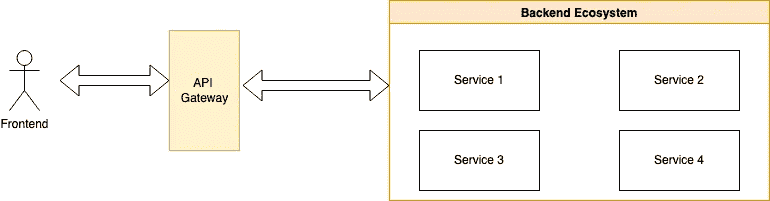
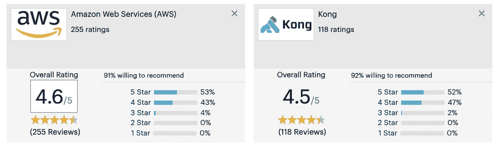

# 系统设计基础:API 网关

> 原文：<https://medium.com/geekculture/system-design-basics-api-gateway-6e3387698f92?source=collection_archive---------2----------------------->

# API 网关

API 网关是一个 API 管理工具，位于客户端和一组后端服务之间。

根据 NginX 的说法，API 网关接收来自客户端的所有 API 调用，然后通过请求路由、组合和协议翻译将它们路由到适当的微服务。通常，它通过调用多个微服务并汇总结果来处理请求，以确定最佳路径。它可以在 web 协议和内部使用的对 web 不友好的协议之间进行转换。

API 网关是组织由微服务架构处理的请求的指挥者，以便为用户创建简化的体验。它是一个翻译器，将客户的许多请求转化为一个请求，以减少客户和应用程序之间的往返次数。API 网关设置在微服务的前面，并成为应用程序执行的每个新请求的入口点。它简化了客户端实现和微服务应用程序。

# 为什么要使用 API 网关？

API 网关提供以下功能:

*   通过身份验证，它可以防止过度使用和滥用您的 API
*   可以在网关上配置分析和监控工具。
*   它为外部用户提供单一端点，而不管系统中运行多少微服务。
*   只要契约保持不变，在重构、添加/删除资源等情况下，用户不需要改变任何东西。
*   它还充当流量控制器，为所有请求形成一个单一的入口点。

# API 管理系统

根据 RedHat 的说法，API 管理指的是分发、控制和分析 API 的过程，这些 API 连接整个企业和整个云的应用程序和数据。API 管理的目标是允许创建 API 或使用其他 API 的组织监控活动，并确保使用 API 的开发人员和应用程序的需求得到满足。

它通常具有以下功能:

*   开发者门户:这包括 API 文档、测试沙箱、入职手册等。这有助于其他开发人员使用他们的 API
*   API 网关:这用于向外部用户提供单一的抽象层
*   API 生命周期管理:管理所有 API 的设计和实现，直到它被弃用。
*   分析:这有助于从 API 的使用和性能中获得洞察力，这可以在设计改进和扩展时用作有价值的信息。
*   货币化:这有助于从你的 API 中获得收入。合同可以根据多个参数来定义，如规模、用途、用户数量等。

# API 网关的缺点

1.  **延迟**:架构中增加的网络跳导致了整个系统延迟的增加。
2.  **SPoF** :作为所有请求的单一入口点的 API 网关充当单点故障(SPoF)。通过使用多个 API 网关并使用负载平衡器和弹性 IP 来分割调用，可以在某种程度上缓解这一问题。
3.  **增加的复杂性**:当终端用户可能是各种类型的，比如 IoS、Android、Web 等，API 网关可能会变得复杂。在这种情况下，我们可以为不同的入口点添加多个配置。这种架构也被称为“后端对前端”模式。

# 孔 vs 亚马逊 API 网关

Kong 和 Amazon API Gateway 是市场上最流行的两种 API 网关。

AWS 将**亚马逊 API 网关**描述为“*创建、发布、维护、监控和保护任何规模的 API*”。Amazon API Gateway 处理接受和处理多达数十万个并发 API 调用所涉及的所有任务，包括流量管理、授权和访问控制、监控和 API 版本管理。

**孔**详细为“*开源微服务& API 管理层*”。Kong 是一个可扩展的、开源的 API 层(也称为 API 网关，或 API 中间件)&建立在 NGINX 之上。Kong 控制第 4 层和第 7 层流量，并通过插件进行扩展，插件提供核心平台之外的额外功能和服务。

亚马逊 API Gateway 在学习曲线方面有优势，因为它是一项完全托管的服务。如果你在 AWS 生态系统中，它也非常适合。另一方面，Kong 对定制更开放，因为它是开源的，很容易集成到 L4 和 L7 上的插件和附加层中。在 Gartner 的评论集中，两者都得到了很高的评价。

# 结论

对于任何拥有多个微服务、不同类型的用户和向外部世界公开的功能的架构来说，API Gateway 都是一个很有价值的部分。这对于扩展您的系统至关重要，但如果使用不当，也会成为瓶颈和单点故障。

*恭喜你坚持到最后！在*[*Twitter*](https://twitter.com/bot_pragmatic)*，*[*GitHub*](https://github.com/abinator-1308/abinator-1308)*，*[*Medium*](/@abhinav.as1308)*，*[*LinkedIn*](https://www.linkedin.com/in/abinator-1308/)*，或者*[*insta gram*](https://www.instagram.com/abinator_1308/)*上随意谈论科技或者任何很酷的项目。*

感谢阅读！

# 参考

*   [https://www.nginx.com/learn/api-gateway/](https://www.nginx.com/learn/api-gateway/)
*   https://aws.amazon.com/api-gateway/
*   https://www.youtube.com/watch?v=1vjOv_f9L8I&T4 ab _ channel = JavaBrains
*   https://www.youtube.com/watch?v=1vjOv_f9L8I&ab _ channel = JavaBrains
*   [https://docs.konghq.com/gateway/latest/?_ ga = 2.16985521-172525271](https://docs.konghq.com/gateway/latest/?_ga=2.16986096.858199693.1662885521-1725270442.1661617281)46628
*   [https://www . Gartner . com/reviews/market/full-life-cycle-API-management/compare/Amazon-we b-services-vs-kong](https://www.gartner.com/reviews/market/full-life-cycle-api-management/compare/amazon-web-services-vs-kong)